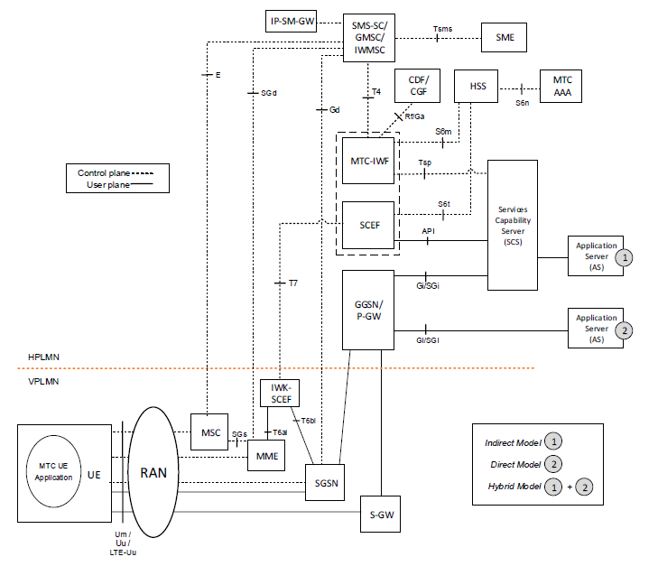
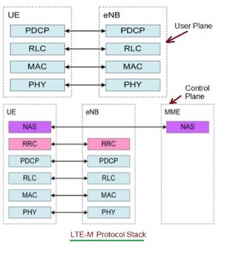
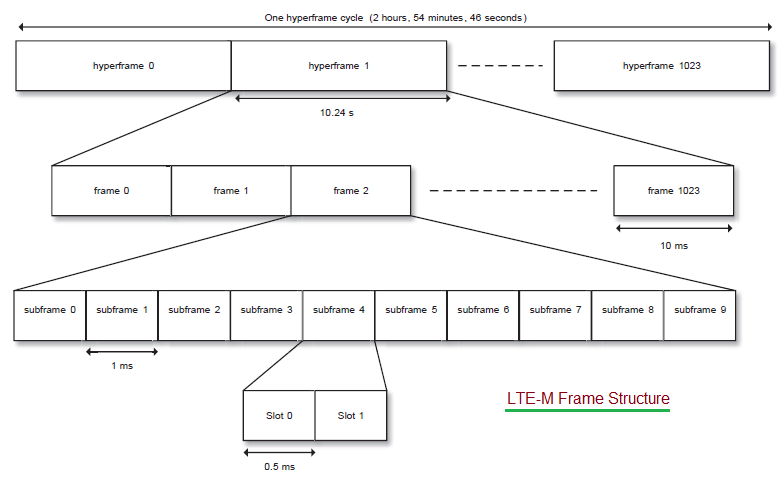

## [lte] - Introduction

### LTE-M Architecture
* Roaming 

### LTE-M Main Feature in comparison to NB-IOT
1. higher up/down link speed up to 1Mbps
2. VoLTE support for voice calls
3. Mobility Support for devices in movement

### What is LTE-M Technology

### LTE-M Protocol Stack

[protocol-stack](https://www.rfwireless-world.com/Tutorials/LTE-Protocol-Stack.html)

### LTE-M Frame Structure

### LTE-M Operators Worldwide
| Operators | Deployment Countries |
| --- | --- |
| AIS | Thailand |
| America Movil | Mexico |
| APTG, Chunghwa Telecom | Taiwan |
| AT&T | USA, Mexico |
| Bell, Rogers, Telus| Canada |
| Dialog Axiata | Sri Lanka |
| Etisalat | UAE |
| KDDI Corporation, NTT DOCOMO, Softbank | Japan |
| Korea Telecom | South Korea |
| KPN, Verizon | The Netherlands |
| NTT DOCOMO | Belgium |
| Orange | France , Romania |
| SingTel | Singapore |
| Spark, verizon | New Zealand |
| Swisscom | Switzerland |
| Telecom Italia | Argentina |
| Telefonica | Brazil, Germany |
| Telenor | Denmark, Norway |
| Telstra | Australia |
| Turkcell | Turkey |
| Verizon | North America |

### LTE-M Bands
| LTE Frequency Band | UL Frequency Range (MHz) | DL Frequency Range (MHz) |
|---|---|---|
| Band 1 | 1920 ~ 1980  | 2110 ~ 2170 |
| Band 2 | 1850 ~ 1910 | 1930 ~ 1990 |
| Band 3 | 1710 ~ 1785 | 1805 ~ 1880 |
| Band 4 | 1710 ~ 1755 | 2110 ~ 2155|
| Band 5 | 824 ~ 849 | 869 ~ 894 |
| Band 6 | 830 ~ 840 | 875 ~ 885 |
| Band 7 | 2550 ~ 2570 | 2620 ~ 2690 |
| Band 8 | 880 ~  915 | 925 ~ 960 |
| Band 9 | 1749.9 ~ 1784.9 | 1844.9 ~ 1879.9 |
| Band 10 | 1710 ~ 1770 | 2110 ~ 2170 |
| Band 11 | 1427.9 ~ 1447.9 | 1475.9 ~ 1495.9 |
| Band 12 | 699 ~ 716 | 729 ~ 746 |
| Band 13 | 777 ~ 787 | 746 ~ 756 |
| Band 14 | 788 ~ 798 | 758 ~ 768 |
| Band 15 | Reserved  | Reserved |
| Band 16 | Reserved | Reserved |
| Band 17 | 704 ~ 716 | 734 ~ 746 |
| Band 18 | 815 ~ 830 | 860 ~ 875 |
| Band 19 | 830 ~ 845 | 875 ~ 890 |
| Band 20 | 832 ~ 862 | 791 ~ 821 |
| Band 21 | 1447.9 ~ 1462.9 | 1495.9 ~ 1510.9 |
| Band 22 | 3410 ~ 3490 | 3510 ~ 3590 |
| Band 23 | 2000 ~ 2020 | 2180 ~ 2200 |
| Band 24 | 1626.5 ~ 1660.5 | 1525 ~ 1559 |
| Band 25 | 1850 ~ 1915 | 1930 ~ 1995 |
| Band 28 | 703 ~ 748 | 758 ~ 803 |
