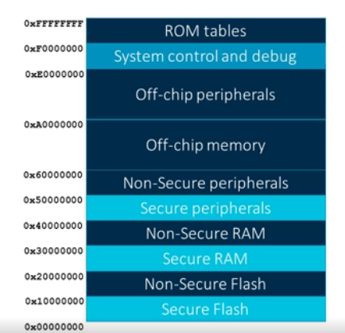
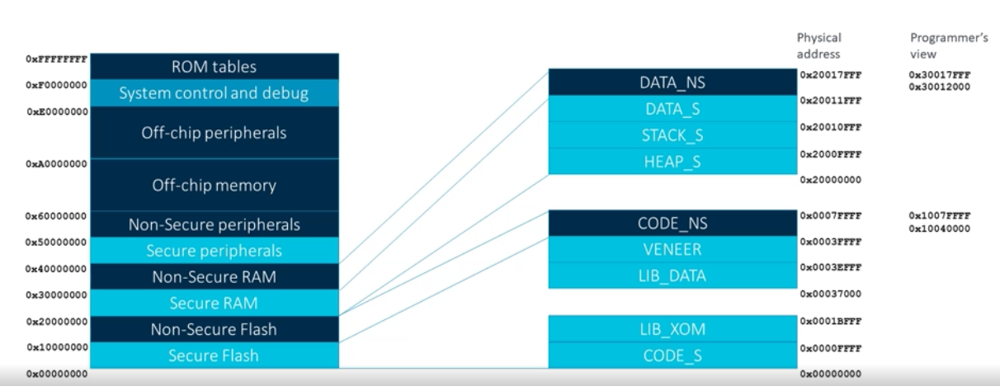
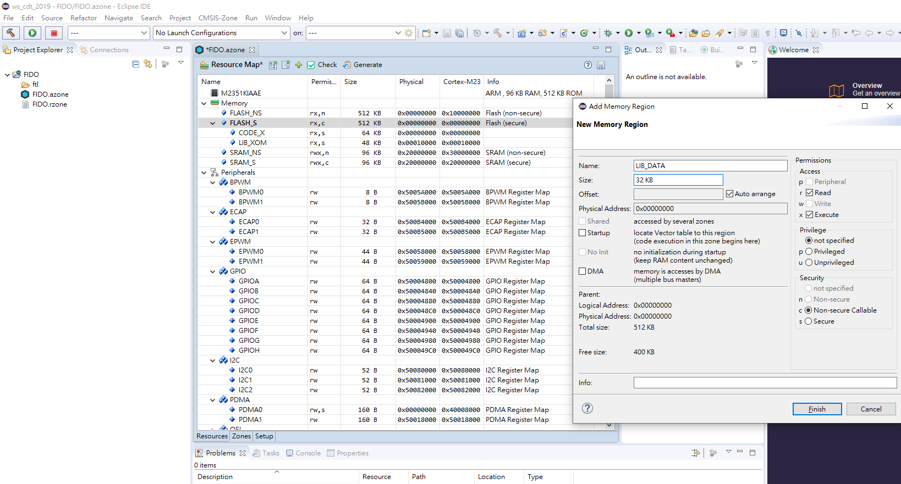
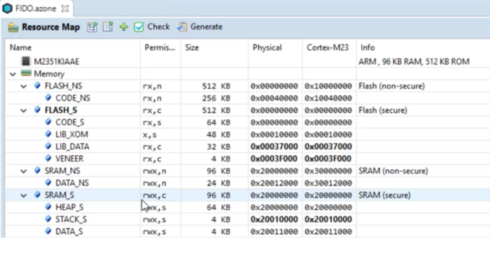

## CMSIS-ZONE Tutorial/Setup

[video](https://arm-software.github.io/CMSIS_5/Zone/html/index.html#ManualSections)

[github](https://github.com/ARM-software/CMSIS-Zone.git)

[M2351](https://arm-software.github.io/CMSIS_5/Zone/html/zTEM2351.html)

[Zone Description Format](https://arm-software.github.io/CMSIS_5/Zone/html/zoneFormat.html)

[memory pheripheral resources](https://arm-software.github.io/CMSIS_5/Zone/html/zTUIMemPerRes.html#zTUIPerSlotConf)

#### Armv8-M Programmer's model memory Map
* secure and non-secure interleaved every 256MBs

#### Fido Application Memory Map for RAM/Flash

#### Add secure flash in azone setting

#### Resource map example

