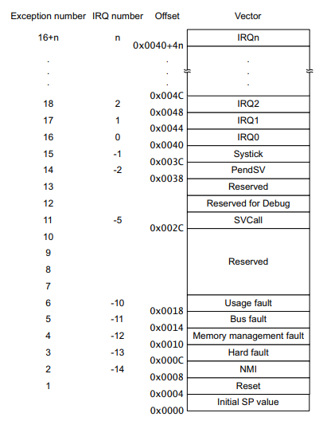

## [arm] - assembler startup file

### Overview
* startup code consists:
  -  Architecture and syntax
  -  Declaration of the Stack area
  -  Declaration of the Heap area
  -  Vector table
  -  Assembler code of Reset handler
  -  Definition of interrupt handler

### Architecture and syntax
two slightly different syntaxes are support for ARM and THUMB instructions, divided and unified.
```s
    .syntax     unified
    .arch       armv7e-m
```
> The ".arch" instruction used to select the target architecture. What the architecture of Cortex-M4 is ARMv7E-M.

### Declaration of the Stack area
*  the ".align 3" makes the starting of the satck on a multiple of 8-byte (2^3 = 8) boundary.

* ".globl" directive makes the symbol “__StackTop” and “__StackLimit” visible to GNU linker.
```s
      .section    .stack
      .align      3
  #ifdef __STACK_SIZE
      .equ        Stack_Size, __STACK_SIZE
  #else
      .equ        Stack_Size, 0x00000400
  #endif
      .globl      __StackTop
      .globl      __StackLimit
  __StackLimit:
      .space      Stack_Size
      .size       __StackLimit, . - __StackLimit
  __StackTop:
      .size       __StackTop, . - __StackTop
```

* The linker file will set the stack top to end of RAM
* stack limit move down by size of stack_dummy section.

```s
  __StackTop = ORIGIN(RAM) + LENGTH(RAM);
  __StackLimit = __StackTop - SIZEOF(.stack_dummy);
  PROVIDE(__stack = __StackTop);
```

###　Declaration of the Heap area
* The heap is a pool of memory that are managed by the processor itself (for example, with the C malloc function).
* typically used for the creation of dynamic data objects.
* “__HeapBase” and “__HeapLimit” indicate the starting and the ending of the heap area respectively
* __HeapBase and __HeapLimit are defined in the linker file.

```s
      .section    .heap
      .align      3
  #ifdef __HEAP_SIZE
      .equ        Heap_Size, __HEAP_SIZE
  #else
      .equ        Heap_Size, 0x00000C00
  #endif
      .globl      __HeapBase
      .globl      __HeapLimit
  __HeapBase:
      .if Heap_Size
      .space      Heap_Size
      .endif
      .size       __HeapBase, . - __HeapBase
  __HeapLimit:
      .size       __HeapLimit, . - __HeapLimit
```

### Vector table
* The vector table contains:
  - the reset value of the stack pointer, 
  - the start addresses for all exception and 
  - interrupt handlers
* vector table is fixed at address 0x00000000 on system reset
*  The privileged software can write to the VTOR register to relocate the vector table start address to a different memory location, in the range 0x00000080 to 0x3FFFFF80.
* Once an exception or interrupt is triggered, the processor automatically jumps to the corresponding address in the vector table which contains an address to the relevant exception or interrupt handlers (ISR).

  

```s
    .section    .vectors
    .align      2
    .globl      __Vectors
__Vectors:
    .long       __StackTop                 /* Top of Stack */
    .long       Reset_Handler              /* Reset Handler */
    .long       NMI_Handler                /* NMI Handler */
    .long       HardFault_Handler          /* Hard Fault Handler */
    .long       MemManage_Handler          /* MPU Fault Handler */
    .long       BusFault_Handler           /* Bus Fault Handler */
    .long       UsageFault_Handler         /* Usage Fault Handler */
    .long       Default_Handler            /* Reserved */
    .long       Default_Handler            /* Reserved */
    .long       Default_Handler            /* Reserved */
    .long       Default_Handler            /* Reserved */
    .long       SVC_Handler                /* SVCall Handler */
    .long       DebugMon_Handler           /* Debug Monitor Handler */
    .long       Default_Handler            /* Reserved */
    .long       PendSV_Handler             /* PendSV Handler */
    .long       SysTick_Handler            /* SysTick Handler */

    /* External interrupts */
    .long       EMU_IRQHandler             /* 0 - EMU */
    .long       WDOG0_IRQHandler           /* 1 - WDOG0 */
    .long       LDMA_IRQHandler            /* 2 - LDMA */
    /* ------------------- */
    .size       __Vectors, . - __Vectors
```
* The assembly code above declared the vectors section with a multiple of 4-bytes (2^2 = 4) boundary
* places all of the exception and interrupt handlers into the vector section with the directive “.long” since all of the handlers are 32-bit values.
* the default value of the first 32-bit of the vector table is “__StackTop” that correspond to the end of RAM. 
* it will always initialize the stack pointer as the “__StackTop” after resetting.

### Assembler code of Reset handler
* Reset is invoked on power up or a warm reset. 
* When reset is asserted, the operation of the processor stops, potentially at any point in an instruction.
* When reset is deasserted, execution restarts from the address provided by the reset entry in the vector table, which is “Reset_Handler” in following example.
* “.type” directive set the symbol “Reset_Handler” to be a function symbol.
```s
      .text
      .thumb
      .thumb_func
      .align      2
      .globl      Reset_Handler
      .type       Reset_Handler, %function
  Reset_Handler:
  #ifndef __NO_SYSTEM_INIT
      ldr     r0, =SystemInit
      blx     r0
  #endif

```
* After resetting the system, it will branch to the function “ _start”.

```s
  #ifndef __START
  #define __START _start
  #endif
      bl      __START

      .pool
      .size   Reset_Handler, . - Reset_Handler
```

### Definition of interrupt handler
* During the code execution, there might be exception or interrupt occurs, and the processor will start executing the exception or interrupt handler.
* This “.weak” directive sets the weak attribute on the symbol “Default_Handler”, if the symbol does not already exist in the source code, it will be created. And by default, the handler is just an endless loop by the directive “b .”

```s
    .align  1
    .thumb_func
    .weak   Default_Handler
    .type   Default_Handler, %function
Default_Handler:
    b       .
    .size   Default_Handler, . - Default_Handler
```
### external 
* [gnu assembler](https://ftp.gnu.org/old-gnu/Manuals/gas-2.9.1/html_chapter/as_toc.html)
* [arm_asm](https://www.keil.com/support/man/docs/armasm/)
