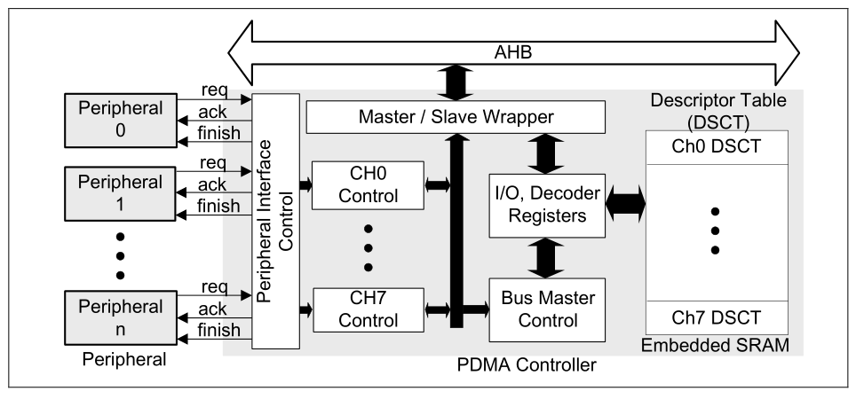
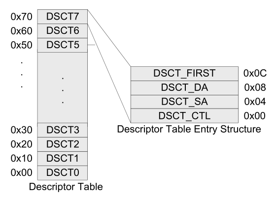

## [m23] - peripheral direct memory access (PDMA) controller

### Functions
- 8 independent channels
- 2 level of priorities
  - fixed level or round robin priority
- 8, 16, 32 bits data transfer
- source / destination address increment size
  - byte
  - half word
  - word
  - no increment
- Request source
  - software, 
  - PSIO, 
  - SPI/I2S, 
  - UART, 
  - USCI, 
  - EADC, 
  - DAC, 
  - PWM,
  - capture event and TIMER
- Scatter Gather Mode
  - use descriptor link list table
- Single and Burst Transfer
- Timeout function on channel 0 and 1
- Stride function from channel 0 to 5

### Block Diagram


### CLK Configuration
- Enable PDMA controller clock in PDMACKEN(CLK_AHBCLK [1])
- Reset PDMA controller in PDMARST (SYS_IPRST0[2])

### Modes
- Basic mode is used to perform one descriptor table transfer. 
- Scatter-gather mode has more entries for each PDMA channel, and thus the PDMA controller supports sophisticated transfer through the entries. 

- The descriptor table entry data structure contains many transfer information including the transfer source address, transfer destination address, transfer count, burst size, transfer type and operation mode.



- DSCT_FIRST
- DSCT_DA
- DSCT_SA
- DSCT_CTL


### Register table
|Register|Description|
|--|--|
|PDMA_DSCTn_SA|Source Address Register PDMA channel n|
|PDMA_DSCTn_DA|Destination Address Register PDMA channel n|
|PDMA_DSCTn_CTL|Descriptor Table Conntrol Register PDMA channel n|
|PDMA_DSCTn_NEXT|Next Scatter gather Descriptor table offset addr of PDMA channel n|
|PDMA_CURSCATn|Current scatter gather descriptpr table offset addr of PDMA channel n|
|PDMA_CHCTL|PDMA channel control register|
|PDMA_PAUSE|PDMA transfer pause control register|
|PDMA_SWREQ|PDMA software request register|
|PDMA_TRGSTS|PDMA channel request status register|
|PDMA_PRISET|PDMA fixed priority setting register|
|PDMA_PRICLR|PDMA fixed priority clear register|
|PDMA_INTEN|PDMA interrupt enable|
|PDMA_INTSTS|PDMA interrupt status|
|PDMA_ABTSTS|PDMA channel R/W target abort flag|
|PDMA_TDSTS|PDMA channel transfer done flag|
|PDMA_ALIGN|PDMA transfer alignment status|
|PDMA_TACTSTS|PDMA transfer active flag|
|PDMA_TOUTPSC|PDMA timeout prescaler|
|PDMA_TOUTEN|PDMA timeout enable|
|PDMA_TOUTIEN|PDMA timeout interrupt enable|
|PDMA_SCATBA|PDMA Scatter-gather Descriptor Table Base Address|
|PDMA_TOC0_1|PDMA Time-out Counter Ch1 and Ch0|
|PDMA_CHRST|PDMA channel reset|
|PDMA_SPI|PDMA with SPI performance improvement|
|PDMA_REQSEL0_3|PDMA request source select 0|
|PDMA_REQSEL4_7|PDMA request source select 1|
|PDMA_STCR0|stride transfer count of PDMA channel 0|
|PDMA_ASOCR0|address stride offset of PDMA channel 0|
|PDMA_STCRn|stride transfer count register of PDMA ch n|
|PDMA_ASOCRn|address stride offset register of PDMA ch n|


### Basic Mode Example


### Scatter Mode Example


### UART PDMA


### SPI PDMA


### PDMA.h

```c
/*  Peripheral Transfer Mode Constant Definitions  */
#define PDMA_MEM          0UL   /*!<DMA Connect to Memory \hideinitializer */
#define PDMA_UART0_TX     4UL /*!<DMA Connect to UART0_TX \hideinitializer */
#define PDMA_UART0_RX     5UL /*!<DMA Connect to UART0_RX \hideinitializer */
#define PDMA_UART1_TX     6UL /*!<DMA Connect to UART1_TX \hideinitializer */
#define PDMA_UART1_RX     7UL /*!<DMA Connect to UART1_RX \hideinitializer */
#define PDMA_UART2_TX     8UL /*!<DMA Connect to UART2_TX \hideinitializer */
#define PDMA_UART2_RX     9UL /*!<DMA Connect to UART2_RX \hideinitializer */
#define PDMA_UART3_TX    10UL /*!<DMA Connect to UART3_TX \hideinitializer */
#define PDMA_UART3_RX    11UL /*!<DMA Connect to UART3_RX \hideinitializer */
#define PDMA_USCI0_TX    16UL /*!<DMA Connect to USCI0_TX \hideinitializer */
#define PDMA_USCI0_RX    17UL /*!<DMA Connect to USCI0_RX \hideinitializer */
#define PDMA_USCI1_TX    18UL /*!<DMA Connect to USCI1_TX \hideinitializer */
#define PDMA_USCI1_RX    19UL /*!<DMA Connect to USCI1_RX \hideinitializer */
#define PDMA_QSPI0_TX    20UL /*!<DMA Connect to QSPI0_TX \hideinitializer */
#define PDMA_QSPI0_RX    21UL /*!<DMA Connect to QSPI0_RX \hideinitializer */
#define PDMA_SPI0_TX     22UL /*!<DMA Connect to SPI0_TX \hideinitializer */
#define PDMA_SPI0_RX     23UL /*!<DMA Connect to SPI0_RX \hideinitializer */
#define PDMA_SPI1_TX     24UL /*!<DMA Connect to SPI1_TX \hideinitializer */
#define PDMA_SPI1_RX     25UL /*!<DMA Connect to SPI1_RX \hideinitializer */
#define PDMA_PWM0_P1_RX  32UL /*!<DMA Connect to PWM0_P1 \hideinitializer */
#define PDMA_PWM0_P2_RX  33UL /*!<DMA Connect to PWM0_P2 \hideinitializer */
#define PDMA_PWM0_P3_RX  34UL /*!<DMA Connect to PWM0_P3 \hideinitializer */
#define PDMA_PWM1_P1_RX  35UL /*!<DMA Connect to PWM1_P1 \hideinitializer */
#define PDMA_PWM1_P2_RX  36UL /*!<DMA Connect to PWM1_P2 \hideinitializer */
#define PDMA_PWM1_P3_RX  37UL /*!<DMA Connect to PWM1_P3 \hideinitializer */
#define PDMA_I2C0_TX     38UL /*!<DMA Connect to I2C0_TX \hideinitializer */
#define PDMA_I2C0_RX     39UL /*!<DMA Connect to I2C0_RX \hideinitializer */
#define PDMA_I2C1_TX     40UL /*!<DMA Connect to I2C1_TX \hideinitializer */
#define PDMA_I2C1_RX     41UL /*!<DMA Connect to I2C1_RX \hideinitializer */
#define PDMA_TMR0        46UL /*!<DMA Connect to TMR0 \hideinitializer */
#define PDMA_TMR1        47UL /*!<DMA Connect to TMR1 \hideinitializer */
#define PDMA_TMR2        48UL /*!<DMA Connect to TMR2 \hideinitializer */
#define PDMA_TMR3        49UL /*!<DMA Connect to TMR3 \hideinitializer */
#define PDMA_EADC_RX     50UL /*!<DMA Connect to EADC_RX \hideinitializer */
#define PDMA_DAC0_TX     51UL /*!<DMA Connect to DAC0_TX \hideinitializer */
#define PDMA_DAC1_TX     52UL /*!<DMA Connect to DAC1_TX \hideinitializer */
#define PDMA_PSIO_TX     66UL /*!<DMA Connect to PSIO_TX \hideinitializer */
#define PDMA_PSIO_RX     67UL /*!<DMA Connect to PSIO_RX \hideinitializer */
#define PDMA_USCI2_TX    68UL /*!<DMA Connect to USCI2_TX \hideinitializer */
#define PDMA_USCI2_RX    69UL /*!<DMA Connect to USCI2_RX \hideinitializer */

```