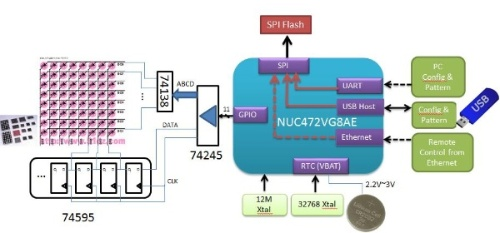
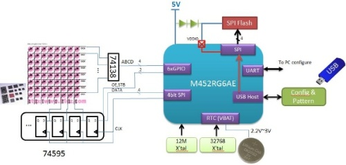

## [m4] - led display

This solution can replace the display subtitles via Ethernet, USB, Bluetooth, support monochrome LED up to 80K points and two-color LED up to 40K points, with independent power supply Calendar RTC, RTC can still record time when the main computer is powered off.

The launch reference design has NUC472 Ethernet and M452 simplified design. The NUC472 Ethernet design can change the LED screen subtitle through Ethernet, USB, and Bluetooth, and support monochrome LED up to 80k dots, bi-color LED up to 40k dots. The systematic block diagram is as follows:

The M452 simplified design can change the LED display subtitle through USB or Bluetooth, and support monochrome LED up to 32k dots and bi-color LED up to 16k dots. The systematic block diagram is as follows:

The two designs also support RTC timing LED display update function. The LED display content can be updated remotely through Bluetooth using mobile phones or computers. In addition, Nuvoton provides Android Apps on Google Play for reference.