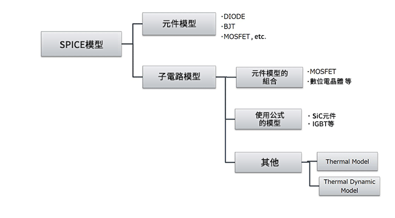
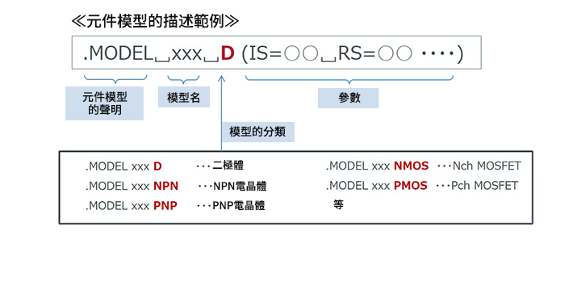
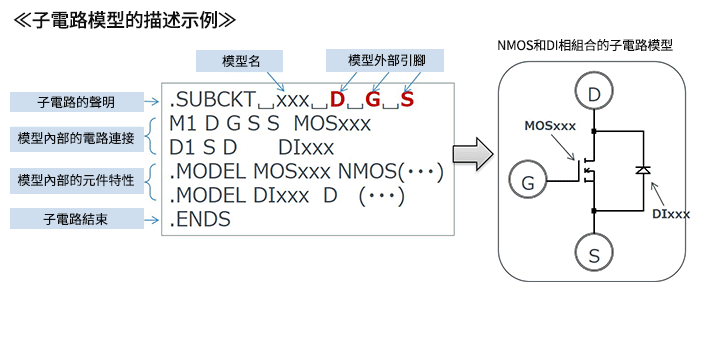
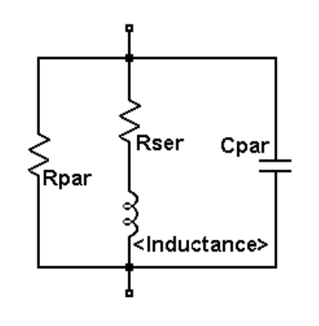
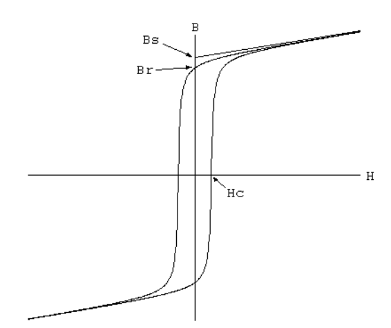
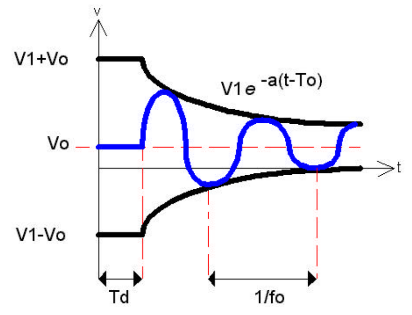
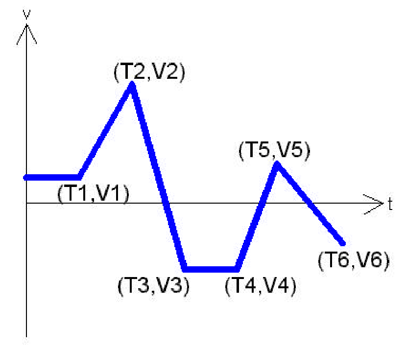
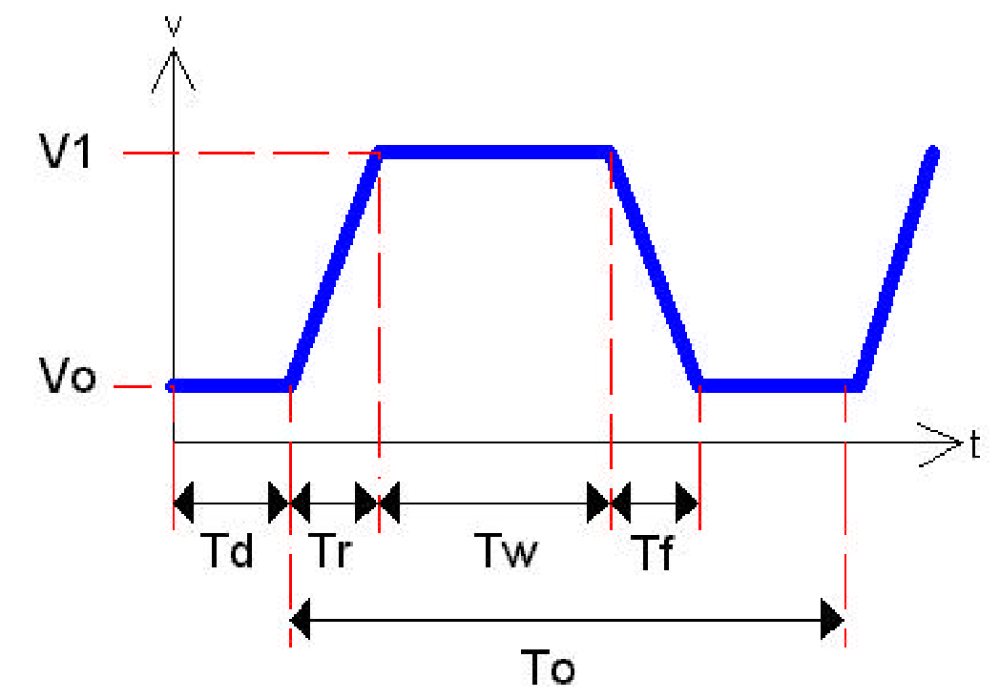

## **SPICE模型的種類**
* 元件模型
* 子電路(Subcircuit)模型
* 熱計算的特殊模型




### **SPICE的元件模型**
> 表示電晶體和二極體等各模型電氣特性的公式是規定好的，元件模型是表示該公式所用係數（參數）的。




### **SPICE的子電路模型**
> 元件模型、電源及公式等相結合，組成電路的模型。模型中包含電路連接資訊和元件模型等。




### **Component SPICE Quick Reference**

```spice
TITLE STATEMENT
ELEMENT STATEMENTS
.
COMMAND (CONTROL) STATEMENTS
OUTPUT STATEMENTS
.END <CR>

```
> * The statements have a free format and consist of fields separated by a **blank**. 
> * To continue a statement to the ***next line***, one uses a **"+"** sign (**continuation** sign) at the
beginning of the next line.
> * Numbers can be integers, or floating points. For example:
  ```
  RES1 1 0 3500 or RES1 1 0 3.5E3
  ```
### **SCALE FACTOR**
| Suffix | Scale | Value | Name |
| -----| -----| ----- | ----- |
| T | E+12 | 1,000,000,000,000| Tera |
| G | E+9 | 1,000,000,000 | Giga |
| X or MEG | E+6 | 1,000,000 | Mega |
| K | E+3 | 1,000 | Kilo |
| M | E-3 | 0.001 | Milli |
| U | E-6 | 0.000001 | Micro |
| N | E-9 | 0.000000001 | Nano |
| P | E-12 | 0.000000000001 | Pico |
| F | E-15 | 0.000000000000001 | Femto |

* eg. a capacitor of 225 picofarad in the following ways:
  ```
  225P, 225p, 225pF; 225pFarad; 225E-12; 0.225N, etc.
  ```

### **Basic Components**
#### ***Resistor***
```
Rname N+ N- Value
```
* N+: Positive Terminal
* N-: Negative Terminal
* Value: Resistance Value

#### ***Inductor***

```
# Symbol
  IND, IND2

# Syntax
Lname N+ N- <inductance> <IC=Initial current>
+ [Rser=<value>] [Rpar=<value>]
+ [Cpar=<value>] [m=<value>] [temp=<value>]

```
* IC: Initial Condition (DC Voltage for C, DC Current for I)

|Name|Description|
|---|---|
|Rser|Equivalent series resistance|
|Rpar|Equivalent parallel resistance|
|Cpar|Equivalent parallel capacitance|
|m|Number of parallel units|
|ic|Initial current(used if uic flagged on .tran)|
|tcl|Linear Inductance temperature coeff.|
|Tcl|Quadratic inducance temperature coeff.|
|temp|Instance temp|

[LTspice](http://ltwiki.org/LTspiceHelp/LTspiceHelp/L_Inductor.htm)

#### ***Hysteretic Core Model***
|Name|Description|Units|
|---|---|---|
|Hc|Coercive force|Amp-turns/meter|
|Br|Remnant flux density| Tesla|
|Bs|Saturation flux density|Tesla|

* Upper branch of Hysteresis:

  $B_{up}(H) = B_s * \frac{H+H_c}{|H +H_c| + H_c * (B_s/B_r-1)}*\mu_0*H$

* Lower Branch of Hysteresis

    $B_{dn}(H) = B_s * \frac{H-Hc}{|H -H_c| + H_c * (B_s/B_r-1)}*\mu_0*H$
    


#### ***Capacitor***
```
Cname N+ N- Value <IC=Initial Condition>

```


### **Voltage and Current Source**
#### ***Independent DC Source***
```
# Voltage Source
  Vname N+ N- <DC=> DC Value
# Current Source
  IName N+ N- <DC=> DC Value

```
* DCValue gives the value of the source
* Name of voltage and current source must start with **V and I** respectively.

#### ***Independent AC Source***
```
# Voltage Source
  Vname N+ N- AC ACValue, Phase
  
# Current Source
  Iname N+ N- AC ACValue, Phase
```
* ACValue gives value of the source
* ACPhase gives the phase in degree

### **Transient Source**
#### ***Sinusoidal***

```
  Vname N+ N- SIN(VO VA fo <TD> <a> <Phase>)
  Vname = VO + VA exp[-a.(t-TD)] sin[2pi.f(t-TD)+(PHASE/360)]
```
* VO - offset voltage
* VA - Amplitude
* fo - frequency
* TD - delay in seconds
* a - damping factor per second
* Phase - phase in degree
(if TD, a, and phase not specified, assumed zero)
> Cosine can be generated by shifting a sine by 90 degrees

#### ***Piece-Wise Linear***

```
  Vname N+ N- PWL(T1 V1 T2 V2 T3 V3 ... Tn Vn)
```
* Ti Vi - Specify Vi of source at time Ti

#### ***Pulse***

```
  Vname N+ N- PULSE(Vo V1 Td Tr Tf Tw To)
```
* Vo - Initial Voltage
* V1 - peak voltage
* Td - initial delay time
* Tr - rise time
* Tf - fall time
* Tw - pulse width
* To - Period of wave

#### **Dependent Source**
```
# Voltage Controlled Voltage Source
  Ename N+ N- NC1 NC2 Value
# Voltage Controlled Current Source
  Gname N+ N- NC1 NC2 Value
# Current Controlled Voltage Source
  Hname N+ N- Vcontrol Value
# Current Controlled Current Source
  Fname N+ N- Vcontrol Value
```
* NC1 and NC2: positive and negative terminals of the **controlling voltage source**
* Vcontrol: the zero value voltage source used to measure controlling current 
* Value: multiplier value. 
```
# in Math Term:
  Value*(NC1 - NC2) = (N+ - N-)
```

### **Semiconductor Devices**
#### ***Diode***
```
# Element Line
  Dname N+ N- MODName

# Model statement (Appear in deck to describe circuit element)
  .MODEL MODName D (IS= N= Rs= CJO= Tt= BV= IBV=)
  .model D1N4148 D (IS=0.1PA, RS=16 CJO=2PF TT=12N BV=100 IBV=0.1PA)
```
* Element Name Start with D indicate a diode component
* MODName: Name of model of the component
* IS: saturation current, (default = 1E-14A)
* N: emission coefficient, (default = 1)
* RS: series resistance, (default = 0 ohm)
* CJO: junction capacitance, (default = 0 F)
* TT: transit time, (default = 0 sec)
* BV: reverse bias breakdown voltage, (default = infinite)
* IBV: reverse bias breakdown current, (default = 1xE-10 A)

#### ***Bipolar Transistor***
```
# Element Line
  QName C B E BJT_modelname
# Model Statement
  .MODEL BJT_modName NPN (BF=val IS=val VAF=val)
  .MODEL BJT_modName PNP (BF=val IS=val VAF=val)
# example
  .model Q2N222A NPN (IS=14.34F XTI=3 EG=1.11 VAF=74.03 BF=255.9 NE=1.307 ISE=14.34F IKF=.2847 XTB=1.5 BR=6.092 NC=2 ISC=0 IKR=0 RC=1 CJC=7.306P MJC=.3416 VJC=.75 FC=.5 CJE=22.01P MJE=.377 VJE=.75 TR=46.91N TF=411.1P ITF=.6 VTF=1.7 XTF=3 RB=10)
```
#### **Modified Gummel-Poon BJT Parmeters**
> [wiki](https://en.wikipedia.org/wiki/Gummel%E2%80%93Poon_model)

| Name | Description | Unit | Default |
|-----|-------|------|--------|
|Is|Transient Saturation current|A|1e-16|
|Bf|Common Emitter Current Gain $\beta$ |--|100|
|Nf|Forward current emission coefficient|--|1.|
|Vaf|Forward Early voltage|V|Infin.|
|Ikf|Corner for forward $\beta$ high current roll-off|A|Infin.|


#### ***MOSFET***
```
# Element
  Mname ND NG NS <NB> ModName <L=VAL> <W=VAL>

# Model Statement
  .MODEL ModName NMOS (<LEVEL=VAL> <KEYNAME=VAL> ...)
    .MODEL ModName PMOS (<LEVEL=VAL> <KEYNAME=VAL> ...)
```
> [parameters](https://www.seas.upenn.edu/~jan/spice/spice.MOSparamlist.html)


#### ***Subcircuits***
```
# Defining Subcircuit
  .SUBCKT SUBNAME N1 N2 N3 ...
  Element statements
  .
  .
  .
  .END SUBNAME
```

## **Control Statements**

### **.OP Statement**

### **.DC Statement**

### **.AC Statement**

### **.TRAN Statement**

### **.IC Statement**

### **.TF Statement**

## **Output Statements**

### **.PRINT**


### **.PLOT**


### **.MEAS**


