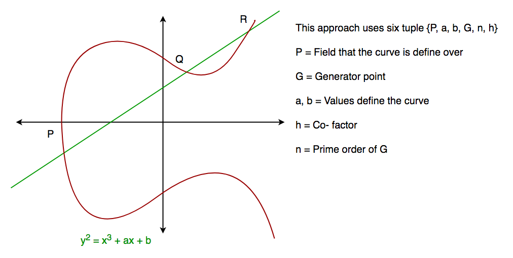

## [alg] - Elliptic Curve Digital Signature Algorithm

* variant of **Digital Signature Algorithm (DSA)
* Uses elliptic curve cryptography

* private, public key pair
* Trapdoor function:
    - (A -> B) Easy
    - (A <- B) Hard
* multiply prime numbers


### ECC vs RSA
* ECC key size: 256 bit (top secret: 384 bit)
* RSA key size: 3072 bit (top secret: 7680 bit)

### ECC Basic (Diffie Hellmann) - Key Exchange Protocol
* a planar algebraic curve defined by an equation in form of:  y^2 = x^3 + ax + b
    
* elliptic and symmetric about the x-axis
* a line intersect no more than 3 points to the curve (A dot B -> C)
    
* used to establish a **shared secret** using the elliptic curve to generate points and get the secret key using the **parameters**

* consider 4 variables (simplified)
    - prime P
    - prime G (a primitive root of P)
    - private value a
    - private value b
* P & G are public available.
* Users (Bob and Alice) pick private values a & b and generate key and exchange it publicly.
* Opposite receive the key and generates a secret key, which both parties have the same secret key to encrypt.

| Step | Alice | Bob |
| ----- | ----- | ----- |
| Public Keys | P, G | P, G |
| Private Key selected | a | b |
| Key generated | x = G^a mod P | y = G^b mod P |
| Exchange of generated keys takes place | | |
| Generated Secret Key | ka = y^a mod P | kb = x^b mod P |
| Algebraically, it can be shown that ka = kb |
| Users now have symmetric secret key to encrypt |

### Example

```pseudo
Step 1: Alice and Bob get public numbers P = 23, G = 9

Step 2: Alice selected a private key a = 4 and
        Bob selected a private key b = 3

Step 3: Alice and Bob compute public values
Alice:    x =(9^4 mod 23) = (6561 mod 23) = 6
        Bob:    y = (9^3 mod 23) = (729 mod 23)  = 16

Step 4: Alice and Bob exchange public numbers

Step 5: Alice receives public key y =16 and
        Bob receives public key x = 6

Step 6: Alice and Bob compute symmetric keys
        Alice:  ka = y^a mod p = 65536 mod 23 = 9
        Bob:    kb = x^b mod p = 216 mod 23 = 9

Step 7: 9 is the shared secret.
```

```c
/* This program calculates the Key for two persons
using the Diffie-Hellman Key exchange algorithm */
#include<stdio.h>
#include<math.h>

// Power function to return value of a ^ b mod P
long long int power(long long int a, long long int b,
									long long int P)
{
	if (b == 1)
		return a;

	else
		return (((long long int)pow(a, b)) % P);
}

//Driver program
int main()
{
	long long int P, G, x, a, y, b, ka, kb;

	// Both the persons will be agreed upon the
		// public keys G and P
	P = 23; // A prime number P is taken
	printf("The value of P : %lld\n", P);

	G = 9; // A primitive root for P, G is taken
	printf("The value of G : %lld\n\n", G);

	// Alice will choose the private key a
	a = 4; // a is the chosen private key
	printf("The private key a for Alice : %lld\n", a);
	x = power(G, a, P); // gets the generated key

	// Bob will choose the private key b
	b = 3; // b is the chosen private key
	printf("The private key b for Bob : %lld\n\n", b);
	y = power(G, b, P); // gets the generated key

	// Generating the secret key after the exchange
		// of keys
	ka = power(y, a, P); // Secret key for Alice
	kb = power(x, b, P); // Secret key for Bob

	printf("Secret key for the Alice is : %lld\n", ka);
	printf("Secret Key for the Bob is : %lld\n", kb);

	return 0;
}

/* output:
The value of P : 23
The value of G : 9

The private key a for Alice : 4
The private key b for Bob : 3

Secret key for the Alice is : 9
Secret Key for the Bob is : 9
*/
```

### Signature generation algorithm

| parameter | description |
| ----- | ----- |
| CURVE | the elliptic curve field and equation used |
| G | elliptic curve base point, a point on the curve that generates a subgroup of large prime order n |
| n | integer order of G, n * G = O, where O is the identity element |
| dA | the private key (random select) |
| QA | the public key (calculated by elliptic curve) |
| m | message to send |

* The order n of the base point G **must be prime** (2, 3, 5, 7, 11, 13, 17, 19, 23, 29 ... and so on)


### Elliptic curve point multiplication

* Given a curve, E: y^2 = x^3 + ax + b
* point multiplication is defined as
    - repeated addition of a point along that curve
    - denote as nP = P + P + P + ... + P