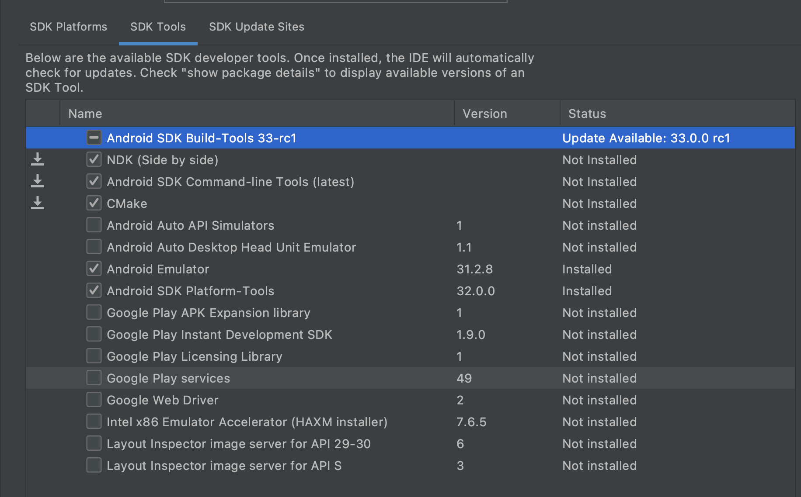

## [anderoid-ndk] Begineer.md

## **Install/Configure NDK and CMAKE**

* In Tools > SDK Manager
* Select SDK Tools Tab, and seklect NDK (Side by side) and CMake


### Configure CMAKE 
* To set the CMake version, add the following to your module's build.gradle file:
```gradle
android {
    ...
    externalNativeBuild {
        cmake {
            ...
            version "cmake-version"
        }
    }
}
```

### Configure NDK version
```gradle
android {
    ndkVersion "major.minor.build" // e.g.,  ndkVersion "21.3.6528147"
}
```

## **Create / Import Native Project**


[github](https://github.com/android/ndk)
[ndk-samples](https://github.com/android/ndk-samples)

[ndk-api](https://developer.android.com/ndk/reference)

[reference](https://developer.android.com/studio/projects/install-ndk)
