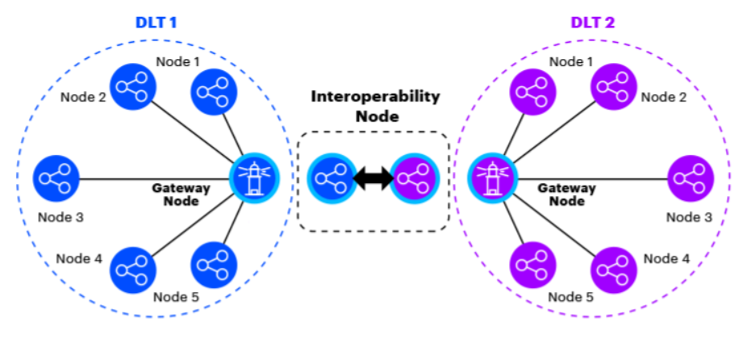

## [blockchain] - layer 0 protocol
* infrastructure layer to build multiple layer 1 blockchain..
* ie. Binance chain (layer1) was built using Cosmos SDK.
* allow blockchains to be built on top of layer 0
* allow for corss-chain interoperability between layer 1 projects
* different blockchains can communicate with each other
* developer can decide blockchain has
  - staking, 
  - on-chain or off-chain governance,
  - communication with other,
  - slashings



### Two prominent layer 0 blockchain protocols
1. Cosmos (go)
2. Polkadot (rust)

3. Metal (go)


### ChatGPT replies
```
There are no widely recognized layer 0 blockchain protocols. In the context of blockchain technology, Layer 0 generally refers to the underlying physical layer of the network infrastructure, including the hardware and networking components.

The blockchain protocols are usually considered to start at Layer 1, which is the most fundamental layer of the blockchain architecture, and where the basic consensus mechanism and block validation process take place.

So, it's not common to refer to any blockchain protocol as a Layer 0 protocol. However, some people might use this term to refer to the underlying infrastructure or hardware that supports the blockchain network, but it's not a widely accepted practice.

```


### 5 layer of block chain
  1. hardware infrastructure layer
  2. data layer
  3. network layer
  4. consensus layer, 
  5. application layer

### Proof of Stake (PoS) protocol
  - consensus mechanism of blockchains that work by selecting validators in proportion to their quantity of holdings in the associated cryptocurrency.

### Byzantine Fault-Tolerance consensus algorithms
 - guarantees safety for up to a third (1/3) of Byzantine, or malicious actors

