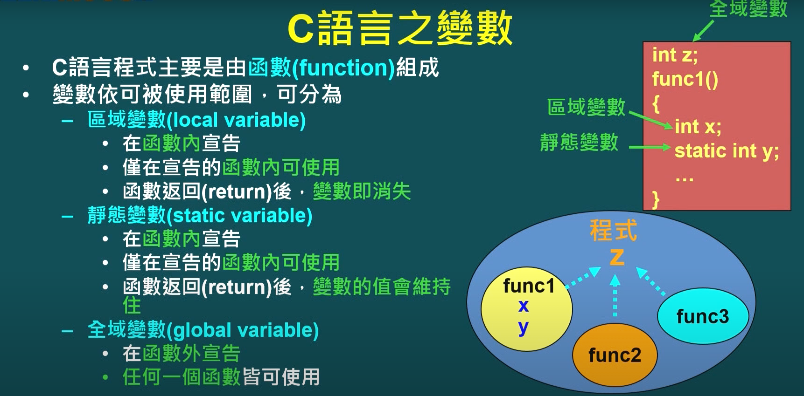
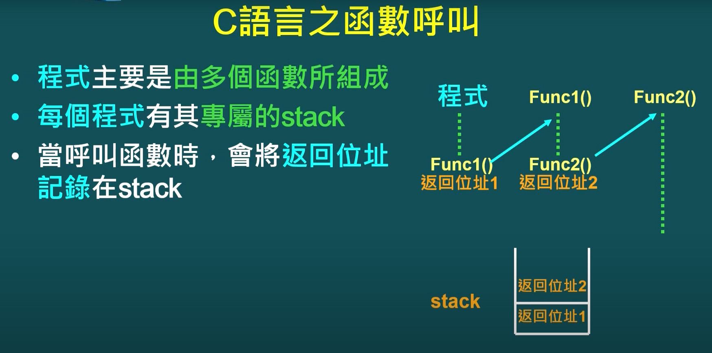
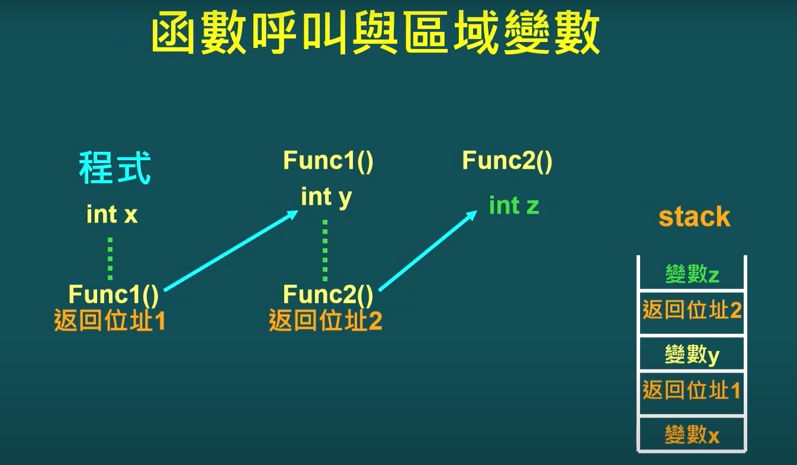
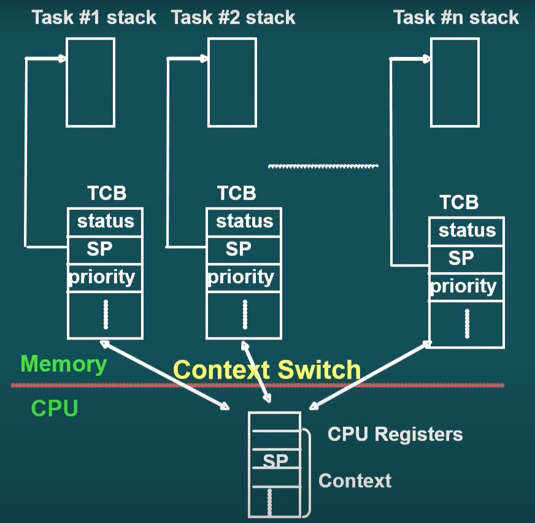
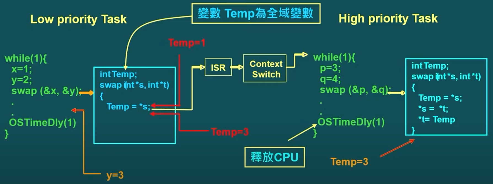
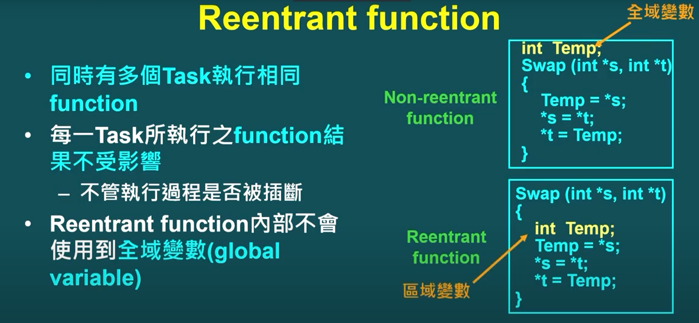

## **C51 Multi-Tasking**

### C programming variables
* local variable (區域變數)
    * 在函數(function)內宣告
    * 僅在宣告的函數內可使用
    * 函數返回後 變數及消失
* static variable (靜態變數)
    * 在函數內宣告
    * 僅在宣告的函數可使用
    * 函數返回後 **變數的值會維持住**
* global variable (全域變數)
    * 在函數外宣告
    * 任何一個函數皆可使用




### C Programming Memory
* Global Memory
    * 存放全域變數 & 靜態變數
    * 程式編譯時 及確認變數位址
* Stack Memory
    * 存放函數返回位址 (return addr)
    * 存放呼叫函數時 所傳遞的參數 (parameters)
    * 存放區域變數
        - 函數被呼叫時 才確認變數位址 變數才存在
* Heap Memory
    * 動態記憶體管理區域
    * 動態記憶體要求時 所提供的記憶體空間

### C Programming Stack
* Return address

* Return address with local variable


### Stack in Multi-Tasking
* 每個 task 就是一個獨立程式
* 每個 task 有自己的 stack 存放
    - 返回位址
    - 區域變數
    - 函數呼叫之參數

### Stack Overflow
* 宣告區域變數 or 函數呼叫層數 多於 stack 容量

### Function Pointer Declaration
```c
void (*function_ptr) (void);
```

### Non-reentrant Functions (不可多個 task 同時執行)
* RTOS 之多工環境 (多個程式獨立執行), Tasks are event driven (事件觸發)
* Task 執行過程, 隨時可能被其他**較高優先權**的task插斷 (preemptive)
* Function 執行結果 是否會被插斷 (多個Task執行) 所影響
    * Example:
    * Task A 執行一個func到一半, 被Task B 插斷
    * Task B 也執行相同func
    * 當Task B釋放CPU使用權時(context switch), Task A完成未執行完的function
    * Task A 執行 func 結果受此func執行過程是否被插斷所影響



###  Reentrant Functions

```c
// definition
int calc (int a, int b, int c) compact reentrant {
    long x, y, z;
}
```
* 可以讓多個 task 同時執行相同 function
* 每個 task 執行 function 不受影響
* Reentrant function 內部不會使用到全域變數 (global variable)
* Declared using reentrant keyword.
* arguments (a, b, c) and local variables (x, y, z) are stored on a simulated stack in PDATA (COMPACT memory model)
* May be shared by several processes without fear of data corruption.
* May be interrupted at any time & resumed later without loss of data.
* Required in real-time application / where interrupt code and non-interrupt code must share a function
* When a reentrant function returns, it adjusts the stack pointer to the value before arguments were pushed.
* The caller does not need to perform any stack adjustment after calling a reentrant function.



* Small model reentrant function
    * simulate reentrant stack in **idata** memory
    * The maximum reentrant stack size is 256 bytes.
    * pointer: ?C_IBP (1 byte)
    * Within Startup.A51:
    ```asm
        IBPSTACK        EQU     1
        XBPSTACKTOP     EQU     0x1FF +1   ; default 01FFH+1

    ```

* Compact model reentrant function
    * simulate reentrant stack in **pdata** memory
    * The maximum reentrant stack size is 256 bytes.
    * pointer: ?C_PBP (1 byte)
    * Within Startup.A51
    ```asm
        PBPSTACK        EQU     0
        PBPSTACKTOP     EQU     0xFF +1   ; default 0FFH+1
    ```

* Large model reentrant function
    * simulate reentrant stack in **xdata** memory
    * The maximum reentrant stack size is 64K Bytes.
    * pointer: ?C_XBP (2 bytes)
    * Within Startup.A51
    ```asm
        XBPSTACK        EQU     0
        XBPSTACKTOP     EQU     0x1FF +1  ; default 01FFH+1
    ```


#### **Further Readings**

* [Reentrant](https://www.keil.com/support/man/docs/c51/c51_le_reentrantfuncs.htm)
* [即時作業系統基本觀念](https://youtu.be/K3TTmgq_MPY)
* [formosa-tasker](http://www.formosaos.url.tw/rtos8051/structos__tcb.html)
* [formosa](http://www.formosaos.url.tw/my8051/8051_tasking.html)