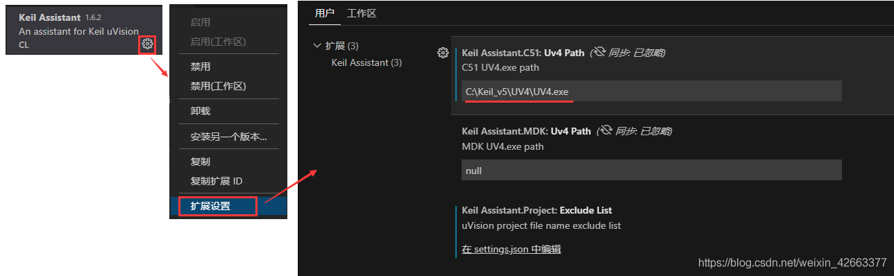
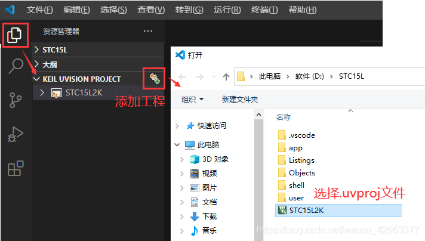
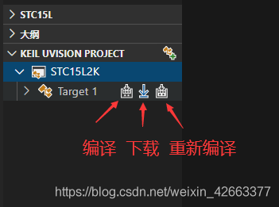
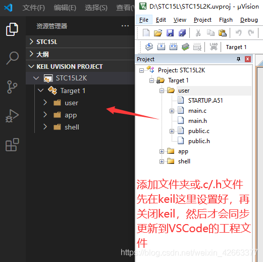
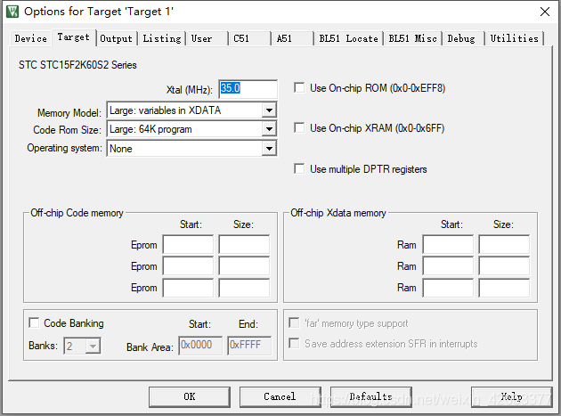

## [C51] - VSCode Setup for Keil C51 and ARM UV4

#### Install VSCode Plugins 
* Keil Assistant
* C/C++

#### Setting up Keil Assistant
* Setup C51 and MDK UV4 Path
* Open Keil Assiatant's extended settings, fill in the path of UV4.exe to the corresponding location. Keil C51 is used here, if it is Keil MDK, fill it in below.

#### Add uvproj to VSCode

#### Compile / Build / Download

#### File Include / Compilation Option
* add a .c.h file, just like using Keil directly, you need to add the file to the Project window on the left of keil,

*  compilation option settings of the project need to be set back in Keil,

#### Source
[doc](https://www.codetd.com/en/article/12109341)