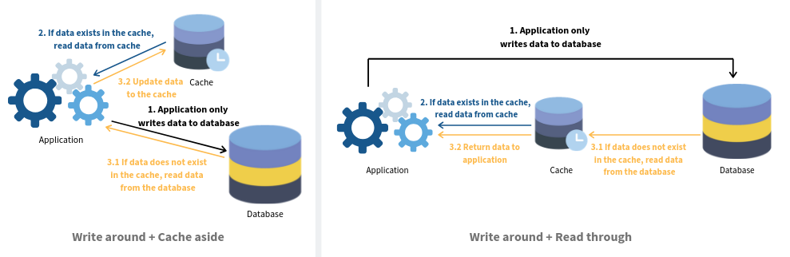

## [db] - Database Caching Strategies 

### **Caching**
>A database is one of the most common uses of data store technology like Bluzelle. This is what most people commonly think of. Additionally this same technology can be used as a cache. This blog will explain in details what is a cache and why it is important.

* A three-tier architecture is a model generally used by app developers to create flexible and reusable applications. It includes a presentation tier (user interface), an application tier (business logic) and a data tier (databases and file storage).

**Presentation Layer:** 
>the interface that users interact with. It translates tasks and results from the servers to things that users can understand.

**Application Tier:** 
> coordinator of the application. It processes commands, makes logical decisions and processes data between the user interface and the database.

**Data tier:** 
>where the data and files are actually stored.

Each of these tiers can work and be maintained independently, and in most cases, be in different hosts. Therefore every time the application queries for data, the speed is limited by network performance. Data retrieval time plays a key role in user experience and is a critical requirement in almost all commercial applications.

What is database caching and how does it work
Caching is a buffering technique that stores frequently-queried data in a temporary memory. It makes data easier to be accessed and reduces workloads for databases. For example, you need to retrieve a user’s profile from the database and you need to go from a server to server. After the first time, the user profile is stored next (or much nearer) to you. Therefore, it great reduces the time to read the profile when you need it again.

The cache can be set up in different tiers or on its own, depending on the use case. It works with any type of database including but not limited to:

Relational databases: Amazon RDS
NoSQL databases: MongoDB, Amazon DynamoDB, Azure Cosmos DB and Apache Cassandra
There are several benefits using cache:

Performance — Performance is improved by making data easier to be accessed through the cache and reduces workloads for database.

Scalability —Workload of backend query is distributed to the cache system which is lower costs and allow more flexibility in processing of data.

Availability — If backend database server is unavailable, cache can still provide continuous service to the application, making the system more resilient to failures.

Overall, it is the minimally invasive strategy to improve application performance by implementing caching with additional benefits of scalability and availability.

What are the top caching strategies?
A caching strategy is to determine the relationship between data source and your caching system, and how your data can be accessed. There are various strategies to implement cache but each will have different impacts on your system design and the resulted performance. Before designing your architecture, it is useful to go through how your data need to be accessed so that you can determine which strategy suits best. Below we will analyse some of the most adopted ones.

### **Cache Aside**

In this strategy, the cache is sitting aside the database. The application will first request the data from the cache. If the data exists (we call this a ‘cache hit’), the app will retrieve the data directly. If not (we call this a ‘cache miss’), the app will request data from the database and write it to the cache so that the data can be retrieved from the cache again next time.

### **Read Through**

Unlike cache aside, the cache sits in between the application and the database. The application only request data from the cache. If a ‘cache miss’ occurs, the cache is responsible to retrieve data from the database, update itself and return data to the application.

### **Write Through**

Similar to read through, the cache sits in between. Every writes from the application must go through the cache to the database.

### **Write Back (a.k.a Write Behind)**

It has a similar setup with write through. The application still writes data to the cache. However, there is a delay in writing from the cache to the database. The cache only flushes all updated data to the DB once in a while (e.g. every 2 minutes).

### **Write Around**

Write around usually combines with either cache aside or read through strategy. The application writes directly to the database. Only data that is read goes to the cache.

In practice, how do you know which strategy to use for your system? We have summarized the pros & cons for each of them:

[source](https://bluzelle.com/blog/things-you-should-know-about-database-caching)