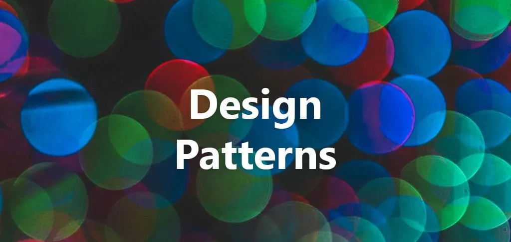

## [DP] - 後端進階 Design Pattern 



### Rule of Thumb
* 面向接口編程
* 職責單一原則
  1. 每各類應該只有單一功能
  2. 而該功能應由這各類完全封裝
* 對修改關閉、對擴展開放
  1. 在功能實踐代碼基礎上實現擴展

### Gang of four Design Patterns
* 創建型模式 
* 結構型模式
* 行為型模式

### 創建型模型
* 給客戶端提供創建對象的方式
  1. new 一個對象, set 相關屬性 如 constructor
* 

** 簡單的工廠模式 **
```java
public class FoodFactory {

    public static Food makeFood(String name) {
        if (name.equals("noodle")) {
            Food noodle = new LanZhouNoodle();
            noodle.addSpicy("more");
            return noodle;
        } else if (name.equals("chicken")) {
            Food chicken = new HuangMenChicken();
            chicken.addCondiment("potato");
            return chicken;
        } else {
            return null;
        }
    }
}

// LanZhouNoodle 和 HuangMenChicken 都继承自 Food
```

### 結構型模型


### 行為型模型


### Source
**原文: [external link](https://mp.weixin.qq.com/s/GzdKPompG1fgPPL7MDEYKA)**