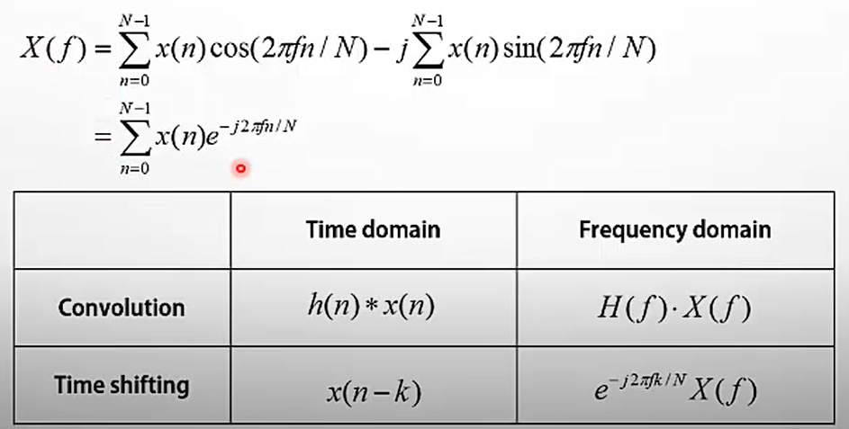
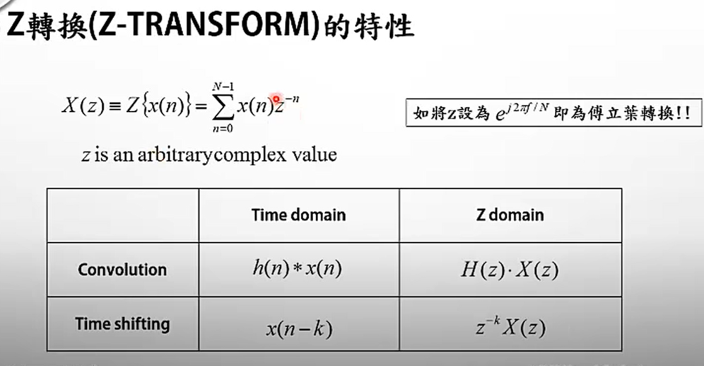
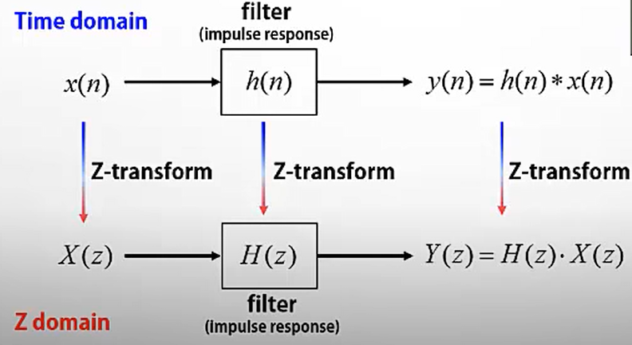
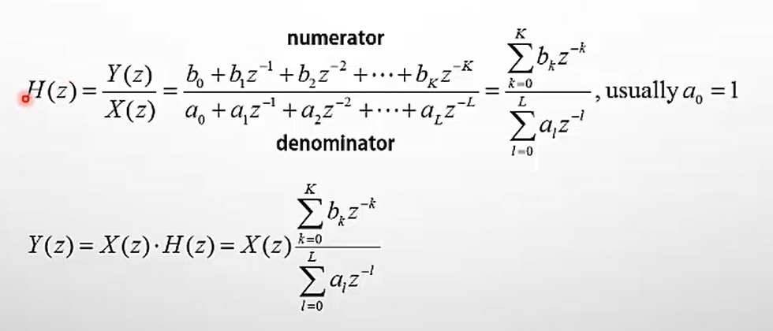
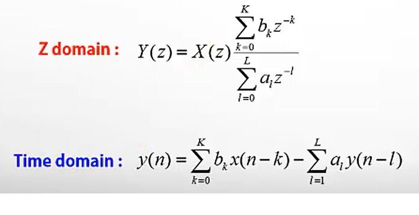
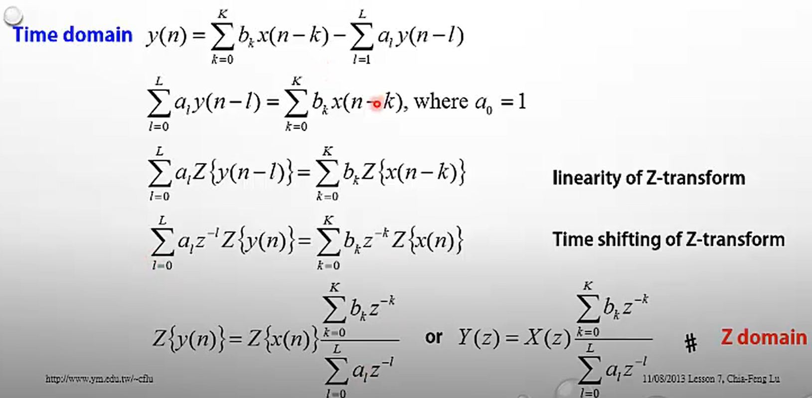
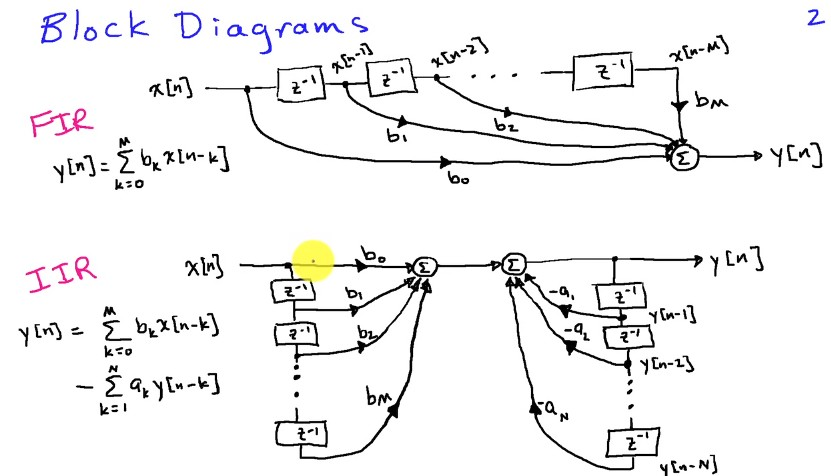

# [dsp] - Digital Filter Design

* filtering
* resampling
* denoising
* epochs, blocks
* thresholding
* normalizing
* event detecting
* pre-processing

### fourier transform
* Time domain 是 卷積 (Convolution )



### Z-transform


### Filtering technique


### Digital Transfer Function
* window function / impulse response 
* H(z) - 濾波器 = 頻率響應函式
* 看 window function 的頻率成分


### Input-output function
* 定義 aL and bK 設計濾波器
* bK 為新的點, aL*y(n-1) 為上一個 output 的點 y(n-1)
* K & L, the order of filter (the number of coefficients)


### Input-Output function (time to z domain)


### FIR (Finite Impulse Response)

### IIR (Infinite Impulse Response)




### CMSIS-DSP Q Format (Q31, Q15, Q7, F32)

> In DSP operations, when a problem cannot be solved by using an integer, and the floating-point operation spends too much time, the Q format can be used to solve the problem regarding performance and operation time.

* q31, q15, and q7 use a fixed-point number to represent the bits of fractional part. The data size is 32, 16, and 8 bits respectively, and the values are in the range of -1 to 0.9999.

  - Signed Q15 is a fixed point format where you have 15 fractional bits, and can represent values from -1 to 32767/32768 ≃ 0.9999695.
  - Signed Q31 is a fixed point format where you have 31 fractional bits, and can represent values from -1 to 2147483647/2147483648 ≃ 0.99999999953.

* f32 is the floating-point number that uses 32 bits to store and represent.

### convert 32-bit floating point values

* arm_float_to_f16

```c
void 	arm_float_to_f16 (const float32_t *pSrc, float16_t *pDst, uint32_t blockSize)
```

* arm_float_to_q15

```c
void 	arm_float_to_q15 (const float32_t *pSrc, q15_t *pDst, uint32_t blockSize)
```

* arm_float_to_q31

```c
void 	arm_float_to_q31 (const float32_t *pSrc, q31_t *pDst, uint32_t blockSize)
```

* arm_float_to_q7

```c
void 	arm_float_to_q7 (const float32_t *pSrc, q7_t *pDst, uint32_t blockSize)
/**
 * 
    [in]	*pSrc	points to the floating-point input vector
    [out]	*pDst	points to the Q7 output vector
    [in]	blockSize	length of the input vector
 */
```


### Statistics Functions

#### Mean Functions


#### Minimum Functions