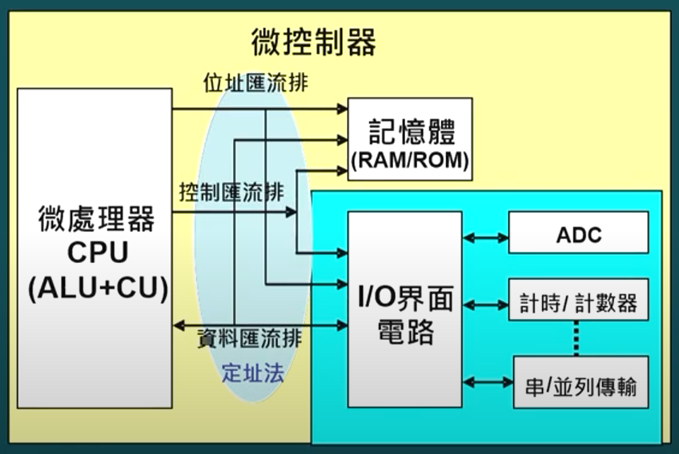

## [embed] - I/O Interface

* What is Interface

* What is Peripheral Device

* What is io interface
    * 記憶體外之周邊裝置接稱為 IO 裝置

* CPU 與周邊溝通方法
    - 匯流排系統
        * 位址匯流排
        * 資料匯流排
        * 控制匯流排



* I/O mapped I/O
    * I/O 與 記憶體有獨立定址空間
    * 對 I/O 操作與 對記憶體操作 指令不同
    * 利用硬體訊號 Mem/IO# 來區分要對 I/O 操作 或 記憶體操作
    * MOV AX, [10]      // 記憶體操作
    * IN AX, [10]       // I/O 操作


* Memory mapped I/O
    * 使用**相同指令**來對 I/O 與 記憶體存取
    * 由 CPU 產生的 位址範圍 決定是對 I/O 操作 或對 記憶體操作
    * MOV AX, [10]
    * MOV AX, [1024]


* 崁入式系統由許多 tasks (processes) 組成 相互分工完成系統功能
* 每個 task 工作內容可分兩部分
    * 資料處理部分 (Consume CPU Time) -> 不會用到匯流排
    * 資料搬移部分 (Consum I/O Bus) -> 不會用到 CPU

### Task 工作行為
* Task 依 資料處裡 和 資料搬移 比例可分
    * CPU bound
        * 資料處理佔大部分時間
        * IO 大部分在 idle
    * I/O bound
        * 資料搬移佔大部分時間
        * CPU 大部分在 idle


* CPU-based 資料搬移
    - CPU 執行資料搬移指令
    - 在搬移期間 會占用CPU時間
    - 少量資料搬移
    ```asm
        MOV A, [mem-address]
        MOV [IO-address], A
    ```

* DMA-based 資料搬移
    - 額外硬體 DMAC (Direct Memory Access Controller) 負責搬移工作
    - CPU 對 DMAC 設定
        * 記憶體起始位址
        * 資料長度
        * 搬移方向 (read/write)
        * I/O 位址
        * 啟動搬移
    - DMAC 依設定搬移資料
        * 產生記憶體位址
        * 產生記憶體 read/write 訊號
        * 產生 io 位址
        * 產生 io 之 read/write 訊號
    - 搬移過程 不佔用CPU時間

