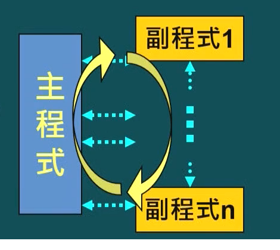
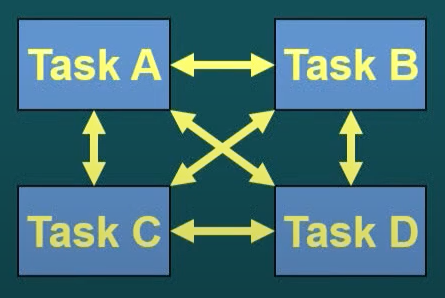
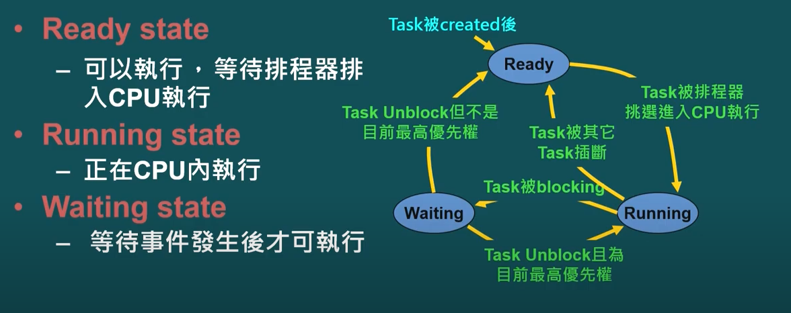
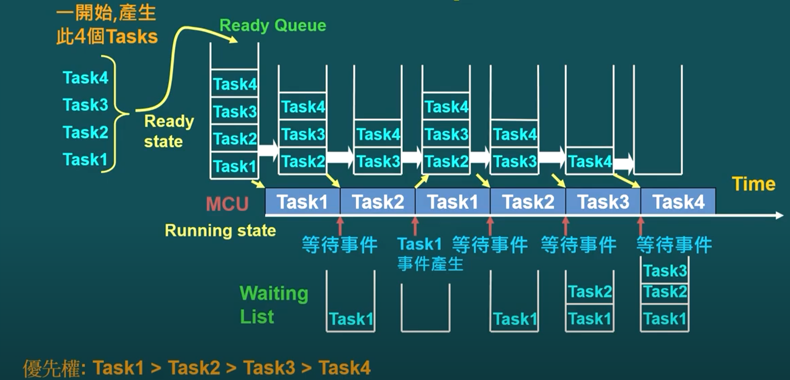

## [embed] - RTOS embedded system
### embedded 種類
* 單工 - 循環
* 單工 - foreground / background
    - Cyclic Execution
    - Cyclic Execution + Interrupt ISR
        * Non-nesting Interrupt (無巢狀中斷)
        * Nesting Interrupt (允許巢狀中斷)

## Foreground / Background 架構
* Cyclic execution + Interrupt ISR
    - Interrupt: foreground 程式
    - 即時性要求高事件須放在 foreground 程式
* Cyclic execution loop - background 程式
    - 沒發生中斷時的 loop 程式
    - Cyclic execution loop 反應時間最長為 loop cycle time
    - 執行順序事先決定

* 多工 - nesting / non-nesting 中斷
* 多工 - 程式狀態
    - event driven
    - 執行順序依實際事件發生順序決定

### Task States
* Ready State
    - 可以執行 等待排程器排入 CPU 執行
* Running State
    - 正在 CPU 執行
* Waiting State
    - 等待事件發生後才可執行

### Task Queue

### Real time OS
* Hard Real-time
    - Miss deadline 造成嚴重系統危害
* Soft Real-time
    - Miss deadline 感覺系統效能不好 但不影響運作正確性

### Embedded RTOS
* Mult-Tasking
* Event Driven
* Priority-based scheduling
    * high real-time task have higher priority