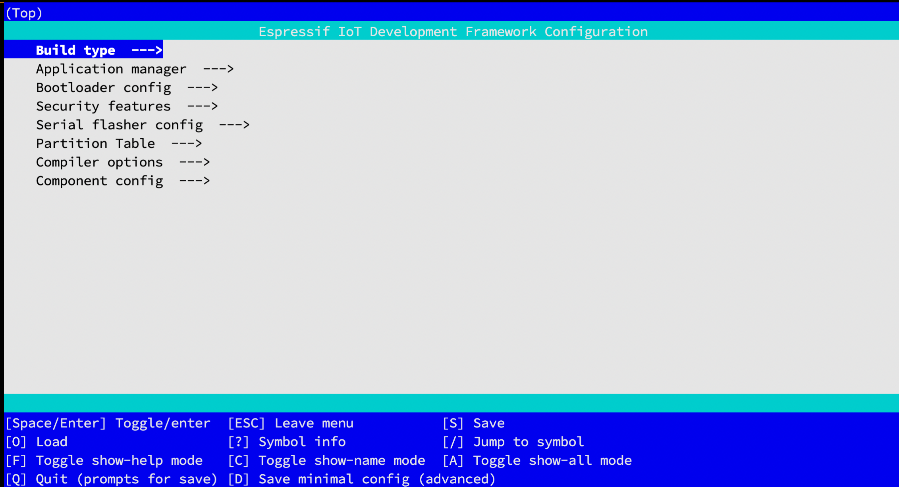

## [esp] - VS Code Extension Setup Guide

* ESP IDE
* ESP OS
* ESP Examples

#### **Installation**

* [installation guide](https://raw.githubusercontent.com/espressif/vscode-esp-idf-extension/master/docs/tutorial/install.md)

* Get ESP-IDF
  ```bash
  mkdir -p ~/esp
  cd ~/esp
  git clone --recursive https://github.com/espressif/esp-idf.git
  ```
* 確認 Python 安裝
```bash
python --verison
python3 --version
```
#### **Install PIP***
- Download
```bash
curl https://bootstrap.pypa.io/get-pip.py -o get-pip.py
```
- Install
```bash
python3 get-pip.py
```

### Install Cmake & Ninja
```bash
brew install cmake ninja dfu-util
```

### Download ESP-IDF
```
mkdir -p ~/esp
cd ~/esp
git clone --recursive https://github.com/espressif/esp-idf.git
```

### **Tool setup**
```
cd ~/esp/esp-idf
./install.sh esp32
```
> The above commands install tools for ESP32 only. If you intend to develop projects for more chip targets then you should list all of them and run for example:
```bash
cd ~/esp/esp-idf
./install.sh esp32,esp32s2
```
> In order to install tools for all supported targets please run the following command:
```bash
cd ~/esp/esp-idf
./install.sh all
```

### **Set up the environment variables**
* within ~/.zshrc add:
```bash
. $HOME/Programming/esp/esp-idf/export.sh
# add IDF_PATH
export IDF_PATH=~/esp/esp-idf
export PATH="$IDF_PATH/tools:$PATH"
```
* restart zsh
```bash
$ source ~/.zshrc
```

### check
```bash
$ printenv IDF_PATH
> $HOME/Programming/esp/esp-idf
$ which idf.py
> /Users/xxxx/Programming/esp/esp-idf/tools/idf.py
```

### Add esp tools to path
```bash
$ get_idf

Detecting the Python interpreter
Checking "python3" ...
Python 3.9.12
"python3" has been detected
Checking Python compatibility
Checking other ESP-IDF version.
Adding ESP-IDF tools to PATH...
Using Python interpreter in /Users/jubo/.espressif/python_env/idf5.0_py3.9_env/bin/python
Checking if Python packages are up to date...
Skipping the download of /Users/jubo/.espressif/espidf.constraints.v5.0.txt because it was downloaded recently. If you believe that this is causing you trouble then remove it manually and re-run your install script.
Constraint file: /Users/jubo/.espressif/espidf.constraints.v5.0.txt
Requirement files:
 - /Users/jubo/Programming/esp/esp-idf/tools/requirements/requirements.core.txt
Python being checked: /Users/jubo/.espressif/python_env/idf5.0_py3.9_env/bin/python
Python requirements are satisfied.
...
...
Done! You can now compile ESP-IDF projects.
Go to the project directory and run:

  idf.py build
```

#### **Copy Sample Project**
```bash
## create and go to path
$ mkdir esp_project && cd esp_project
## copy example to path
$ cp -r $IDF_PATH/examples/get-started/hello_world .
$ cp -r $IDF_PATH/examples/protocols/mqtt/tcp .
```
### **Create Project**

> * Use examples from ESP-IDF or
> * Use ***ESP-IDF: Show Examples Projects*** command
> * Use template: ***ESP-IDF: Create ESP-IDF Projects*** command

### **Configure Project**
```bash
cd ~/esp/hello_world
idf.py set-target esp32
idf.py menuconfig
```

### Menu Config
> idf.py menuconfig




### Build Project
```bash
idf.py build
```

### Flash to Device
> Replace PORT with your ESP32 board’s serial port name.

* You can also change the flasher baud rate by replacing BAUD with the baud rate you need. The default baud rate is 460800.

* Serial ports have the following patterns in their names:

  * Windows: names like COM1
  * Linux: starting with /dev/tty
  * macOS: starting with /dev/cu.

```bash
idf.py -p PORT [-b BAUD] flash
```

* full flash command line
```bash
# Project build complete. To flash, run this command:

/Users/jubo/.espressif/python_env/idf5.0_py3.9_env/bin/python ../../esp-idf/components/esptool_py/esptool/esptool.py -p (PORT) -b 460800 --before default_reset --after hard_reset --chip esp32  write_flash --flash_mode dio --flash_size detect --flash_freq 40m 0x1000 build/bootloader/bootloader.bin 0x8000 build/partition_table/partition-table.bin 0x10000 build/hello_world.bin

##

/Users/jubo/.espressif/python_env/idf5.0_py3.10_env/bin/python ../../../../../esp-idf/components/esptool_py/esptool/esptool.py -p /dev/cu.usbserial-120 -b 460800 --before default_reset --after hard_reset --chip esp32  write_flash --flash_mode dio --flash_size detect --flash_freq 40m 0x1000 build/bootloader/bootloader.bin 0x8000 build/partition_table/partition-table.bin 0x10000 build/gatt_client_demo.bin

/Users/jubo/.espressif/python_env/idf5.0_py3.10_env/bin/python ../../../../../esp-idf/components/esptool_py/esptool/esptool.py -p /dev/cu.usbserial-120 -b 460800 --before default_reset --after hard_reset --chip esp32  write_flash --flash_mode dio --flash_size detect --flash_freq 40m 0x1000 build/bootloader/bootloader.bin 0x8000 build/partition_table/partition-table.bin 0x10000 build/gatt_server_demos.bin
```
#### **Extension activation self configuration**

#### **Setup Wizard**


#### **JSON Manual Configuration**


#### **UI Manual Configuration**


#### **Example configuration setting values**

#### **Additional Frameworks in extensions:**
[guide](https://github.com/espressif/vscode-esp-idf-extension/blob/master/docs/tutorial/additional_frameworks.md)

### **
[latest-doc](https://espressif-docs.readthedocs-hosted.com/_/downloads/esp-idf/en/latest/pdf/)

[latest-TRM](https://www.espressif.com/sites/default/files/documentation/esp32_technical_reference_manual_en.pdf)

[esp32-ds](https://www.espressif.com/sites/default/files/documentation/esp32_datasheet_en.pdf)

[esp32-hw-design-guide](https://www.espressif.com/sites/default/files/documentation/esp32_hardware_design_guidelines_en.pdf)

[esp32-eco-bug-workaround](https://www.espressif.com/sites/default/files/documentation/eco_and_workarounds_for_bugs_in_esp32_en.pdf)

## ** Add-on & Framework**
* ESP-ADF - Expressif Audio Development Framework
  - Use "Install ESP-ADF" command:
    + Clone ESP-ADF to path and set ***idf.espMdfPath*** configuration
* ESP-MDF - Expressif Mesh Development Framework
  - Use "Install ESP-MDF" command:
    + Clone ESP-MDF to path and set ***idf.espMdfPath*** configuration
* Add Arduino-ESP32 as ESP-IDF component
* Create ESP-IDF project with arduino-as-component template


#### External Resources

* [expressif-docs](https://espressif-docs.readthedocs-hosted.com/_/downloads/esp-idf/en/latest/pdf/)


### Logs
> idf.py set-target esp32

```bash
Adding "set-target"'s dependency "fullclean" to list of commands with default set of options.
Executing action: fullclean
Build directory '/Users/coco/esp/hello_world/build' not found. Nothing to clean.
Executing action: set-target
Set Target to: esp32, new sdkconfig created. Existing sdkconfig renamed to sdkconfig.old.
Running cmake in directory /Users/coco/esp/hello_world/build
Executing "cmake -G Ninja -DPYTHON_DEPS_CHECKED=1 -DESP_PLATFORM=1 -DIDF_TARGET=esp32 -DCCACHE_ENABLE=0 /Users/coco/esp/hello_world"...
-- Found Git: /opt/homebrew/bin/git (found version "2.35.1")

-- The C compiler identification is GNU 8.4.0
-- The CXX compiler identification is GNU 8.4.0
-- The ASM compiler identification is GNU
-- Found assembler: /Users/coco/.espressif/tools/xtensa-esp32-elf/esp-2021r2-patch3-8.4.0/xtensa-esp32-elf/bin/xtensa-esp32-elf-gcc
-- Detecting C compiler ABI info
-- Detecting C compiler ABI info - done
-- Check for working C compiler: /Users/coco/.espressif/tools/xtensa-esp32-elf/esp-2021r2-patch3-8.4.0/xtensa-esp32-elf/bin/xtensa-esp32-elf-gcc - skipped
-- Detecting C compile features
-- Detecting C compile features - done
-- Detecting CXX compiler ABI info
-- Detecting CXX compiler ABI info - done
-- Check for working CXX compiler: /Users/coco/.espressif/tools/xtensa-esp32-elf/esp-2021r2-patch3-8.4.0/xtensa-esp32-elf/bin/xtensa-esp32-elf-g++ - skipped
-- Detecting CXX compile features
-- Detecting CXX compile features - done
-- Project is not inside a git repository, or git repository has no commits; will not use 'git describe' to determine PROJECT_VER.
-- Building ESP-IDF components for target esp32
-- Project sdkconfig file /Users/coco/esp/hello_world/sdkconfig
-- Looking for sys/types.h
-- Looking for sys/types.h - found
-- Looking for stdint.h
-- Looking for stdint.h - found
-- Looking for stddef.h
-- Looking for stddef.h - found
-- Check size of time_t
-- Check size of time_t - done
-- Found Python3: /Users/coco/.espressif/python_env/idf5.0_py3.8_env/bin/python (found version "3.8.9") found components: Interpreter
-- Performing Test C_COMPILER_SUPPORTS_WFORMAT_SIGNEDNESS
-- Performing Test C_COMPILER_SUPPORTS_WFORMAT_SIGNEDNESS - Success
-- App "hello_world" version: 1

### Linking

-- Adding linker script /Users/coco/esp/hello_world/build/esp-idf/esp_system/ld/memory.ld
-- Adding linker script /Users/coco/esp/esp-idf/components/esp_system/ld/esp32/sections.ld.in
-- Adding linker script /Users/coco/esp/esp-idf/components/esp_rom/esp32/ld/esp32.rom.ld
-- Adding linker script /Users/coco/esp/esp-idf/components/esp_rom/esp32/ld/esp32.rom.api.ld
-- Adding linker script /Users/coco/esp/esp-idf/components/esp_rom/esp32/ld/esp32.rom.libgcc.ld
-- Adding linker script /Users/coco/esp/esp-idf/components/esp_rom/esp32/ld/esp32.rom.newlib-data.ld
-- Adding linker script /Users/coco/esp/esp-idf/components/esp_rom/esp32/ld/esp32.rom.syscalls.ld
-- Adding linker script /Users/coco/esp/esp-idf/components/esp_rom/esp32/ld/esp32.rom.newlib-funcs.ld
-- Adding linker script /Users/coco/esp/esp-idf/components/esp_rom/esp32/ld/esp32.rom.newlib-time.ld
-- Adding linker script /Users/coco/esp/esp-idf/components/soc/esp32/ld/esp32.peripherals.ld

### Components

-- Components: app_trace app_update asio bootloader bootloader_support bt cmock console cxx driver efuse esp-tls esp32 esp_adc_cal esp_common esp_eth esp_event esp_gdbstub esp_hid esp_http_client esp_http_server esp_https_ota esp_https_server esp_hw_support esp_lcd esp_local_ctrl esp_netif esp_phy esp_pm esp_ringbuf esp_rom esp_serial_slave_link esp_system esp_timer esp_wifi espcoredump esptool_py fatfs freemodbus freertos hal heap http_parser idf_test ieee802154 json log lwip main mbedtls mdns mqtt newlib nvs_flash openthread partition_table perfmon protobuf-c protocomm pthread sdmmc soc spi_flash spiffs tcp_transport tinyusb ulp unity usb vfs wear_levelling wifi_provisioning wpa_supplicant xtensa

### Component Paths

-- Component paths: /Users/coco/esp/esp-idf/components/app_trace /Users/coco/esp/esp-idf/components/app_update /Users/coco/esp/esp-idf/components/asio /Users/coco/esp/esp-idf/components/bootloader /Users/coco/esp/esp-idf/components/bootloader_support /Users/coco/esp/esp-idf/components/bt /Users/coco/esp/esp-idf/components/cmock /Users/coco/esp/esp-idf/components/console /Users/coco/esp/esp-idf/components/cxx /Users/coco/esp/esp-idf/components/driver /Users/coco/esp/esp-idf/components/efuse /Users/coco/esp/esp-idf/components/esp-tls /Users/coco/esp/esp-idf/components/esp32 /Users/coco/esp/esp-idf/components/esp_adc_cal /Users/coco/esp/esp-idf/components/esp_common /Users/coco/esp/esp-idf/components/esp_eth /Users/coco/esp/esp-idf/components/esp_event /Users/coco/esp/esp-idf/components/esp_gdbstub /Users/coco/esp/esp-idf/components/esp_hid /Users/coco/esp/esp-idf/components/esp_http_client /Users/coco/esp/esp-idf/components/esp_http_server /Users/coco/esp/esp-idf/components/esp_https_ota /Users/coco/esp/esp-idf/components/esp_https_server /Users/coco/esp/esp-idf/components/esp_hw_support /Users/coco/esp/esp-idf/components/esp_lcd /Users/coco/esp/esp-idf/components/esp_local_ctrl /Users/coco/esp/esp-idf/components/esp_netif /Users/coco/esp/esp-idf/components/esp_phy /Users/coco/esp/esp-idf/components/esp_pm /Users/coco/esp/esp-idf/components/esp_ringbuf /Users/coco/esp/esp-idf/components/esp_rom /Users/coco/esp/esp-idf/components/esp_serial_slave_link /Users/coco/esp/esp-idf/components/esp_system /Users/coco/esp/esp-idf/components/esp_timer /Users/coco/esp/esp-idf/components/esp_wifi /Users/coco/esp/esp-idf/components/espcoredump /Users/coco/esp/esp-idf/components/esptool_py /Users/coco/esp/esp-idf/components/fatfs /Users/coco/esp/esp-idf/components/freemodbus /Users/coco/esp/esp-idf/components/freertos /Users/coco/esp/esp-idf/components/hal /Users/coco/esp/esp-idf/components/heap /Users/coco/esp/esp-idf/components/http_parser /Users/coco/esp/esp-idf/components/idf_test /Users/coco/esp/esp-idf/components/ieee802154 /Users/coco/esp/esp-idf/components/json /Users/coco/esp/esp-idf/components/log /Users/coco/esp/esp-idf/components/lwip /Users/coco/esp/hello_world/main /Users/coco/esp/esp-idf/components/mbedtls /Users/coco/esp/esp-idf/components/mdns /Users/coco/esp/esp-idf/components/mqtt /Users/coco/esp/esp-idf/components/newlib /Users/coco/esp/esp-idf/components/nvs_flash /Users/coco/esp/esp-idf/components/openthread /Users/coco/esp/esp-idf/components/partition_table /Users/coco/esp/esp-idf/components/perfmon /Users/coco/esp/esp-idf/components/protobuf-c /Users/coco/esp/esp-idf/components/protocomm /Users/coco/esp/esp-idf/components/pthread /Users/coco/esp/esp-idf/components/sdmmc /Users/coco/esp/esp-idf/components/soc /Users/coco/esp/esp-idf/components/spi_flash /Users/coco/esp/esp-idf/components/spiffs /Users/coco/esp/esp-idf/components/tcp_transport /Users/coco/esp/esp-idf/components/tinyusb /Users/coco/esp/esp-idf/components/ulp /Users/coco/esp/esp-idf/components/unity /Users/coco/esp/esp-idf/components/usb /Users/coco/esp/esp-idf/components/vfs /Users/coco/esp/esp-idf/components/wear_levelling /Users/coco/esp/esp-idf/components/wifi_provisioning /Users/coco/esp/esp-idf/components/wpa_supplicant /Users/coco/esp/esp-idf/components/xtensa


-- Configuring done
-- Generating done
-- Build files have been written to: /Users/coco/esp/hello_world/build
```

### Build Project Logs
- idf.py build
> This command will compile the application and all ESP-IDF components, then it will generate the bootloader, partition table, and application binaries.

```bash
Executing action: all (aliases: build)
Running ninja in directory /Users/coco/esp/hello_world/build
Executing "ninja all"...
[0/1] Re-running CMake...
-- Project is not inside a git repository, or git repository has no commits; will not use 'git describe' to determine PROJECT_VER.
-- Building ESP-IDF components for target esp32
-- Project sdkconfig file /Users/coco/esp/hello_world/sdkconfig
-- App "hello_world" version: 1
-- Adding linker script /Users/coco/esp/hello_world/build/esp-idf/esp_system/ld/memory.ld
-- Adding linker script /Users/coco/esp/esp-idf/components/esp_system/ld/esp32/sections.ld.in
-- Adding linker script /Users/coco/esp/esp-idf/components/esp_rom/esp32/ld/esp32.rom.ld
-- Adding linker script /Users/coco/esp/esp-idf/components/esp_rom/esp32/ld/esp32.rom.api.ld
-- Adding linker script /Users/coco/esp/esp-idf/components/esp_rom/esp32/ld/esp32.rom.libgcc.ld
-- Adding linker script /Users/coco/esp/esp-idf/components/esp_rom/esp32/ld/esp32.rom.newlib-data.ld
-- Adding linker script /Users/coco/esp/esp-idf/components/esp_rom/esp32/ld/esp32.rom.syscalls.ld
-- Adding linker script /Users/coco/esp/esp-idf/components/esp_rom/esp32/ld/esp32.rom.newlib-funcs.ld
-- Adding linker script /Users/coco/esp/esp-idf/components/esp_rom/esp32/ld/esp32.rom.newlib-time.ld
-- Adding linker script /Users/coco/esp/esp-idf/components/soc/esp32/ld/esp32.peripherals.ld
-- Components: app_trace app_update asio bootloader bootloader_support bt cmock console cxx driver efuse esp-tls esp32 esp_adc_cal esp_common esp_eth esp_event esp_gdbstub esp_hid esp_http_client esp_http_server esp_https_ota esp_https_server esp_hw_support esp_lcd esp_local_ctrl esp_netif esp_phy esp_pm esp_ringbuf esp_rom esp_serial_slave_link esp_system esp_timer esp_wifi espcoredump esptool_py fatfs freemodbus freertos hal heap http_parser idf_test ieee802154 json log lwip main mbedtls mdns mqtt newlib nvs_flash openthread partition_table perfmon protobuf-c protocomm pthread sdmmc soc spi_flash spiffs tcp_transport tinyusb ulp unity usb vfs wear_levelling wifi_provisioning wpa_supplicant xtensa
-- Component paths: /Users/coco/esp/esp-idf/components/app_trace /Users/coco/esp/esp-idf/components/app_update /Users/coco/esp/esp-idf/components/asio /Users/coco/esp/esp-idf/components/bootloader /Users/coco/esp/esp-idf/components/bootloader_support /Users/coco/esp/esp-idf/components/bt /Users/coco/esp/esp-idf/components/cmock /Users/coco/esp/esp-idf/components/console /Users/coco/esp/esp-idf/components/cxx /Users/coco/esp/esp-idf/components/driver /Users/coco/esp/esp-idf/components/efuse /Users/coco/esp/esp-idf/components/esp-tls /Users/coco/esp/esp-idf/components/esp32 /Users/coco/esp/esp-idf/components/esp_adc_cal /Users/coco/esp/esp-idf/components/esp_common /Users/coco/esp/esp-idf/components/esp_eth /Users/coco/esp/esp-idf/components/esp_event /Users/coco/esp/esp-idf/components/esp_gdbstub /Users/coco/esp/esp-idf/components/esp_hid /Users/coco/esp/esp-idf/components/esp_http_client /Users/coco/esp/esp-idf/components/esp_http_server /Users/coco/esp/esp-idf/components/esp_https_ota /Users/coco/esp/esp-idf/components/esp_https_server /Users/coco/esp/esp-idf/components/esp_hw_support /Users/coco/esp/esp-idf/components/esp_lcd /Users/coco/esp/esp-idf/components/esp_local_ctrl /Users/coco/esp/esp-idf/components/esp_netif /Users/coco/esp/esp-idf/components/esp_phy /Users/coco/esp/esp-idf/components/esp_pm /Users/coco/esp/esp-idf/components/esp_ringbuf /Users/coco/esp/esp-idf/components/esp_rom /Users/coco/esp/esp-idf/components/esp_serial_slave_link /Users/coco/esp/esp-idf/components/esp_system /Users/coco/esp/esp-idf/components/esp_timer /Users/coco/esp/esp-idf/components/esp_wifi /Users/coco/esp/esp-idf/components/espcoredump /Users/coco/esp/esp-idf/components/esptool_py /Users/coco/esp/esp-idf/components/fatfs /Users/coco/esp/esp-idf/components/freemodbus /Users/coco/esp/esp-idf/components/freertos /Users/coco/esp/esp-idf/components/hal /Users/coco/esp/esp-idf/components/heap /Users/coco/esp/esp-idf/components/http_parser /Users/coco/esp/esp-idf/components/idf_test /Users/coco/esp/esp-idf/components/ieee802154 /Users/coco/esp/esp-idf/components/json /Users/coco/esp/esp-idf/components/log /Users/coco/esp/esp-idf/components/lwip /Users/coco/esp/hello_world/main /Users/coco/esp/esp-idf/components/mbedtls /Users/coco/esp/esp-idf/components/mdns /Users/coco/esp/esp-idf/components/mqtt /Users/coco/esp/esp-idf/components/newlib /Users/coco/esp/esp-idf/components/nvs_flash /Users/coco/esp/esp-idf/components/openthread /Users/coco/esp/esp-idf/components/partition_table /Users/coco/esp/esp-idf/components/perfmon /Users/coco/esp/esp-idf/components/protobuf-c /Users/coco/esp/esp-idf/components/protocomm /Users/coco/esp/esp-idf/components/pthread /Users/coco/esp/esp-idf/components/sdmmc /Users/coco/esp/esp-idf/components/soc /Users/coco/esp/esp-idf/components/spi_flash /Users/coco/esp/esp-idf/components/spiffs /Users/coco/esp/esp-idf/components/tcp_transport /Users/coco/esp/esp-idf/components/tinyusb /Users/coco/esp/esp-idf/components/ulp /Users/coco/esp/esp-idf/components/unity /Users/coco/esp/esp-idf/components/usb /Users/coco/esp/esp-idf/components/vfs /Users/coco/esp/esp-idf/components/wear_levelling /Users/coco/esp/esp-idf/components/wifi_provisioning /Users/coco/esp/esp-idf/components/wpa_supplicant /Users/coco/esp/esp-idf/components/xtensa
-- Configuring done
-- Generating done
-- Build files have been written to: /Users/coco/esp/hello_world/build
[3/1203] Generating ../../partition_table/partition-table.bin
Partition table binary generated. Contents:
*******************************************************************************
# ESP-IDF Partition Table
# Name, Type, SubType, Offset, Size, Flags
nvs,data,nvs,0x9000,24K,
phy_init,data,phy,0xf000,4K,
factory,app,factory,0x10000,1M,
*******************************************************************************
[621/1203] Performing configure step for 'bootloader'
-- Found Git: /opt/homebrew/bin/git (found version "2.35.1")
-- The C compiler identification is GNU 8.4.0
-- The CXX compiler identification is GNU 8.4.0
-- The ASM compiler identification is GNU
-- Found assembler: /Users/coco/.espressif/tools/xtensa-esp32-elf/esp-2021r2-patch3-8.4.0/xtensa-esp32-elf/bin/xtensa-esp32-elf-gcc
-- Detecting C compiler ABI info
-- Detecting C compiler ABI info - done
-- Check for working C compiler: /Users/coco/.espressif/tools/xtensa-esp32-elf/esp-2021r2-patch3-8.4.0/xtensa-esp32-elf/bin/xtensa-esp32-elf-gcc - skipped
-- Detecting C compile features
-- Detecting C compile features - done
-- Detecting CXX compiler ABI info
-- Detecting CXX compiler ABI info - done
-- Check for working CXX compiler: /Users/coco/.espressif/tools/xtensa-esp32-elf/esp-2021r2-patch3-8.4.0/xtensa-esp32-elf/bin/xtensa-esp32-elf-g++ - skipped
-- Detecting CXX compile features
-- Detecting CXX compile features - done
-- Building ESP-IDF components for target esp32
-- Project sdkconfig file /Users/coco/esp/hello_world/sdkconfig
-- Looking for sys/types.h
-- Looking for sys/types.h - found
-- Looking for stdint.h
-- Looking for stdint.h - found
-- Looking for stddef.h
-- Looking for stddef.h - found
-- Check size of time_t
-- Check size of time_t - done
-- Adding linker script /Users/coco/esp/esp-idf/components/soc/esp32/ld/esp32.peripherals.ld
-- Adding linker script /Users/coco/esp/esp-idf/components/esp_rom/esp32/ld/esp32.rom.ld
-- Adding linker script /Users/coco/esp/esp-idf/components/esp_rom/esp32/ld/esp32.rom.api.ld
-- Adding linker script /Users/coco/esp/esp-idf/components/esp_rom/esp32/ld/esp32.rom.libgcc.ld
-- Adding linker script /Users/coco/esp/esp-idf/components/esp_rom/esp32/ld/esp32.rom.newlib-funcs.ld
-- Adding linker script /Users/coco/esp/esp-idf/components/bootloader/subproject/main/ld/esp32/bootloader.ld
-- Adding linker script /Users/coco/esp/esp-idf/components/bootloader/subproject/main/ld/esp32/bootloader.rom.ld
-- Components: bootloader bootloader_support efuse esp32 esp_common esp_hw_support esp_rom esp_system esptool_py freertos hal log main micro-ecc newlib partition_table soc spi_flash xtensa
-- Component paths: /Users/coco/esp/esp-idf/components/bootloader /Users/coco/esp/esp-idf/components/bootloader_support /Users/coco/esp/esp-idf/components/efuse /Users/coco/esp/esp-idf/components/esp32 /Users/coco/esp/esp-idf/components/esp_common /Users/coco/esp/esp-idf/components/esp_hw_support /Users/coco/esp/esp-idf/components/esp_rom /Users/coco/esp/esp-idf/components/esp_system /Users/coco/esp/esp-idf/components/esptool_py /Users/coco/esp/esp-idf/components/freertos /Users/coco/esp/esp-idf/components/hal /Users/coco/esp/esp-idf/components/log /Users/coco/esp/esp-idf/components/bootloader/subproject/main /Users/coco/esp/esp-idf/components/bootloader/subproject/components/micro-ecc /Users/coco/esp/esp-idf/components/newlib /Users/coco/esp/esp-idf/components/partition_table /Users/coco/esp/esp-idf/components/soc /Users/coco/esp/esp-idf/components/spi_flash /Users/coco/esp/esp-idf/components/xtensa
-- Configuring done
-- Generating done
-- Build files have been written to: /Users/coco/esp/hello_world/build/bootloader
[668/1203] Performing build step for 'bootloader'
[1/98] Generating project_elf_src_esp32.c
[2/98] Building C object CMakeFiles/bootloader.elf.dir/project_elf_src_esp32.c.obj
[3/98] Building C object esp-idf/soc/CMakeFiles/__idf_soc.dir/esp32/ledc_periph.c.obj
[4/98] Building C object esp-idf/soc/CMakeFiles/__idf_soc.dir/esp32/i2c_periph.c.obj
[5/98] Building C object esp-idf/soc/CMakeFiles/__idf_soc.dir/esp32/i2s_periph.c.obj
[6/98] Building C object esp-idf/soc/CMakeFiles/__idf_soc.dir/esp32/dac_periph.c.obj
[7/98] Building C object esp-idf/soc/CMakeFiles/__idf_soc.dir/esp32/lcd_periph.c.obj
[8/98] Building C object esp-idf/soc/CMakeFiles/__idf_soc.dir/esp32/interrupts.c.obj
[9/98] Building C object esp-idf/soc/CMakeFiles/__idf_soc.dir/esp32/adc_periph.c.obj
[10/98] Building C object esp-idf/soc/CMakeFiles/__idf_soc.dir/esp32/gpio_periph.c.obj
[11/98] Building C object esp-idf/soc/CMakeFiles/__idf_soc.dir/esp32/mcpwm_periph.c.obj
[12/98] Building C object esp-idf/soc/CMakeFiles/__idf_soc.dir/lldesc.c.obj
[13/98] Building C object esp-idf/soc/CMakeFiles/__idf_soc.dir/esp32/pcnt_periph.c.obj
[14/98] Building C object esp-idf/soc/CMakeFiles/__idf_soc.dir/esp32/rmt_periph.c.obj
[15/98] Building C object esp-idf/soc/CMakeFiles/__idf_soc.dir/esp32/sigmadelta_periph.c.obj
[16/98] Building C object esp-idf/soc/CMakeFiles/__idf_soc.dir/esp32/sdmmc_periph.c.obj
[17/98] Building C object esp-idf/soc/CMakeFiles/__idf_soc.dir/esp32/timer_periph.c.obj
[18/98] Building C object esp-idf/soc/CMakeFiles/__idf_soc.dir/esp32/spi_periph.c.obj
[19/98] Building C object esp-idf/soc/CMakeFiles/__idf_soc.dir/esp32/rtc_io_periph.c.obj
[20/98] Building C object esp-idf/soc/CMakeFiles/__idf_soc.dir/esp32/sdio_slave_periph.c.obj
[21/98] Building C object esp-idf/soc/CMakeFiles/__idf_soc.dir/esp32/uart_periph.c.obj
[22/98] Building C object esp-idf/soc/CMakeFiles/__idf_soc.dir/esp32/touch_sensor_periph.c.obj
[23/98] Building C object esp-idf/hal/CMakeFiles/__idf_hal.dir/mpu_hal.c.obj
[24/98] Building C object esp-idf/bootloader_support/CMakeFiles/__idf_bootloader_support.dir/src/bootloader_mem.c.obj
[25/98] Building C object esp-idf/hal/CMakeFiles/__idf_hal.dir/efuse_hal.c.obj
[26/98] Building C object esp-idf/hal/CMakeFiles/__idf_hal.dir/mmu_hal.c.obj
[27/98] Building C object esp-idf/hal/CMakeFiles/__idf_hal.dir/cpu_hal.c.obj
[28/98] Building C object esp-idf/hal/CMakeFiles/__idf_hal.dir/wdt_hal_iram.c.obj
[29/98] Building C object esp-idf/hal/CMakeFiles/__idf_hal.dir/esp32/efuse_hal.c.obj
[30/98] Building C object esp-idf/bootloader_support/CMakeFiles/__idf_bootloader_support.dir/src/bootloader_random.c.obj
[31/98] Building C object esp-idf/bootloader_support/CMakeFiles/__idf_bootloader_support.dir/src/bootloader_clock_init.c.obj
[32/98] Building C object esp-idf/bootloader_support/CMakeFiles/__idf_bootloader_support.dir/src/bootloader_common_loader.c.obj
[33/98] Building C object esp-idf/bootloader_support/CMakeFiles/__idf_bootloader_support.dir/src/bootloader_random_esp32.c.obj
[34/98] Building C object esp-idf/bootloader_support/CMakeFiles/__idf_bootloader_support.dir/src/secure_boot.c.obj
[35/98] Building C object esp-idf/bootloader_support/CMakeFiles/__idf_bootloader_support.dir/src/bootloader_common.c.obj
[36/98] Building C object esp-idf/bootloader_support/CMakeFiles/__idf_bootloader_support.dir/src/flash_encrypt.c.obj
[37/98] Building C object esp-idf/bootloader_support/CMakeFiles/__idf_bootloader_support.dir/src/flash_partitions.c.obj
[38/98] Building C object esp-idf/bootloader_support/CMakeFiles/__idf_bootloader_support.dir/bootloader_flash/src/bootloader_flash_config_esp32.c.obj
[39/98] Building C object esp-idf/bootloader_support/CMakeFiles/__idf_bootloader_support.dir/bootloader_flash/src/bootloader_flash.c.obj
[40/98] Building C object esp-idf/bootloader_support/CMakeFiles/__idf_bootloader_support.dir/src/bootloader_init.c.obj
[41/98] Building C object esp-idf/bootloader_support/CMakeFiles/__idf_bootloader_support.dir/src/bootloader_efuse.c.obj
[42/98] Building C object esp-idf/bootloader_support/CMakeFiles/__idf_bootloader_support.dir/bootloader_flash/src/flash_qio_mode.c.obj
[43/98] Building C object esp-idf/bootloader_support/CMakeFiles/__idf_bootloader_support.dir/src/bootloader_panic.c.obj
[44/98] Building C object esp-idf/bootloader_support/CMakeFiles/__idf_bootloader_support.dir/src/esp_image_format.c.obj
[45/98] Building C object esp-idf/bootloader_support/CMakeFiles/__idf_bootloader_support.dir/src/bootloader_clock_loader.c.obj
[46/98] Building C object esp-idf/bootloader_support/CMakeFiles/__idf_bootloader_support.dir/src/bootloader_console_loader.c.obj
[47/98] Building C object esp-idf/bootloader_support/CMakeFiles/__idf_bootloader_support.dir/src/bootloader_utility.c.obj
[48/98] Building C object esp-idf/bootloader_support/CMakeFiles/__idf_bootloader_support.dir/src/esp32/bootloader_soc.c.obj
[49/98] Building C object esp-idf/bootloader_support/CMakeFiles/__idf_bootloader_support.dir/src/bootloader_console.c.obj
[50/98] Building C object esp-idf/efuse/CMakeFiles/__idf_efuse.dir/esp32/esp_efuse_table.c.obj
[51/98] Building C object esp-idf/bootloader_support/CMakeFiles/__idf_bootloader_support.dir/src/esp32/bootloader_sha.c.obj
[52/98] Building C object esp-idf/efuse/CMakeFiles/__idf_efuse.dir/src/esp_efuse_fields.c.obj
[53/98] Building C object esp-idf/efuse/CMakeFiles/__idf_efuse.dir/src/esp_efuse_api.c.obj
[54/98] Building C object esp-idf/efuse/CMakeFiles/__idf_efuse.dir/esp32/esp_efuse_fields.c.obj
[55/98] Building C object esp-idf/micro-ecc/CMakeFiles/__idf_micro-ecc.dir/uECC_verify_antifault.c.obj
[56/98] Building C object esp-idf/esp_system/CMakeFiles/__idf_esp_system.dir/esp_err.c.obj
[57/98] Building C object esp-idf/esp_hw_support/CMakeFiles/__idf_esp_hw_support.dir/compare_set.c.obj
[58/98] Building C object esp-idf/bootloader_support/CMakeFiles/__idf_bootloader_support.dir/src/esp32/bootloader_esp32.c.obj
[59/98] Building C object esp-idf/efuse/CMakeFiles/__idf_efuse.dir/esp32/esp_efuse_utility.c.obj
[60/98] Building C object esp-idf/esp_hw_support/CMakeFiles/__idf_esp_hw_support.dir/cpu_util.c.obj
[61/98] Building C object esp-idf/efuse/CMakeFiles/__idf_efuse.dir/src/efuse_controller/keys/without_key_purposes/three_key_blocks/esp_efuse_api_key.c.obj
[62/98] Building C object esp-idf/efuse/CMakeFiles/__idf_efuse.dir/src/esp_efuse_utility.c.obj
[63/98] Building C object esp-idf/xtensa/CMakeFiles/__idf_xtensa.dir/eri.c.obj
[64/98] Building C object esp-idf/esp_hw_support/CMakeFiles/__idf_esp_hw_support.dir/port/esp32/rtc_pm.c.obj
[65/98] Building C object esp-idf/xtensa/CMakeFiles/__idf_xtensa.dir/xt_trax.c.obj
[66/98] Building C object esp-idf/esp_hw_support/CMakeFiles/__idf_esp_hw_support.dir/port/esp32/rtc_clk_init.c.obj
[67/98] Building C object esp-idf/esp_rom/CMakeFiles/__idf_esp_rom.dir/patches/esp_rom_crc.c.obj
[68/98] Building C object esp-idf/esp_rom/CMakeFiles/__idf_esp_rom.dir/patches/esp_rom_sys.c.obj
[69/98] Building C object esp-idf/esp_hw_support/CMakeFiles/__idf_esp_hw_support.dir/port/esp32/chip_info.c.obj
[70/98] Building C object esp-idf/esp_hw_support/CMakeFiles/__idf_esp_hw_support.dir/port/esp32/rtc_init.c.obj
[71/98] Building C object esp-idf/esp_hw_support/CMakeFiles/__idf_esp_hw_support.dir/port/esp32/rtc_sleep.c.obj
[72/98] Building C object esp-idf/esp_hw_support/CMakeFiles/__idf_esp_hw_support.dir/port/esp32/rtc_time.c.obj
[73/98] Building C object esp-idf/esp_rom/CMakeFiles/__idf_esp_rom.dir/patches/esp_rom_tjpgd.c.obj
[74/98] Building ASM object esp-idf/esp_rom/CMakeFiles/__idf_esp_rom.dir/patches/esp_rom_longjmp.S.obj
[75/98] Building C object esp-idf/esp_rom/CMakeFiles/__idf_esp_rom.dir/patches/esp_rom_regi2c.c.obj
[76/98] Building C object esp-idf/esp_common/CMakeFiles/__idf_esp_common.dir/src/esp_err_to_name.c.obj
[77/98] Building C object esp-idf/esp_rom/CMakeFiles/__idf_esp_rom.dir/patches/esp_rom_uart.c.obj
[78/98] Building C object esp-idf/main/CMakeFiles/__idf_main.dir/bootloader_start.c.obj
[79/98] Building C object esp-idf/log/CMakeFiles/__idf_log.dir/log_noos.c.obj
[80/98] Building C object esp-idf/esp_hw_support/CMakeFiles/__idf_esp_hw_support.dir/port/esp32/rtc_clk.c.obj
[81/98] Building C object esp-idf/log/CMakeFiles/__idf_log.dir/log_buffers.c.obj
[82/98] Building C object esp-idf/log/CMakeFiles/__idf_log.dir/log.c.obj
[83/98] Linking C static library esp-idf/log/liblog.a
[84/98] Building C object esp-idf/esp_rom/CMakeFiles/__idf_esp_rom.dir/patches/esp_rom_spiflash.c.obj
[85/98] Linking C static library esp-idf/esp_rom/libesp_rom.a
[86/98] Linking C static library esp-idf/esp_common/libesp_common.a
[87/98] Linking C static library esp-idf/xtensa/libxtensa.a
[88/98] Linking C static library esp-idf/esp_hw_support/libesp_hw_support.a
[89/98] Linking C static library esp-idf/esp_system/libesp_system.a
[90/98] Linking C static library esp-idf/efuse/libefuse.a
[91/98] Linking C static library esp-idf/bootloader_support/libbootloader_support.a
[92/98] Linking C static library esp-idf/hal/libhal.a
[93/98] Linking C static library esp-idf/micro-ecc/libmicro-ecc.a
[94/98] Linking C static library esp-idf/soc/libsoc.a
[95/98] Linking C static library esp-idf/main/libmain.a
[96/98] Linking C executable bootloader.elf
[97/98] Generating binary image from built executable
esptool.py v3.3-dev
Creating esp32 image...
Merged 1 ELF section
Successfully created esp32 image.
Generated /Users/coco/esp/hello_world/build/bootloader/bootloader.bin
[98/98] cd /Users/coco/esp/hello_world/build/bootloader/esp-idf/esptool_py && /Users/coco/.espressif/python_env/idf5.0_py3.8_env/bin/python /Users/coco/esp/esp-idf/components/partition_table/check_sizes.py --offset 0x8000 bootloader 0x1000 /Users/coco/esp/hello_world/build/bootloader/bootloader.bin
Bootloader binary size 0x65c0 bytes. 0xa40 bytes (9%) free.
[1202/1203] Generating binary image from built executable
esptool.py v3.3-dev
Creating esp32 image...
Merged 2 ELF sections
Successfully created esp32 image.
Generated /Users/coco/esp/hello_world/build/hello_world.bin
[1203/1203] cd /Users/coco/esp/hello_world/build/esp-id...e.bin /Users/coco/esp/hello_world/build/hello_world.bin
hello_world.bin binary size 0x2b5e0 bytes. Smallest app partition is 0x100000 bytes. 0xd4a20 bytes (83%) free.

Project build complete. To flash, run this command:
/Users/coco/.espressif/python_env/idf5.0_py3.8_env/bin/python ../esp-idf/components/esptool_py/esptool/esptool.py -p (PORT) -b 460800 --before default_reset --after hard_reset --chip esp32  write_flash --flash_mode dio --flash_size detect --flash_freq 40m 0x1000 build/bootloader/bootloader.bin 0x8000 build/partition_table/partition-table.bin 0x10000 build/hello_world.bin
or run 'idf.py -p (PORT) flash'
```