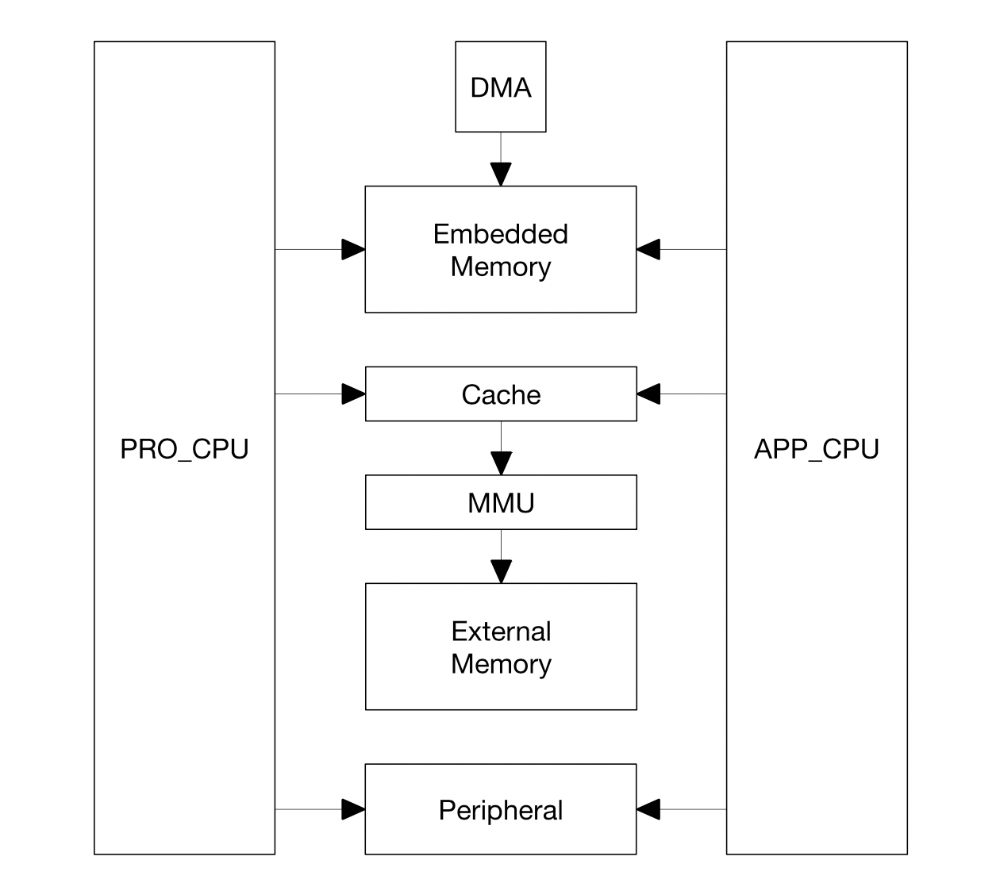
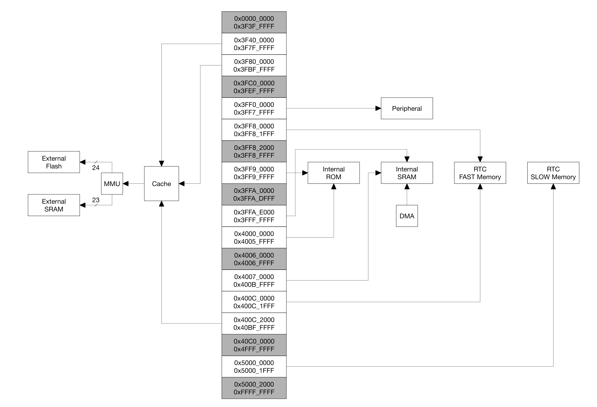

## [esp] - Technical Reference Manual Notes 筆記

#### **System Overview**
* Two Harvard Architecture Xtensa LX6 CPUs.
* Shared memory, cache, external memory, peripheral.
* Symmetric memory mapping.
    * PRO_CPU - protocol cpu
    * APP_CPU - application cpu

#### **Memory Map**

#### **Address Mapping**

#### **Memory Address Mapping**

