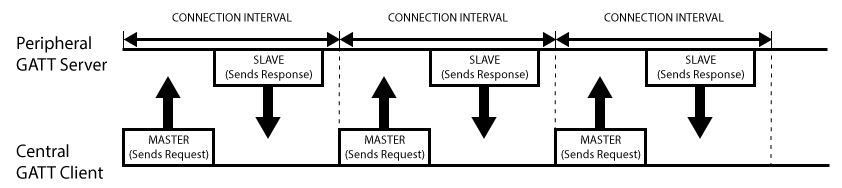
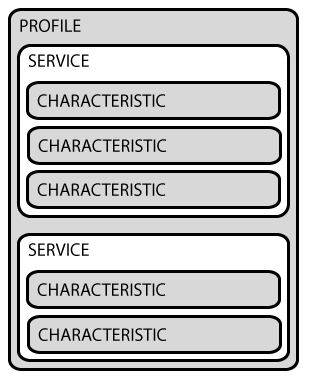

## [esp] - BLE GATT secured client


* mcu - Peripheral / GATT Server
* cellular - Central / GATT Client


### GATT Structure

* BLE GATT Transactions
  * Profile - a pre-defined collection of Services that has been compiled by either the Bluetooth SIG or by the peripheral designers.
  * Service - Services are used to break data up into logical entities, and contain specific chunks of data called characteristics.
    * [official services](https://www.bluetooth.com/specifications/assigned-numbers/)
  * Characteristic - encapsulates a single data point (though it may contain an array of related data, such as X/Y/Z values from a 3-axis accelerometer, etc.).
    * Characteristics are the main point that you will interact with your BLE peripheral, so it's important to understand the concept. They are also used to send data back to the BLE peripheral, since you are also able to write to characteristic.


### ESP Service Class UUIDs

```c
// bt/host/bluedroid/stack/includes/stack/sdpdefs.h

/* Define common 16-bit service class UUIDs
*/
#define UUID_SERVCLASS_SERVICE_DISCOVERY_SERVER 0X1000
#define UUID_SERVCLASS_BROWSE_GROUP_DESCRIPTOR  0X1001
#define UUID_SERVCLASS_PUBLIC_BROWSE_GROUP      0X1002
#define UUID_SERVCLASS_SERIAL_PORT              0X1101
#define UUID_SERVCLASS_LAN_ACCESS_USING_PPP     0X1102
#define UUID_SERVCLASS_DIALUP_NETWORKING        0X1103
#define UUID_SERVCLASS_IRMC_SYNC                0X1104
#define UUID_SERVCLASS_OBEX_OBJECT_PUSH         0X1105
#define UUID_SERVCLASS_OBEX_FILE_TRANSFER       0X1106
#define UUID_SERVCLASS_IRMC_SYNC_COMMAND        0X1107
#define UUID_SERVCLASS_HEADSET                  0X1108
#define UUID_SERVCLASS_CORDLESS_TELEPHONY       0X1109

```


### ESP defined GATT Services (SVCs)

```c
// esp_gatt_defs.h
/**@{
 * All "ESP_GATT_UUID_xxx" is attribute types
 */
#define ESP_GATT_UUID_IMMEDIATE_ALERT_SVC           0x1802          /*  Immediate alert Service*/
#define ESP_GATT_UUID_LINK_LOSS_SVC                 0x1803          /*  Link Loss Service*/
#define ESP_GATT_UUID_TX_POWER_SVC                  0x1804          /*  TX Power Service*/
#define ESP_GATT_UUID_CURRENT_TIME_SVC              0x1805          /*  Current Time Service Service*/
#define ESP_GATT_UUID_REF_TIME_UPDATE_SVC           0x1806          /*  Reference Time Update Service*/
#define ESP_GATT_UUID_NEXT_DST_CHANGE_SVC           0x1807          /*  Next DST Change Service*/
#define ESP_GATT_UUID_GLUCOSE_SVC                   0x1808          /*  Glucose Service*/
#define ESP_GATT_UUID_HEALTH_THERMOM_SVC            0x1809          /*  Health Thermometer Service*/

```

### ESP GAP Attributes

```c
// esp_gatt_defs.h

/* GAP Profile Attributes */
#define ESP_GATT_UUID_GAP_DEVICE_NAME               0x2A00
#define ESP_GATT_UUID_GAP_ICON                      0x2A01
#define ESP_GATT_UUID_GAP_PREF_CONN_PARAM           0x2A04
#define ESP_GATT_UUID_GAP_CENTRAL_ADDR_RESOL        0x2AA6

/* Attribute Profile Attribute UUID */
#define ESP_GATT_UUID_GATT_SRV_CHGD                 0x2A05


```

### GATT characteristics elements
```c
typedef struct {
    uint16_t                    char_handle;                /*!< The characteristic handle */
    esp_gatt_char_prop_t        properties;                 /*!< The characteristic properties */
    esp_bt_uuid_t               uuid;                       /*!< The characteristic uuid */
} esp_gattc_char_elem_t;                                    /*!< The gattc characteristic element */

```

### Descriptor elements

```c
/**
  * @brief descriptor element
  */
typedef struct {
    uint16_t                   handle;                      /*!< The characteristic descriptor handle */
    esp_bt_uuid_t              uuid;                        /*!< The characteristic descriptor uuid */
} esp_gattc_descr_elem_t;                                   /*!< The gattc descriptor type element */

```

### Include Service Element
```c
/**
  * @brief include service element
  */
typedef struct {
    uint16_t                   handle;                      /*!< The include service current attribute handle */
    uint16_t                   incl_srvc_s_handle;          /*!< The start handle of the service which has been included */
    uint16_t                   incl_srvc_e_handle;          /*!< The end handle of the service which has been included */
    esp_bt_uuid_t              uuid;                        /*!< The include service uuid */
} esp_gattc_incl_svc_elem_t;                                /*!< The gattc include service element */

```

### GATT Callback function type
```c
/**
 * @brief GATT Client callback function type
 * @param event : Event type
 * @param gattc_if : GATT client access interface, normally
 *                   different gattc_if correspond to different profile
 * @param param : Point to callback parameter, currently is union type
 */
typedef void (* esp_gattc_cb_t)(esp_gattc_cb_event_t event, esp_gatt_if_t gattc_if, esp_ble_gattc_cb_param_t *param);

```

### GATT Interface type

```c
// esp_gatt_defs.h
#define ESP_GATT_IF_NONE    0xff                            /*!< If callback report gattc_if/gatts_if as this macro, means this event is not correspond to any app */

typedef uint8_t    esp_gatt_if_t;                           /*!< Gatt interface type, different application on GATT client use different gatt_if */

```

### GATT Client Callback Function Events

```c
// esp_gattc_api.h
typedef enum {
    ESP_GATTC_REG_EVT                 = 0,        /*!< When GATT client is registered, the event comes */
    ESP_GATTC_UNREG_EVT               = 1,        /*!< When GATT client is unregistered, the event comes */
    ESP_GATTC_OPEN_EVT                = 2,        /*!< When GATT virtual connection is set up, the event comes */
    ESP_GATTC_READ_CHAR_EVT           = 3,        /*!< When GATT characteristic is read, the event comes */
    ESP_GATTC_WRITE_CHAR_EVT          = 4,        /*!< When GATT characteristic write operation completes, the event comes */
    ESP_GATTC_CLOSE_EVT               = 5,        /*!< When GATT virtual connection is closed, the event comes */
    ESP_GATTC_SEARCH_CMPL_EVT         = 6,        /*!< When GATT service discovery is completed, the event comes */

    /* ... */

    ESP_GATTC_DIS_SRVC_CMPL_EVT       = 46,       /*!< When the ble discover service complete, the event comes */
} esp_gattc_cb_event_t;

```

### GATT Client Callback Parameter Union Type


```c
/**
 * @brief Gatt client callback parameters union
 */
typedef union {
    /**
     * @brief ESP_GATTC_REG_EVT
     */
    struct gattc_reg_evt_param {
        esp_gatt_status_t status;       /*!< Operation status */
        uint16_t app_id;                /*!< Application id which input in register API */
    } reg;                              /*!< Gatt client callback param of ESP_GATTC_REG_EVT */

/**


*/

    /**
     * @brief ESP_GATTC_DIS_SRVC_CMPL_EVT
     */
    struct gattc_dis_srvc_cmpl_evt_param {
        esp_gatt_status_t status;      /*!< Operation status */
        uint16_t conn_id;              /*!< Connection id */
    } dis_srvc_cmpl;                   /*!< Gatt client callback param of ESP_GATTC_DIS_SRVC_CMPL_EVT */

} esp_ble_gattc_cb_param_t;             /*!< GATT client callback parameter union type */

```