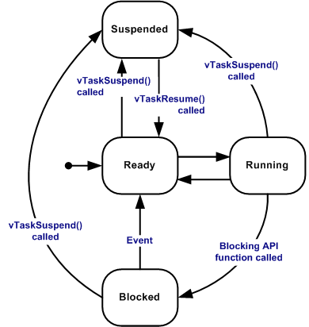

## [freertos] - the basics

### what is real time (definition)
    * real-time deals with guarantees, not with raw speed, not with promises.
    * having more processors, more RAM, faster bus interfaces does not make a system **real time**
    * if the timing constraints are not met, system failure is said to have occurred
    * hard real-time, eg. air bag system, missile guidance, anti-lock braking, voip, stock market website

### GPOS vs RTOS
    * GPOS - linux, window, iOS, android
        - process throughput
        - task switching latency (an event occurred and the time the task take care of event is allowed)
            - may vary significantly
        - priority inversion: insignificant


    * RTOS - VxWork, QNX, freeRTOS, Integrity, Zephyr
        - task switching latency
            - almost constant
        - priority inversion: must be solved
            - priority based preemptive scheduling mechanism
            - low or non critical sections which disable preemptive
            - priority inversion avoidance
            - bounded interrupt latency
            - bounded scheduling latency


### project structure
* FreeRTOS
    * demo (sample codes)
    * test
    * license
    * source
        - kernel
        - include (headers)
        - portable
            - architecture / compiler specifics
                - GCC
                - Keil
* FreeRTOS-Plus (middlewares)

### Task Creation
* xTaskCreate
    - let ESP-IDF FreeRTOS choose which core the task to run on
* xTaskCreatePinnedToCore
    - Allow for specifying which core to run on

```c
BaseType_t xTaskCreatePinnedToCore(TaskFunction_t pvTaskCode, const char *const pcName, const uint32_t usStackDepth, void *const pvParameters, UBaseType_t uxPriority, TaskHandle_t *const pvCreatedTask, const BaseType_t xCoreID)
```

### Parameter
* pvTaskCode – Pointer to the task entry function. Tasks must be implemented to never return (i.e. continuous loop), or should be terminated using vTaskDelete function.

* pcName – A descriptive name for the task. This is mainly used to facilitate debugging. Max length defined by configMAX_TASK_NAME_LEN - default is 16.

* usStackDepth – The size of the task stack specified as the number of bytes. Note that this differs from vanilla FreeRTOS.

* pvParameters – Pointer that will be used as the parameter for the task being created.

* uxPriority – The priority at which the task should run. Systems that include MPU support can optionally create tasks in a privileged (system) mode by setting bit portPRIVILEGE_BIT of the priority parameter. For example, to create a privileged task at priority 2 the uxPriority parameter should be set to ( 2 | portPRIVILEGE_BIT ).

* pvCreatedTask – Used to pass back a handle by which the created task can be referenced.

* xCoreID – If the value is tskNO_AFFINITY, the created task is not pinned to any CPU, and the scheduler can run it on any core available. Values 0 or 1 indicate the index number of the CPU which the task should be pinned to. Specifying values larger than (portNUM_PROCESSORS - 1) will cause the function to fail.

### Task States
* Running
    - When a task is actually executing it is said to be in the Running state. It is currently utilizing the processor.
* Ready
    - Ready tasks are those that are able to execute (they are not in the Blocked or Suspended state) but are not currently executing because a different task of equal or higher priority is already in the Running state.
* Blocked
    - A task is said to be in the Blocked state if it is currently waiting for either a temporal or external event.
* Suspended
    - Tasks in the Suspended state cannot be selected to enter the Running state, but tasks in the Suspended state do not have a time out.
    - Tasks can only enter or exit suspended state when explicitly commanded to do so through the vTaskSuspend() and xTaskResume() API calls respectively.



### vTaskDelay()
```c
#include “FreeRTOS.h”
#include “task.h”
void vTaskDelay( TickType_t xTicksToDelay );
```
* Places the task that calls vTaskDelay() into the Blocked state for a fixed number of tick
interrupts.
* Calling vTaskDelay(0) is equivalent to calling taskYIELD().
* portTICK_PERIOD_MS constant can be used to calculate real time from tick rate
```c
void vTaskFunction(void *pvParameters)
{
    // Blocking for 500ms
    const TickType_t xDelay = 500 /portTICK_PERIOD_MS
    for (;;)
    {
        // Simply toggle the LED every 500ms, blocking between each toggle.
        vToggleLED();
        vTaskDelay(xDelay);
    }
}
```