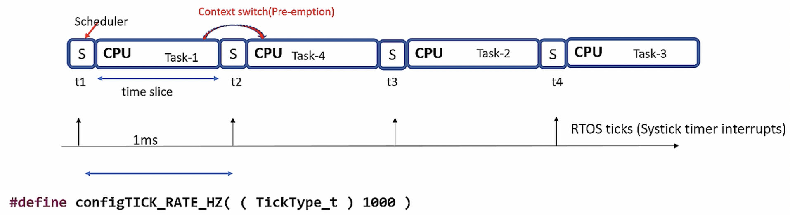
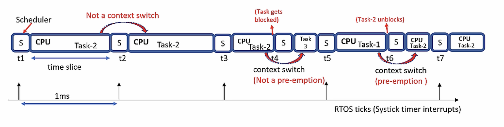
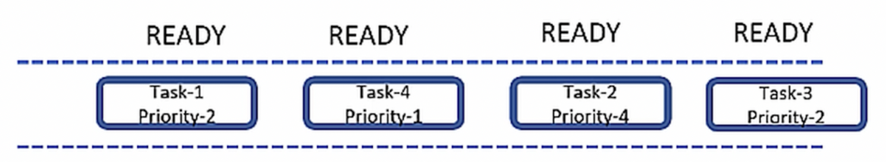
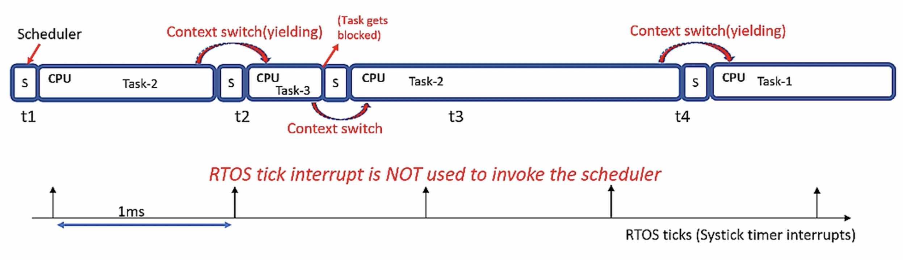

## [freertos] - Scheduling

* preemption scheduling
    - replacing running task with another task
    - scheduler does context switch to run some other tasks of the application

    - two type of scheduling
        1. round-robin preemptive scheduling
        
        2. non-context switch case and tasks get blocked handling
        
        3. scheduling tasks without priority is cyclic executive.
        

* cooperative scheduling
    - RTOS tick interrupt is not used to invoke the scheduler
    - Tasks give up processor voluntarily
        - task yielding
            
