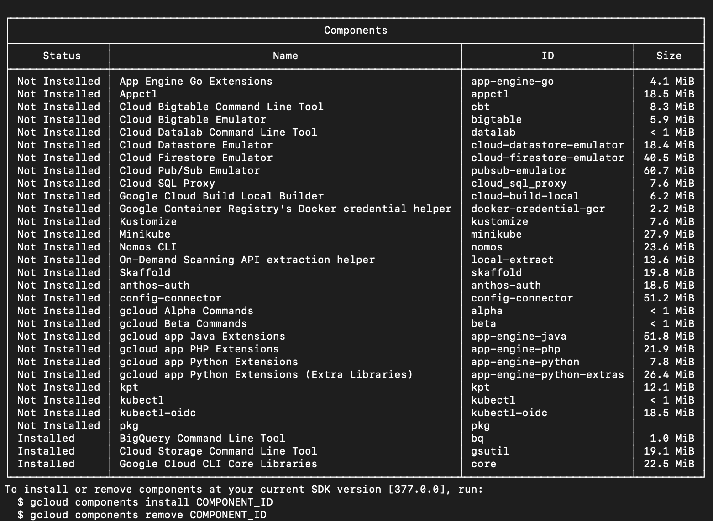

## [GCP] - Install gcloud 學習筆記

- https://cloud.google.com/sdk/docs/quickstart

- 下載 SDK bundle

- Unzip .tar.gz

- Run script

  ```bash
  $ ./google-cloud-sdk/install.sh
  ```

### Install / Remove gc sdk component

```bash
$ gcloud components install COMPONENT _ID
$ gcloud components remove COMPONENT _ID
```


### Path to rc file (default)

```bash
$ /Users/default_user/.zshrc
```

### Init gcloud SDK

```bash
$ ./google-cloud-sdk/bin/gcloud init
```

### Update rc file

```bash
$ source ~/.bash_profile
# or
$ source ~/.bashrc
# restart command line
```

### Install Cloud SQL Auth proxy

- Instruction - https://cloud.google.com/sql/docs/mysql/sql-proxy#macos-64-bit

```bash
# macOS
$ curl -o cloud_sql_proxy https://dl.google.com/cloudsql/cloud_sql_proxy.darwin.amd64
# Make Cloud SQL Auth Proxy executable
$ chmod +x cloud_sql_proxy

# Docker Container (not tested)
$ docker pull gcr.io/cloudsql-docker/gce-proxy:1.21.0

# install gcloud cli
* [gcloud](https://cloud.google.com/sdk/docs/install)

# execute cloud_sql_proxy
$ ./cloud_sql_proxy -instances=INSTANCE_CONNECTION_NAME=tcp:0.0.0.0:1234

$ ./cloud_sql_proxy -instances=lorem-pro:asia-east1:lorem-sql:=tcp:5433
```

### gcloud auth login & test

```bash
# authenticate your google account with chrome
gcloud auth login
# 出現成功連結後，可以使用 psql 連進 database
psql -U postgres -h localhost -d db_name
```

