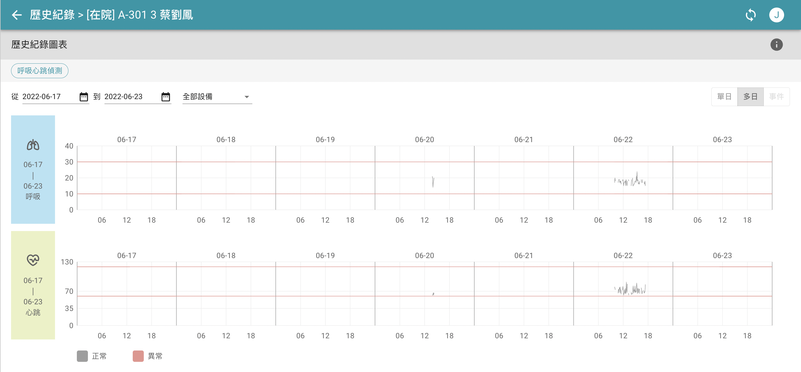
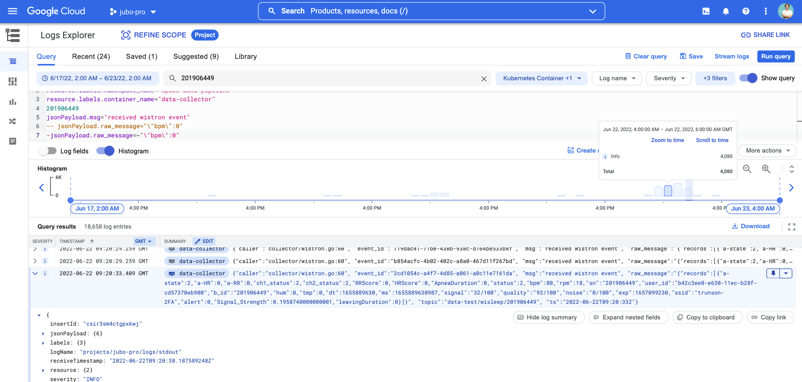
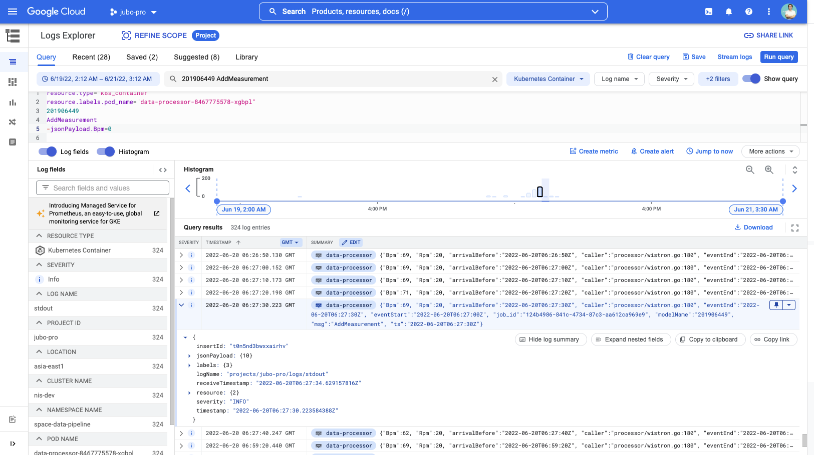
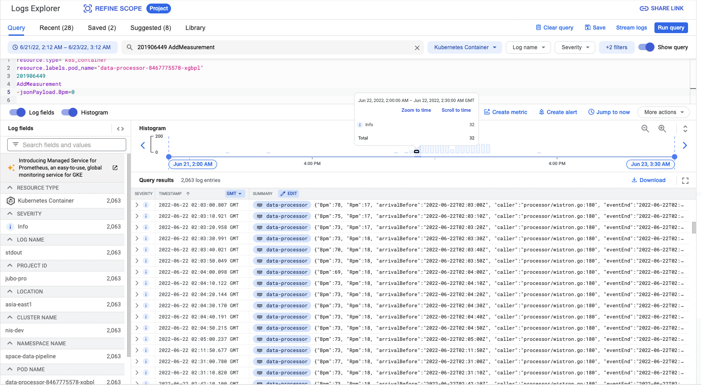
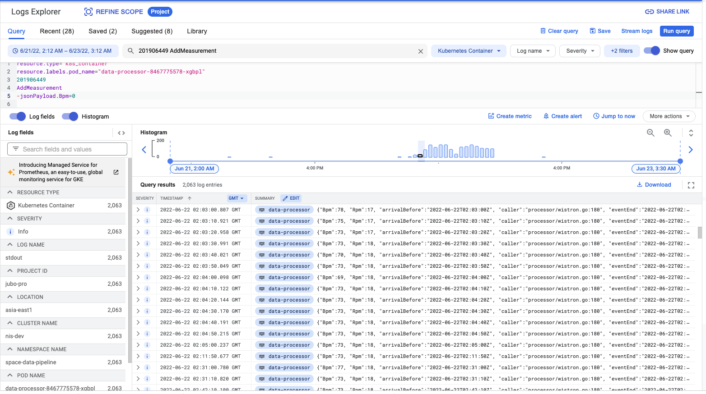
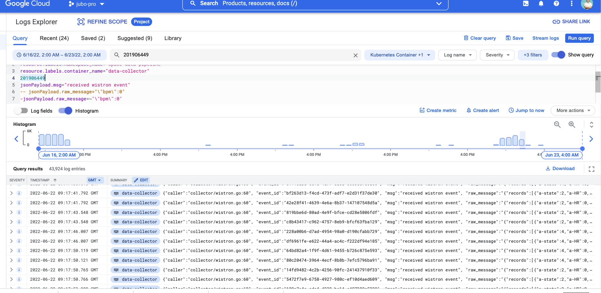

## [gcp] - Log Explorer

### logging query language
[guide](https://cloud.google.com/logging/docs/view/logging-query-language)

[query-building](https://cloud.google.com/logging/docs/view/building-queries)

### Log Fields

### Histogram

### Show Query

### Query Examples

```log
2022-06-22 02:03:00.807 GMT

data-processor
{"Bpm":78, "Rpm":17, "arrivalBefore":"2022-06-22T02:03:00Z", "caller":"processor/wistron.go:180", "eventEnd":"2022-06-22T02:03:00Z", "eventStart":"2022-06-22T02:02:30Z", "job_id":"e111c513-03bc-49ae-8b91-a658059b07f7", "modelName":"201906449", "msg":"AddMeasurement", "ts":"2022-06-22T02:03:00Z"}
```

```sql
resource.type="k8s_container"
resource.labels.namespace_name="xxx-yyy-pipeline"
resource.labels.container_name="zzz-collector"
-- search key word
201906449
-- search specific log msg
jsonPayload.msg="received wistron event"
-- filter raw_message within jsonPayload
-- jsonPayload.raw_message="\"bpm\":0"
-jsonPayload.raw_message=~"\"bpm\":0"
-- jsonPayload.raw_message=~"\"rpm\":0"
-- jsonPayload.raw_message!="\"rpm\":0"
```

### query samples
* 201906449 issue

* 201906449 loggings

* 201906449

* 201906449

* 201906449

* 201906449


