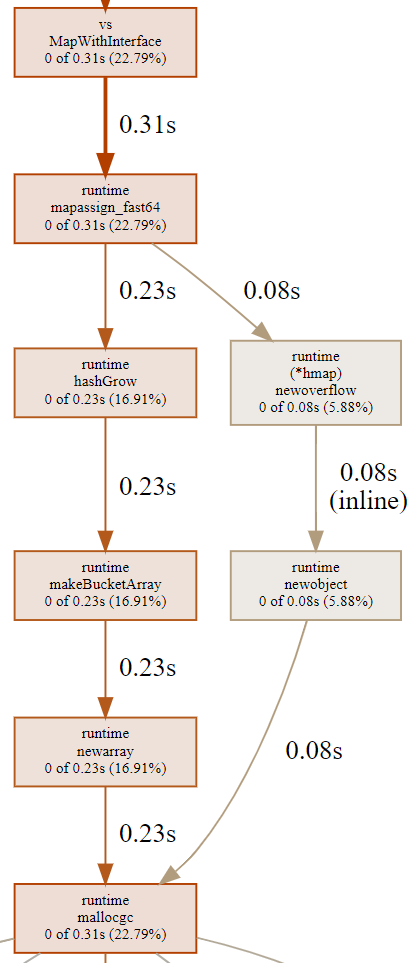

## [go] - Empty Struct Notes

> struct type with no fields.
>   - contains no data,
```go
type Q struct{}
type q struct{}
```

### Width
> Width describe the numbers of bytes of storage an instance of a type occupies.
* Discover Width of any value using unsafe.Sizeof()
```go
var s string
var c complex128
fmt.Println(unsafe.Sizeof(s))   // 8
fmt.Println(unsafe.Sizeof(c))   // 16
```

* Width of array type is a multiple of element type
```go
var a [3]uint32
fmt.Println(unsafe.Sizeof(a))   //12
```

* structs provide defining composite types
* width of struct is the sum of the width of constituent types, plus padding
```go
type S struct {
    a uint16
    b uint32
}
var s S
fmt.Println(unsafe.Sizeof(s))   // 8, not 16
```

### An Empty struct
*  the empty struct has a width of zero. It occupies zero bytes of storage.
```go
var s struct{}
fmt.Println(unsafe.Sizeof(s))   //prints 0

```
* As the empty struct consumes zero bytes, it follows that it needs no padding. Thus a struct comprised of empty structs also consumes no storage.

```go
    type S struct {
        A struct{}
        B struct{}
    }
    var s S
    fmt.Println(unsafe.Sizeof(s))   // prints 0
```

* Declare an array of empty structs{}, but they also consume no storage
```go
    var x [10000000]struct{}
    fmt.Println(unsafe.Sizeof(x))   // prints 0
```

* take the address of a struct{} as it is addressable
```go
    var a struct{}
    var b = &a

```

* the address of two struct{} values may be the same
```go
    var a, b struct{}
    fmt.Println(&a == &b)   // print true

```

* same with []struct{}s
```go
    a := make([]struct{}, 10)
    b := make([]struct{}, 20)
    fmt.Println(&a == &b)   // false, a and b are different slices
    fmt.Println(&a[0] == &b[0]) // their backing arrays are the same
```

### struct{} as a method receiver
* empty struct behave just like any other type

```go
    type S struct{}
    func (s *S) addr() { fmt.Printf("%p\n", s)}
    func main() {
        var a, b S
        // the exact address of all zero sized values may vary for different versions of Go.
        a.addr()    // 0x1beeb0
        b.addr()    // 0x1beeb0
    }
```

### Keep thousands of entries as map[string]struct{} instead of string slice
* string slice/array search O(n)
* hashmap search O(1)

```go
mySlice := []string{"Yasoob", "Ali", "Ahmed"}
mySlice.contains("Yasoob")

var flag bool
for _, val := range mySlice{
    if val == "Yasoob"{
        flag = true
    }
}
```

* to check if hash exist in map
```go
myMap := map[string]struct{}{
    "Yasoob": struct{}{},
    "Ali":    struct{}{},
}
_, ok := myMap["Yasoob"]
if ok{
    fmt.Println("exists!")
}

// faster
```

### benchmarks (empty struct vs interface)
```go
package main

func main() {}

func MapWithInterface() {
    m := map[int]interface{}{}
    for i := 1; i <= 100; i++ {
        m[i] = nil
    }
}

func MapWithEmptyStruct() {
    m := map[int]struct{}{}
    for i := 1; i <= 100; i++ {
        m[i] = struct{}{}
    }
}
```
* Benchmark code
```go
package main

import "testing"

func Benchmark_Interface(b *testing.B) {
    for i := 0; i < b.N; i++ {
        MapWithInterface()
    }
}

func Benchmark_EmptyStruct(b *testing.B) {
    for i := 0; i < b.N; i++ {
        MapWithEmptyStruct()
    }
}
```

* Result
```bash
goos: darwin
goarch: amd64
pkg: awesomeProject1
Benchmark_Interface-8         130419          8949 ns/op        7824 B/op          7 allocs/op
Benchmark_EmptyStruct-8       165147          6964 ns/op        3070 B/op         17 allocs/op
PASS
ok      awesomeProject1 3.122s
```

* empty struct

* interface


* empty struct vs interface


### source
* [Dave Cheney](https://dave.cheney.net/2014/03/25/the-empty-struct)
* [levelup](https://levelup.gitconnected.com/memory-allocation-and-performance-in-golang-maps-b267b5ad9217)