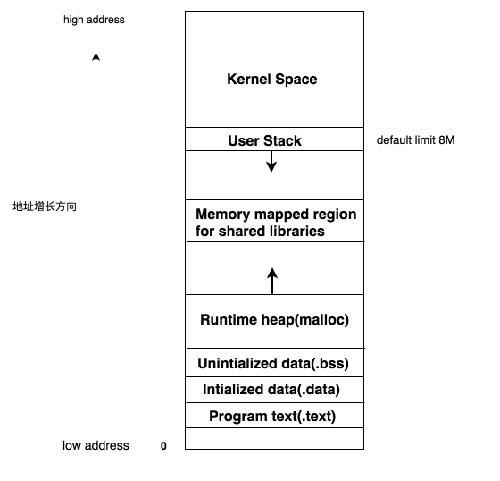
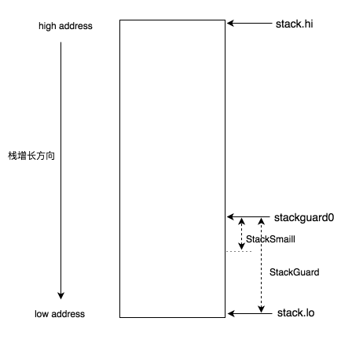

## [go] - go-routine stack

带着问题阅读，往往会更加高效，首先让我们看下问题:

* goroutine stack多大呢？是固定的还是动态变化的呢?
* stack动态变化的话，什么时候扩容和缩容呢？如何实现的呢?
* 对服务有什么影响吗？如何排查栈扩容缩容带来的问题呢?
* 问题明确了，我们就开始往下扯。

### 栈大小

在了解协程栈之前，我们先看下传统的Linux进程内存布局:

user stack的大小是固定的，Linux中默认为8192KB，运行时内存占用超过上限，程序会崩溃掉并报告segment错误。 为了修复这个问题，我们可以调大内核参数中的stack size, 或者在创建线程时显式地传入所需要大小的内存块。 这两种方案都有自己的优缺点, 前者比较简单但会影响到系统内所有的thread，后者需要开发者精确计算每个thread的大小, 负担比较高。

有没有办法既不影响所有thread又不会给开发者增加太多的负担呢? 答案当然是有的，比如: 我们可以在函数调用处插桩， 每次调用的时候检查当前栈的空间是否能够满足新函数的执行，满足的话直接执行，否则创建新的栈空间并将老的栈拷贝到新的栈然后再执行。 这个想法听起来很fancy & simple, 但当前的Linux thread模型却不能满足，实现的话只能够在用户空间实现，并且有不小的难度。

go作为一门21世纪的现代语言，定位于简单高效，充分利用多核优势，解放工程师，自然不能够少了这个特性。它使用内置的运行时runtime优雅地解决了这个问题， 每个routine（g0除外）在初始化时stack大小都为2KB, 运行过程中会根据不同的场景做动态的调整。

### 栈扩容和缩容
在介绍具体的栈处理细节之前，我们先了解下协程栈的内存布局和一些重要的术语:

* stack.lo: 栈空间的低地址
* stack.hi: 栈空间的高地址
* stackguard0: stack.lo + StackGuard, 用于stack overlow的检测
* StackGuard: 保护区大小，常量Linux上为880字节
* StackSmall: 常量大小为128字节，用于小函数调用的优化

可以看到在rpc调用(grpc invoke)时，栈会发生扩容(runtime.morestack)，也就意味着在读写routine内的任何rpc调用都会导致栈扩容， 占用的内存空间会扩大为原来的两倍，4kB的栈会变为8kB，100w的连接的内存占用会从8G扩大为16G（全双工，不考虑其他开销），这简直是噩梦。

解决这个问题的方案有很多，我们选择了channel和worker group，读写routine只负责流量和连接处理，逻辑处理的部分完全交给worker。 优化后，读写routine各占用4KB内存，运行过程中都不会出现栈扩容的问题，单机(24core 32G memory)可以承载100W连接和每秒2~3w消息的发送(512 ~ 1024 byte)。

上面介绍到栈缩容的目标是提高内存利用率，但在缩容过程中会存在栈拷贝和写屏障(write barrier)，对于一些准实时应用可能会存在一些影响。 好在go提供了可设置的参数，需要的话大家可以通过设置环境变量 GODEBUG=gcshrinkstackoff=1 来关闭栈缩容。关闭栈缩容后， 需要承担栈持续增长的风险，在关闭前需要慎重考虑。

如果想查看程序运行过程中栈alloc、扩容、拷贝和缩容细节的话，可以通过设置stackDebug变量 (runtime/stack.go)为非0， 然后重新编译程序（记得要重新编译runtime, 编译时加入-a参数），就可以看到所有栈操作的细节了。 暂时没有找到更好的设置方式比如GODEBUG之类的，如果大家更好的办法，欢迎告诉我。

### source
[知乎](https://zhuanlan.zhihu.com/p/28409657)
