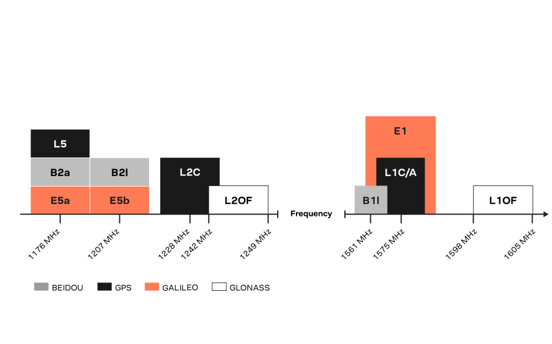

## [gps] - New Civil Channels

### GNSS signal band

### L2C
- the radio frequency used by the signal (1227 MHz, or L2)
- When combined with L1 C/A in a dual-frequency receiver, L2C enables ionospheric correction, a technique that boosts accuracy.
- L2C enables faster signal acquisition, enhanced reliability, and greater operating range.
- easier to receive under trees and even indoors
- The Commerce Department estimates L2C could generate $5.8 billion in economic productivity benefits through 2030.
### L5
- designed to meet demanding requirements for safety-of-life transportation and other high-performance applications.
- designation for the radio frequency used by the signal (1176 MHz).
- L5 is broadcast in a radio band reserved exclusively for aviation safety services

### L1C
- enable interoperability between GPS and international satellite navigation systems.
- radio frequency used by the signal (1575 MHz, or L1) 
- features a Multiplexed Binary Offset Carrier (MBOC) modulation scheme that enables international cooperation. 

> The United States and Europe originally developed L1C as a common civil signal for GPS and Galileo. Japan's Quasi-Zenith Satellite System (QZSS) and China's BeiDou system are also adopting L1C-like signals.

### Combination
- When used in combination with L1 C/A and L2C, L5 will provide a highly robust service.
  - trilaning: the use of three GPS frequencies may enable sub-meter accuracy without augmentations, and very long range operations with augmentations.

