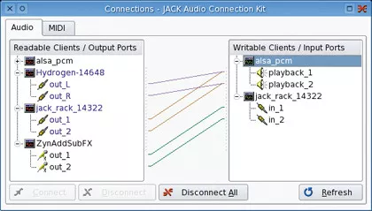

## [gstreamer] - basics

### Linux Audio Explained

#### GStreamer

> GStreamer slots into the audio layers above PulseAudio (which it uses for sound output on most distributions), but below the application level. 
> GStreamer is unique because it's not designed solely for audio – it supports several formats of streaming media, including video, through the use of plugins.

MP3 playback, for example, is normally added to your system through an additional codec download that attaches itself as a GStreamer plugin. 

The commercial Fluendo MP3 decoder, one of the only officially licenced codecs available for Linux, is supplied as a GStreamer plugin, as are its other proprietary codecs, including MPEG-2, H.264 and MPEG.

#### Jack
Inputs: PulseAudio, GStreamer, ALSA,
Outputs: OSS, FFADO, ALSA

Despite the advantages of open configurations such as PulseAudio, they all pipe audio between applications with the assumption that it will proceed directly to the outputs. Jack is the middle layer – the audio equivalent of remote procedure calls in programming, enabling audio applications to be built from a variety of components.

The best example is a virtual recording studio, where one application is responsible for grabbing the audio data and another for processing the audio with effects, before finally sending the resulting stream through a mastering processor to be readied for release. A real recording studio might use a web of cables, sometimes known as jacks, to build these connections. Jack does the same in software.

Jack is an acronym for 'Jack Audio Connection Kit'. It's built to be low-latency, which means there's no undue processing performed on the audio that might impede its progress. But for Jack to be useful, an audio application has to be specifically designed to handle Jack connections. As a result, it's not a simple replacement for the likes of ALSA and PulseAudio, and needs to be run on top of another system that will generate the sound and provide the physical inputs.

With most Jack-compatible applications, you're free to route the audio and inputs in whichever way you please. You could take the output from VLC, for example, and pipe it directly into Audacity to record the stream as it plays back. Or you could send it through JackRack, an application that enables you to build a tower of real-time effects, including pinging delays, cavernous reverb and voluptuous vocoding.

This versatility is fantastic for digital audio workstations. Ardour uses Jack for internal and external connections, for instance, and the Jamin mastering processor can only be used as part of a chain of Jack processes. It's the equivalent of having full control over how your studio is wired. Its implementation has been so successful on the Linux desktop that you can find Jack being put to similar use on OS X.

#### FFADO
Inputs: Jack
Outputs: Audio hardware

In the world of professional and semi-professional audio, many audio interfaces connect to their host machine using a FireWire port.

This approach has many advantages. FireWire is fast and devices can be bus powered. Many laptop and desktop machines have FireWire ports without any further modification, and the standard is stable and mostly mature. You can also take FireWire devices on the road for remote recording with a laptop and plug them back into your desktop machine when you get back to the studio.

But unlike USB, where there's a standard for handling audio without additional drivers, FireWire audio interfaces need their own drivers. The complexities of the FireWire protocol mean these can't easily create an ALSA interface, so they need their own layer.

Originally, this work fell to a project called FreeBOB. This took advantage of the fact that many FireWire audio devices were based on the same hardware. FFADO is the successor to FreeBOB, and opens the driver platform to many other types of FireWire audio interface.

Version 2 was released at the end of 2009, and includes support for many units from the likes of Alesis, Apogee, ART, CME, Echo, Edirol, Focusrite, M-Audio, Mackie, Phonic and Terratec. Which devices do and don't work is rather random, so you need to check before investing in one, but many of these manufacturers have helped driver development by providing devices for the developers to use and test.

Another neat feature in FFADO is that some the DSP mixing features of the hardware have been integrated into the driver, complete with a graphical mixer for controlling the balance of the various inputs and outputs. This is different to the ALSA mixer, because it means audio streams can be controlled on the hardware with zero latency, which is exactly what you need if you're recording a live performance.

Unlike other audio layers, FFADO will only shuffle audio between Jack and your audio hardware. There's no back door to PulseAudio or GStreamer, unless you run those against Jack. This means you can't use FFADO as a general audio layer for music playback or movies unless you're prepared to mess around with installation and Jack. But it also means that the driver isn't overwhelmed by support for various different protocols, especially because most serious audio applications include Jack support by default. This makes it one of the best choices for a studio environment.

#### Xine
Inputs: Phonon
Outputs: PulseAudio, ALSA, ESD

We're starting to get into the niche geology of Linux audio. Xine is a little like the chalk downs; it's what's left after many other audio layers have been washed away. Most users will recognise the name from the very capable DVD movie and media player that most distributions still bundle, despite its age, and this is the key to Xine's longevity.

When Xine was created, the developers split it into a backend library to handle the media, and a front-end application for user interaction. It's the library that's persisted, thanks to its ability to play numerous containers, including AVI, Matroska and Ogg, and dozens of the formats they contain, such as AAC, Flac, MP3, Vorbis and WMA.

It does this by harnessing the powers of many other libraries. As a result, Xine can act as a catch-all framework for developers who want to offer the best range of file compatibility without worrying about the legality of proprietary codecs and patents.

Xine can talk to ALSA and PulseAudio for its output, and there are still many applications that can talk to Xine directly. The most popular are the Gxine front-end and Totem, but Xine is also the default back-end for KDE's Phonon, so you can find it locked to everything from Amarok to Kaffeine.

#### Phonon
Inputs: Qt and KDE applications
Outputs: GStreamer, Xine

Phonon was designed to make life easier for developers and users by removing some of the system's increasing complexity. It started life as another level of audio abstraction for KDE 4 applications, but it was considered such a good idea that Qt developers made it their own, pulling it directly into the Qt framework that KDE itself is based on.

This had great advantages for developers of cross-platform applications. It made it possible to write a music player on Linux with Qt and simply recompile it for OS X and Windows without worrying about how the music would be played back, the capabilities of the sound hardware being used, or how the destination operating system would handle audio. This was all done automatically by Qt and Phonon, passing the audio to the CoreAudio API on OS X, for example, or DirectSound on Windows.

On the Linux platform (and unlike the original KDE version of Phonon), Qt's Phonon passes the audio to GStreamer, mostly for its transparent codec support. Phonon support is being quietly dropped from the Qt framework.

There have been many criticisms of the system, the most common being that it's too simplistic and offers nothing new, although it's likely that KDE will hold on to the framework for the duration of the KDE 4 lifecycle.

#### The rest of the bunch

There are many other audio technologies, including ESD, SDL and PortAudio. ESD is the Enlightenment Sound Daemon, and for a long time it was the default sound server for the Gnome desktop. Eventually, Gnome was ported to use libcanberra (which itself talks to ALSA, GStreamer, OSS and PulseAudio) and ESD was dropped as a requirement in April 2009.

Then there's Arts, the KDE equivalent of ESD, although it wasn't as widely supported and seemed to cause more problems than it solved. Most people have now moved to KDE 4, so it's no longer an issue.

SDL, on the other hand, is still thriving as the audio output component in the SDL library, which is used to create hundreds of cross-platform games. It supports plenty of features, and is both mature and stable.

PortAudio is another cross-platform audio library that adds SGI, Unix and Beos to the mix of possible destinations. The most notable application to use PortAudio is the Audacity audio editor, which may explain its sometimes unpredictable sound output and the quality of its Jack support.

And then there's OSS, the Open Sound System. It hasn't been a core Linux audio technology since version 2.4 of the kernel, but there's just no shaking it. This is partly because so many older applications are dependent on it and, unlike ALSA, it works on systems other than Linux. There's even a FreeBSD version.

It was a good system for 1992, but ALSA is nearly always recommended as a replacement. OSS defined how audio would work on Linux, and in particular, the way audio devices are accessed through the ioctl tree, as with /dev/dsp, for example.

ALSA features an OSS compatibility layer to enable older applications to stick to OSS without abandoning the current ALSA standard. The OSS project has experimented with open source and proprietary development, and is still being actively developed as a commercial endeavour by 4 Front Technologies. Build 2002 of OSS 4.2 was released in November 2009.
