## **[BLE] - 藍芽 Bluetooth 筆記**

### **History (BLE)**
* 2010 (v4.0) - First Launch
* 2013 (v4.1) - First smartphone support
* 2014 (v4.2) - IP connectivity, increased speed
* 2016 (v5) - 4x range, 2x speed
---

### **Bluetooth Device Types**
* Bluetooth Smart: Single Mode (BLE Only)
* Bluetooth Smart Ready: Dual Mode (BLE and Bluetooth Classic)
* Bluetooth Classic (BR/EBR)

---


### **BLE Wireless characteristics**
* 2.4Ghz ISM band, (industrial, scientific, medical band)
* Typical Range: 10-30 meters
* Peak Current Consumption by chip during Tx < 15mA typ.
---
### **BLE vs Classic**
| BLE        | Classic    |
|------------|------------|
|Sensor Data | Audio streaming |
|40 RF Channels | 79 RF Channels |
| 3 Discovery Chs | 32 Discovery Chs |

---

### **BLE 與其他通訊技術比較**

|Bluetooth   |Ethernet|Wi-Fi |Modem |
| ---------- | ------ | ---- | ---- | 
|v1.1: 1Mbps (BR)|802.3i: 10Mbps|802.11: 2Mbps|b.21: 0.3kbps
|v2.0 3Mbps  (EDR)|802.3u: 100Mbps|802.11b: 11Mbps|v.22: 1.2kbps
|v3.0: 54Mbps (MAC/PHY)|802.3ab: 1000Mbps|802.11g: 54Mbps|v.32: 9.6kbps
|v4.0: 0.3Mbps (BLE) |802.3an: 10000Mbps|802.11n: 135Mbps|v.34: 28.6kbps
|v5.0: 2Mbps (BLE) |

* BR: Basic Rate, 
* EBR: Enhanced Basic Rate


### **Bluetooth Stacks**
* Host / Controller
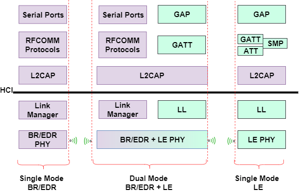

### **BLE Stack**
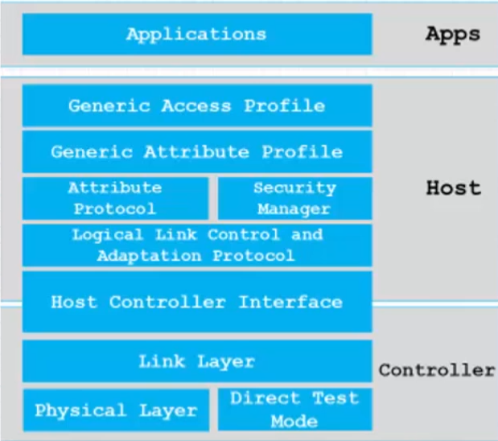
* Application
  - Device End App Use Case
* Host
  - Device Communication Manager
* HCI 
  - Host Controller Interface
* Controller
  - HW / Module Tx/Rx Radio Signal

### **Physical Layer**
* 2.4GHz ISM Band
* 40 RF channels seperated by 2Mhz
* Ch. 37, 38, 39: Primary Avertising Channel
* Others: Secondary Advertising Channel & Data Transfer Channels
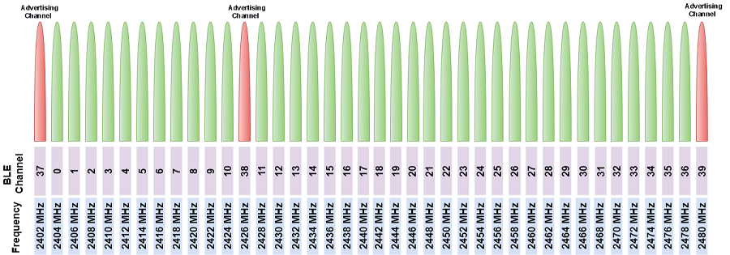

* BLE channels vs Wi-Fi Channels
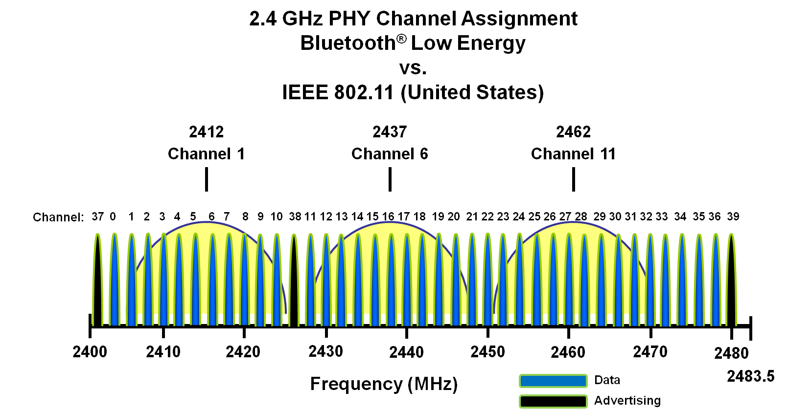

* Frequency Hopping Spread Spectrum (FHSS)
  - Prevent radio interference accross any single channel
  - Wifi / Zigbee etc.
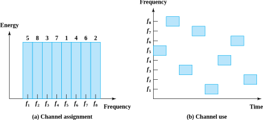
* Adaptive Freq. Hopping over Wi-Fi
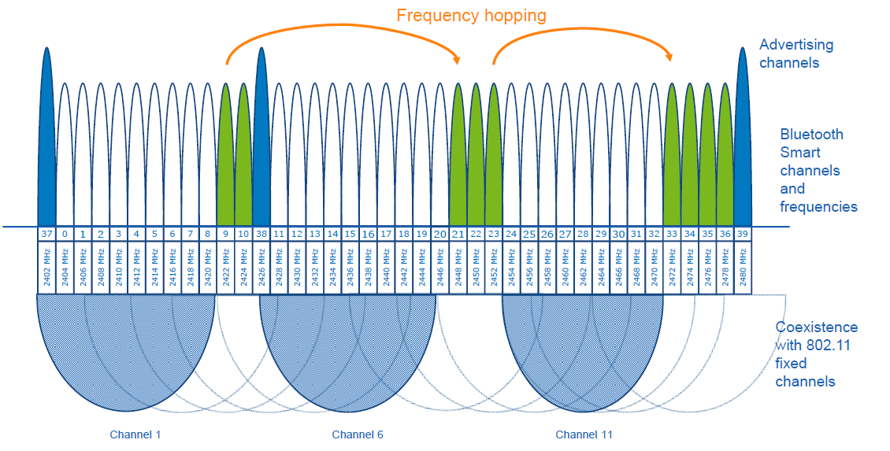

* BLE 4.0, 4.1, 4.2 1Mbps PHY
* BLE 5.0
  - 2Mbps PHY
  - Coded PHY (long range, using forward error correction code)
    * S2 - 2x range, 1/2 data rate
    * S8 - 4x range, 1/8 data rate

* Modulation: 
  - Gaussian Frequency Shift Keying (GFSK)

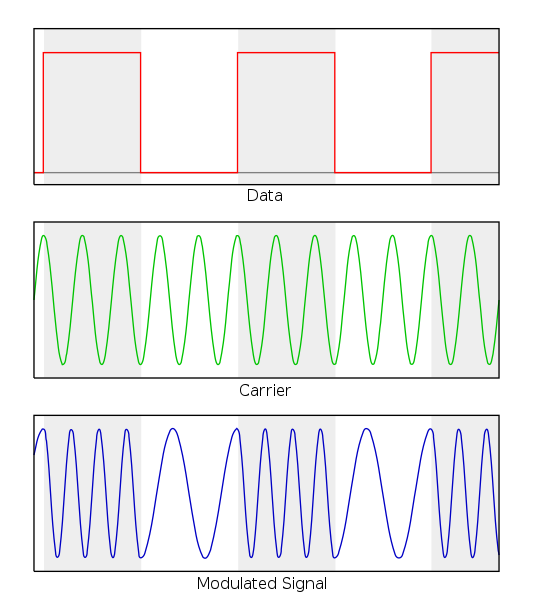


### **BLE Link Layer**
* Responsible for
  - Advertising
  - Scanning
  - Creating / Maintaining connection
  - Ensure packets structure
  - Provide PHY means to talk to HCI layer 

#### **Link Layer Roles**
* Advertiser
  - Send advertising packet
* Scanner
  - scanning for advertising packet
* Master
  - Initiate and manages connection
* Slave
  - accept connection request

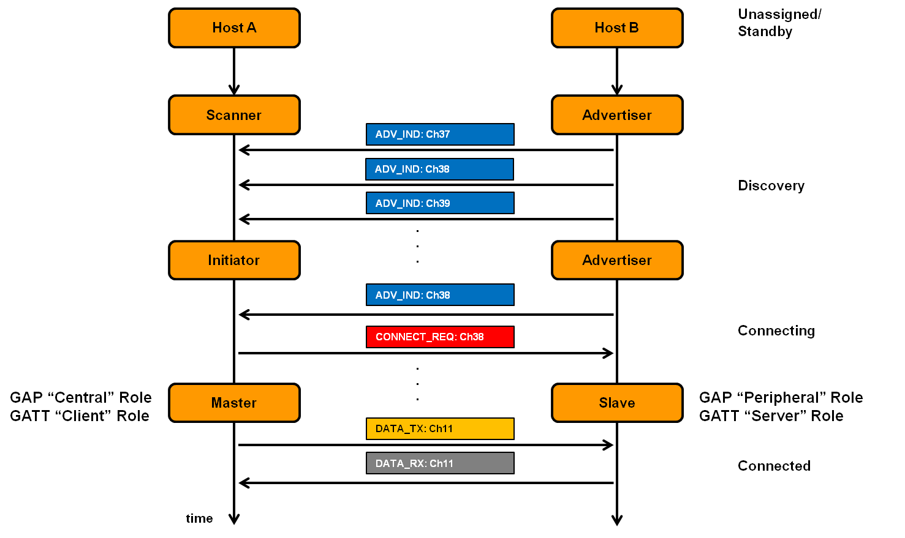

#### ***Link Layer States***

* Standby
  - Default, 
  - No Tx or Rx
* Advertising
  - Send out advertising packet
* Initiating
  - Scanning device to establish connection with advertiser device
* Connected
  - Connection Link established

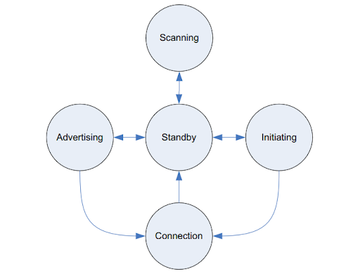

#### ***Link Layer Packet***
* Advertising Packet
  - Finding / Connecting to other device
* Data Packet
  - Sending/Receiving data once connected

* Shortest Allowable packet: 
  - Empty data packet, 80 usec long
* Longest Allowable packet:
  - Fully loaded adv packet, 376 usec long
* Typical advertising packet: 128 usec long
* Typical data packet: 144 usec long


#### ***Access Address***
  - 32 bit
  - Two types:
    * Advertising access addr
    * Data access addr

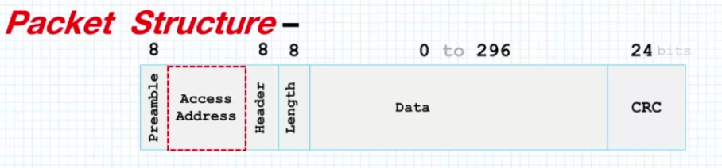
#### ***Packet Header***
  - Advertisement Packet Header

  - Data Packet Header

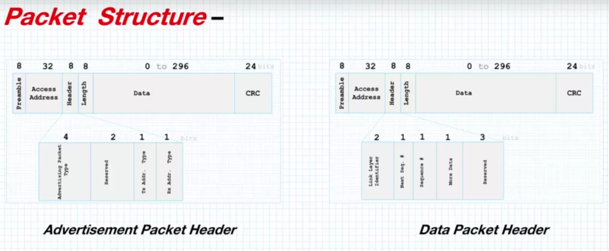

#### ***Packet Length***
  - Advertisement packet length: 6 bits
  - Data Packet Length: 5 bits

#### ***Advertising State***
> Device sends out packets containing useful data.
* Fixed Advertising Interval 
  - (20ms - 10.28s)
* Same adv. packet is transmitted on each of 3 primary adv. channels
* Primary adv. packet limited to 31 bytes
* secondary adv. packet is limited to 254 bytes


#### ***Scan Request & Response***
> Allow advertiser to send addition data
1. central device make **scan request**
2. advertiser provide **scan response**


#### ***Passive and Active Scanning***
* Passive Scanning
  - scanning advertisement without sending scan request.
  - scanning to receive advertising data only
* Active scanning
  - Scanning for advertisement data and send scan request to advertiser
  - scanning to receive advertising data and scan response data

#### ***Advertisement Events***
* Connectable & Scannable **Undirected** Event
  * Allow other devices to receive adv. and send **scan request** and establish connection.
* Connectable **Undirected** Event
  * Allow other devices to receive adv. and establish connection.
* Connectable **Directed** Event
  * Allow ***Specific Device*** to receive adv. and establish connection.
* Non-Connectable & Non-Scannable **Undirected** Event
  * Allow any device receive adv. packet. Does not allow connection.
* Non-Connectable * Non-Scannable **Directed**x Event
  * Allow ***specific device*** to receive adv. packet. Does not allow connection.
* Scannable Undirected Event
  * Allow any device to send scan request to advertiser to receive addition advertisement data.
* Scannable **Directed** Event
  * Allows a specific device to send scan request to the advertiser to receive additional advertisement data.

### **Key Advertising Parameter**
* Advertising Interval
  * 20 msec ~ 10.24 sec.
* Scan Type
  * Passive or Active
* Scan Window
  * How long to scan for advertisement
* Scan Interval
  * How often to scan for advertisement

### **Broadcasting**
* Broadcast data can be received by passive or active scanning devices
* Broadcast data is labelled within the advertisement packet
* Broadcast data cannot be acknowlodged
* Broadcasting device does not know if any device received its data

### **Connection**
> Connection use adaptive frequency hoping between data channels to send 2-way information between master and slave to enable communication robustness.

#### ***Connection Events***
* Connecting Phase
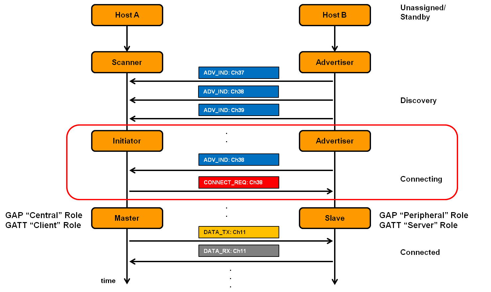
* Connected Phase
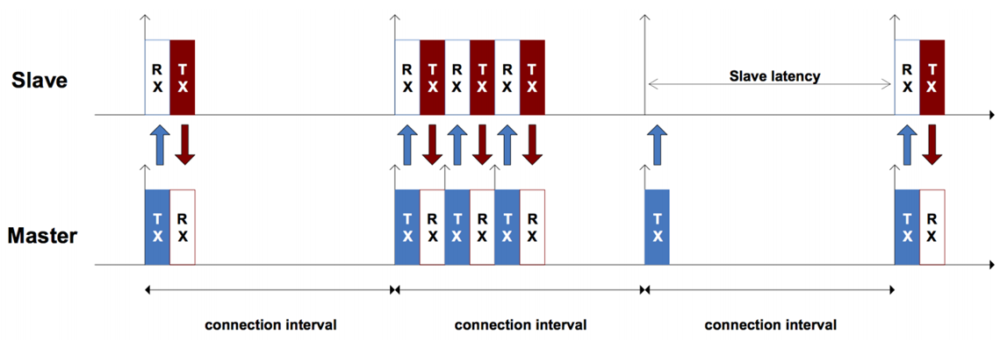
* Connection Interval
  - 7.5 msec. ~ 4 sec.
  - Smaller the higher throughput
  - Smaller the higher power consumption

* Slave latency
  - Number of connection event slave can skip without risking disconnection

* Connection Supervision Timeout
  - max. time between two valid data packets before connection lost
  - Value 100 msec. ~ 32 seconds

* Data Length Extension (DLE)
  - Increase Allowable payload size
  - default payload 27 bytes
  - enabled up to 251 bytes

### **Host Controller Interface**
- Logical Interface
  * Commands, events, data packet formats
- Physical Interface
  * Transport between host & Controller
    -UART, USB, SDIO (ie. I2C/SPI)


### **Logical Link Control & Adaptation Protocol (L2CAP)**

- Protocol Multiplexing
- Flow Control
- Handles 
  * Attribute Protocol (ATT)
  * Security Manager Protocol (SMP)
- Segmentation / Reassebly of packets (when larger than radio can deliver)

### **Attribute Protocol (ATT)**
> Defines how a server exposes its data to a client.
* Server: The device that exposes data.
  - Beacon act as server, exposing battery level, transmit power, etc.
  - Server sends 
    * reponses,
    * notifications, and 
    * indications
* Client: The device that consumes data.
  - Mobile phone app act as client consuming data.
  
> Attribute is a generic name for any data exposed by the server.
* Data is labelled and addressable.
* Attribute made up of:
  - handle
    * 16 bit identifier for each attribute on server
    * make attribute addressable
    * not to change in transactions
  - type
    * 16 bit uuid (SIG Attributes)
    * 128 bit uuid (custom)

```
// Bluetooth Base Address: 00000000 - 0000 - 1000 - 8000 - 00805F 9B34F B
// Short UUID: 0x2A01
// Final 128-bit uuid:
00002A01 - 0000 - 1000 - 8000 - 00805F 9B34F B
```

  - value
  - permissions
    * which can be execute with specific security requirement
    * Determins attribute can be ***read*** or ***write***, can be ***notified*** or ***indicated***


### **Security Manager (SM)**


### **Generic Attribute Profile (GATT)**
* GATT organize attributes in hierachy
* Attributes in GATT server are grouped into ***services***, each with 0 or more characteristics
* GATT defines how **services**, **characteristics**, and **descriptors** can be discovered and used.

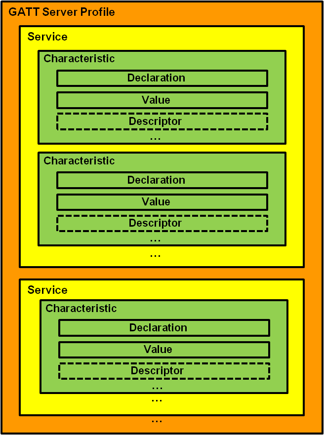

<u>Characteristics</u>
  1. container for user data
  2. Includes:
    - Declaration
      * metadata
    - value
      * user data
    - descriptor
      * expand metadata 

#### <u>Characteristic Value</u>
|Attribute Handle|Attribute Type|Attribute Value|Attribute Permission|
|--|--|--|--|
|0x0002|Characteristic(0x2803)|Properties|Rules for attribute interaction|
|address / attribute table|16 or 128 bit value to identify the type of every attribute|Value Handle|Read-Only|
|||Characteristic UUID||

#### <u>Characteristic Descriptor Attribute</u> ####
> Descriptor contains related information about the characteristic value.
* unit of measurement
* format of data

#### <u>GATT Services</u> ####
* Primary service expose what device does
* Secondary service expose additional information user does not need to understand

#### <u>GATT Profile Specification</u> ####
* Define roles and relatioship between server and client
* services needed
* requirement services must meet
* how services is need and characteristics are used.

### **Generic Access Profile (GAP)**

> GAP services is a mandatory service required to implement on all GATT servers
  * Device Name
    - utf-8 string
  * Apperance
    - 16 bit value enum

#### ***GAP Modes***
* GAP Broadcaster mode
* GAP discoverable modes (peripheral mode)
  - Non discoverable mode
  - Limited discoverable mode
  - General discoverable mode

* GAP connectable modes (peripheral mode)
  - Non connectable mode
  - Directed connectable mode
  - Undirected conntectable mode

* GAP bondable modes
  - non bondable mode
  - bondable mode (device will accept bonding request key from peer device)

#### ***GAP Procedures***
* Observation procedure
* Discovery procedures
  - Limited discovery procedure
  - General discovery procedure
  - Name discovery procedure
* Connection establishment procedures
  - Auto conncection establishment procedures
  - General connection establishment procedures
  - Selective connection establishment procedures
  - Direct connection establishment procedures
* Connection parameter update procedure
* Terminate connection procedure
* Bonding Procedure


#### ***Device Roles***
| Broadcaster | Observer | Peripheral | Central |
| ---- | ---- | ---- | ---- |
| Send adv. packet | scan broadcast | Send connectable adv. packet | Initiate connection to peripheral |
| Tx | Rx | Tx & Rx | Tx & Rx |
| Rx optional | Tx Optional | 2-way comm. | 2-way comm. |
| Reduced HW | Reduced HW | Full BLE HW| Full BLE HW |
| Reduced BLE stack | Reduced BLE Stack | Full Stack | Full Stack |
| Temp. Sensor | Temp. Display | Watch | Mobile phone |


### **Application**

### **BLE 5.x Features**
* Latest Core Spec. v5.3
  - Active: 13 July, 2021

* Optimize BLE for IOT
  - 2x Speed of BLE4
    * 2M PHY
  - 4x Range of BLE4
  - 8x advertising capacity of BLE4
    * Primary Adv. Channel: Legacy Advertisement
    * Secondary Adv. Channel: Extended Advertisement


### **Abbreviations - Nomenclature**
* GATT - Generic Attribute Profile
* PDU - Protocol Data Unit
* SDU - Service Data Unit
* MTU - Maximum Transmissions Unit


### **Resources:**

* [BLE5](https://www.rfwireless-world.com/Terminology/BLE-Advertising-and-Data-Packet-Format.html)

* [BLE5.2 Feats](https://www.bluetooth.com/wp-content/uploads/2020/01/Bluetooth_5.2_Feature_Overview.pdf)

* [Microchip Dev Help](https://microchipdeveloper.com/wireless:ble-introduction)

* [TI BLE-Stack-API](http://software-dl.ti.com/lprf/simplelink_cc2640r2_sdk/1.00.00.22/exports/docs/blestack/doxygen/index.html)

* [TI BLE5-Stack](https://software-dl.ti.com/lprf/simplelink_cc26x2_latest/docs/ble5stack/ble_user_guide/html/ble-stack-5.x/phy-coded.html)

* [STM32WB BLE Stack](https://www.st.com/resource/en/programming_manual/pm0271-stm32wb-ble-stack-programming-guidelines-stmicroelectronics.pdf)

* [BlueNRG-1/2 BLE stack](https://www.st.com/resource/en/programming_manual/dm00294449-bluenrg1-bluenrg2-ble-stack-v2x-programming-guidelines-stmicroelectronics.pdf)

* [Nordic nRF5 SDK](https://devzone.nordicsemi.com/nordic/short-range-guides/b/bluetooth-low-energy/posts/ble-characteristics-a-beginners-tutorial)

* [GATT 16-bit UUID Numbers Document](https://btprodspecificationrefs.blob.core.windows.net/assigned-values/16-bit%20UUID%20Numbers%20Document.pdf)

* [Forward Error Correction Codes](https://onlinelibrary.wiley.com/doi/pdf/10.1002/0470841516.app6#:~:text=The%20basic%20principle%20of%20Forward,transmission%20of%20that%20user%20signal.&text=Block%20codes%20break%20up%20the,of%20k%20bits%20in%20length.)