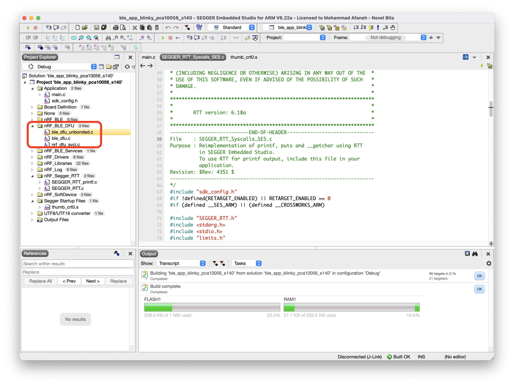
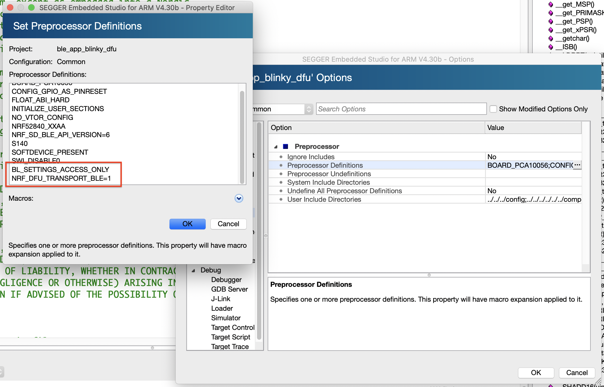
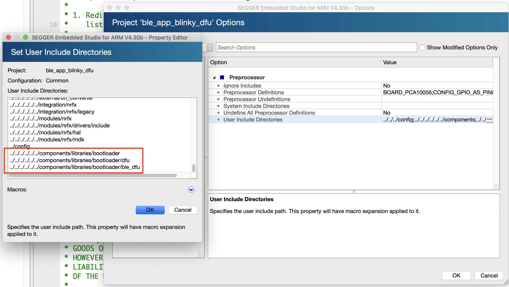

## [nrf] - Nordic nRF52 OTA DFU over Bluetooth LE

### Prerequisites
* Hardware:
    - nRF52-based dev-kit
    - mobile phone as DFU controller
    - PC: build / compile bootloader and application

* Software:
    - nRF SDK (v17.1.0)
    - Segger Embedded Studio (SES)
    - nRF Command Line Tool [nrfjprog](https://www.nordicsemi.com/Products/Development-tools/nrf-command-line-tools/download)
    - nRFutil (python dependent) - generate cryptography keys and DFU packages
    - crypto engine:
        - nRF52840: use CC310 crypto engine [CC310](https://infocenter.nordicsemi.com/index.jsp?topic=%2Fsdk_nrf5_v17.1.0%2Flib_crypto_backend_micro_ecc.html&anchor=lib_crypto_backend_micro_ecc_install)
        - others: may need to install [microecc](https://infocenter.nordicsemi.com/index.jsp?topic=%2Fsdk_nrf5_v17.1.0%2Flib_crypto_backend_micro_ecc.html&anchor=lib_crypto_backend_micro_ecc_install)
    - nRF Connect for Mobile or nRF Connect for Desktop

### Add buttonless DFU service and functionality to an example

1. use **ble_app_blinky** example within nRF5 SDK (v17.1.0)
2. use ***unbonded*** version of the **Buttonless DFU** implementation
3. Nordic [buttonless_dfu]() allows the device to expose the DFU GATT service alongside application's GATT service
4. Go into DFU mode within the application running; instead of requiring boot-up into DFU mode (via physical button presses)
5. Add following files to the project:
    * <SDK Folder>/components/ble/ble_services/ble_dfu/ble_dfu_bonded.c
    * <SDK Folder>/components/ble/ble_services/ble_dfu/ble_dfu_unbonded.c
    * <SDK Folder>/components/ble/ble_services/ble_dfu/ble_dfu.c
    * <SDK Folder>/components/libraries/bootloader/dfu/nrf_dfu_svci.c



6. Add preprocessor definitions to project: (common)
    * BLE_SETTINGS_ACCESS_ONLY
        - Limit access to the bootloader settings to access-only
    * NRF_DFU_TRANSPORT_BLE = 1



7. Add include header files folders for DFU:
    * <SDK Folder>/components/libraries/bootloader
    * <SDK Folder>/components/libraries/bootloader/dfu
    * <SDK Folder>/components/libraries/bootloader/ble_dfu



8. Rebuild for the win

9. Modify definitions within sdk_config.h
    * #define BLE_DFU_ENABLED 1
    * #define NRF_PWR_MGMT_CONFIG_AUTO_SHUTDOWN_RETRY 1
    * #define NRF_SDH_BLE_SERVICE_CHANGED 1

10. add / modify main.c
    * Add #include for the following
    ```c
        #include "nrf_power.h"
        #include "nrf_dfu_ble_svci_bond_sharing.h"
        #include "nrf_svci_async_function.h"
        #include "nrf_svci_async_handler.h"
        #include "ble_dfu.h"
        #include "nrf_bootloader_info.h"
    ```
11. add following functions (from DFU buttonless example)

* app_shutdown_handler()
```c
/**@brief Handler for shutdown preparation.
 *
 * @details During shutdown procedures, this function will be called at a 1 second interval
 *          untill the function returns true. When the function returns true, it means that the
 *          app is ready to reset to DFU mode.
 *
 * @param[in]   event   Power manager event.
 *
 * @retval  True if shutdown is allowed by this power manager handler, otherwise false.
 */
static bool app_shutdown_handler(nrf_pwr_mgmt_evt_t event)
{
    switch (event)
    {
        case NRF_PWR_MGMT_EVT_PREPARE_DFU:
            NRF_LOG_INFO("Power management wants to reset to DFU mode.");
            // YOUR_JOB: Get ready to reset into DFU mode
            //
            // If you aren't finished with any ongoing tasks, return "false" to
            // signal to the system that reset is impossible at this stage.
            //
            // Here is an example using a variable to delay resetting the device.
            //
            // if (!m_ready_for_reset)
            // {
            //      return false;
            // }
            // else
            //{
            //
            //    // Device ready to enter
            //    uint32_t err_code;
            //    err_code = sd_softdevice_disable();
            //    APP_ERROR_CHECK(err_code);
            //    err_code = app_timer_stop_all();
            //    APP_ERROR_CHECK(err_code);
            //}
            break;

        default:
            // YOUR_JOB: Implement any of the other events available from the power management module:
            //      -NRF_PWR_MGMT_EVT_PREPARE_SYSOFF
            //      -NRF_PWR_MGMT_EVT_PREPARE_WAKEUP
            //      -NRF_PWR_MGMT_EVT_PREPARE_RESET
            return true;
    }

    NRF_LOG_INFO("Power management allowed to reset to DFU mode.");
    return true;
}
```

* buttonless_dfu_sdh_state_observer()
```c
/**@brief Register application shutdown handler with priority 0.
 */
NRF_PWR_MGMT_HANDLER_REGISTER(app_shutdown_handler, 0);

static void buttonless_dfu_sdh_state_observer(nrf_sdh_state_evt_t state, void * p_context)
{
    if (state == NRF_SDH_EVT_STATE_DISABLED)
    {
        // Softdevice was disabled before going into reset. Inform bootloader to skip CRC on next boot.
        nrf_power_gpregret2_set(BOOTLOADER_DFU_SKIP_CRC);

        //Go to system off.
        nrf_pwr_mgmt_shutdown(NRF_PWR_MGMT_SHUTDOWN_GOTO_SYSOFF);
    }
}
```

* ble_dfu_buttonless_evt_handler()
```c
/* nrf_sdh state observer. */
NRF_SDH_STATE_OBSERVER(m_buttonless_dfu_state_obs, 0) =
{
    .handler = buttonless_dfu_sdh_state_observer,
};

static void ble_dfu_buttonless_evt_handler(ble_dfu_buttonless_evt_type_t event)
{
    ret_code_t    err_code;

    switch (event)
    {
        case BLE_DFU_EVT_BOOTLOADER_ENTER_PREPARE:
            NRF_LOG_INFO("Device is preparing to enter bootloader mode\r\n");
            break;

        case BLE_DFU_EVT_BOOTLOADER_ENTER:
            NRF_LOG_INFO("Device will enter bootloader mode\r\n");
            break;

        case BLE_DFU_EVT_BOOTLOADER_ENTER_FAILED:
            NRF_LOG_ERROR("Device failed to enter bootloader mode\r\n");
            break;
        default:
            NRF_LOG_INFO("Unknown event from ble_dfu.\r\n");
            break;
    }
}
```
* services_init()
```
/**@brief Function for initializing services that will be used by the application.
 */
static void services_init(void)
{
    ret_code_t         err_code;
    ble_lbs_init_t     init     = {0};
    nrf_ble_qwr_init_t qwr_init = {0};

    // Initialize Queued Write Module.
    qwr_init.error_handler = nrf_qwr_error_handler;

    err_code = nrf_ble_qwr_init(&m_qwr, &qwr_init);
    APP_ERROR_CHECK(err_code);

    // Initialize LBS.
    init.led_write_handler = led_write_handler;

    err_code = ble_lbs_init(&m_lbs, &init);
    APP_ERROR_CHECK(err_code);

    // Initialize the DFU service
    ble_dfu_buttonless_init_t dfus_init =
    {
        .evt_handler = ble_dfu_buttonless_evt_handler
    };
    err_code = ble_dfu_buttonless_init(&dfus_init);
    APP_ERROR_CHECK(err_code);
}
```
* main()
```
/**@brief Function for application main entry.
 */
int main(void)
{
    ret_code_t err_code;

    // Initialize.
    log_init();

    // Initialize the async SVCI interface to bootloader before any interrupts are enabled.
    err_code = ble_dfu_buttonless_async_svci_init();
    APP_ERROR_CHECK(err_code);

    leds_init();
    timers_init();
    buttons_init();
    power_management_init();
    ble_stack_init();
    gap_params_init();
    gatt_init();
    services_init();
    advertising_init();
    conn_params_init();

    // Start execution.
    NRF_LOG_INFO("Blinky example started.");
    advertising_start();

    // Enter main loop.
    for (;;)
    {
        idle_state_handle();
    }
}
```

### Generating the private-public key pair used for signing the firmware image

```
nrfutil keys generate private.key
```