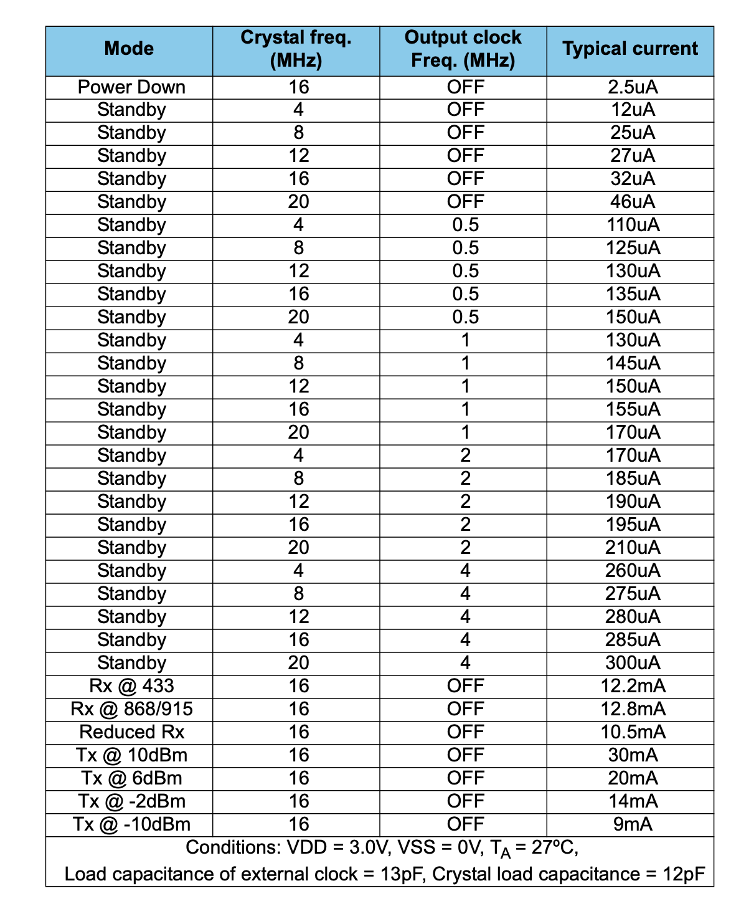

## [nrf] - NRF905

### block diagram

### Current Consumption

### Pin assignment

### Pin Definitions

### Operating Frequencies

### operating frequency equation

### SPI Timing Diagram

### SPI Read Write Operation

### external
[datasheet](https://www.mouser.tw/datasheet/2/297/NRSAS00107_1-2559891.pdf)
[source](https://shop.cpu.com.tw/product/55262/info/)
[code](https://drive.google.com/file/d/1dgyUIex2EPk6OyRiL0WxBJh3BXYMJS0j/view)