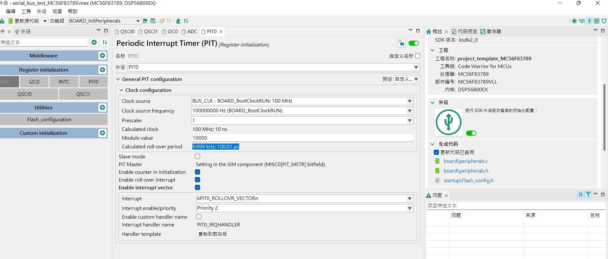

## [nxp] - freescale library (FSL) study notes

### Volatile Typedef
```c
  #define __IO volatile
  #define __I const volatile
  #define __O volatile

```

### Interrupt Level
* LEVEL1 - route to core directly
* LEVEL2 - route to NVIC first then route to core

### Interrupt Number Definition

```c
// MC56F83789.h
#define NUMBER_OF_INT_IRQ 103 /**< Number of interrupts in the IRQ table */
typedef enum IRQn
{
  ...
    /* Device specific interrupts */
    QSCI0_RERR_IRQn        = 42,  /**< QSCI0_RERR interrupt */
    QSCI0_RCV_IRQn         = 43,  /**< QSCI0_RCV interrupt */
    QSCI0_TRIDLE_IRQn      = 44,  /**< QSCI0_TRIDLE interrupt */
    QSCI0_TDRE_IRQn        = 45,  /**< QSCI0_TDRE interrupt */

    I2C1_IRQn              = 52,  /**< I2C1 interrupt */
    I2C0_IRQn              = 53,  /**< I2C0 interrupt */

  ...

} IRQn_Type;

```

### IRQ APIs

* static inline void EnableGlobalIRQ(uint32_t primask)
* static inline uint32_t DisableGlobalIRQ(void)
* void EnableDeepSleepIRQ(IRQn_Type interrupt)
* void DisableDeepSleepIRQ(IRQn_Type interrupt)
  - must define FSL_FEATURE_SOC_SYSCON_COUNT
* status_t EnableIRQWithPriority(IRQn_Type irq, uint8_t priNum)
* status_t IRQ_SetPriority(IRQn_Type irq, uint8_t priNum)
* status_t EnableIRQ(IRQn_Type irq)
* status_t DisableIRQ(IRQn_Type irq)

### memory API
* void *SDK_Malloc(size_t size, size_t alignbytes)
* void SDK_Free(void *ptr)

* SDK_SIZEALIGN MACRO
```c
typedef struct _mem_align_control_block
{
    uint16_t identifier; /*!< Identifier for the memory control block. */
    uint16_t offset;     /*!< offset from aligned address to real address */
} mem_align_cb_t;

/*! Macro to change a value to a given size aligned value */
#define SDK_SIZEALIGN(var, alignbytes) \
    ((unsigned int)((var) + ((alignbytes)-1U)) & (unsigned int)(~(unsigned int)((alignbytes)-1U)))
/* @} */

// usage
EDMA_TransferCreateHandle(psEdmaBase, &psHandle->sTxHandle, eEdmaTxChannel,
                  (edma_channel_tcd_t *)SDK_SIZEALIGN(&psHandle->sTxTcd[0], 
                  sizeof(edma_channel_tcd_t)), 1,
                  EDMA_QSPIMasterTxCallback, psHandle);
```

### Delay API

* void SDK_DelayAtLeastUs(uint32_t delay_us, uint32_t coreClock_Hz)
* void SDK_DelayCoreCycles(uint32_t u32Num) 
  - softawre loop delay

### On-Chip Clock Synthesis (OCCS)


### COP (Computer Operating Properly (Watchdog) driver)
* fsl_cop.h

### EWM (External Watchdog Monitor)


### CRC (Cyclic Redundancy check )

### ADC (12-bit Cyclic Analog-to-Digital Converter)


### CMP (Comparator)


### DAC (12-bit Digital-to-Analog Converter)

### EPWM (Enhanced Flexible Pulse Width Modulator (PWMA + PWMB) for MC56F837xx

### SPWM (Standard Flexible Pulse Width Modulator (PWMA + PWMB)) for MC56F836xx


### Clock API


### Timer Module (TMR)

#### Modes
* Count Mode
* Edge Count Mode


### TMR Memory Map
| Address | Name | Description |
| --- | --- | --- |
| E1AC |
| E1B0 |      |      |
| E1B1 |      |      |
| E1B2 |      |      |
| E1B3 |      |      |
| E1B4 |      |      |
| E1B5 |      |      |
| E1B6 |      |      |
| E1B8 |      |      |
| E1B9 |      |      |
| E1BA |      |      |
| E1BB |      |      |
| E1BC |      |      |
| E1B0 |      |      |
| E1B0 |      |      |


### PIT Module (Periodic Interrupt Timer)

#### Configure a 100 usec software timer
* mcuxpresso setting


* interrupt handler
```c
/**
 * @brief PIT0 interrupt at 10 kHz; 100 µs as software clock base
 * 
 */
/** PIT0_IRQHANDLER ivINT_PIT0_ROLLOVR */
#pragma section CODES_IN_RAM begin
#pragma interrupt alignsp saveall

void PIT0_IRQHANDLER(void) {
  uint16_t pit_flag;
  /* Get and clear pit prf flag */
  pit_flag = PIT0->CTRL & PIT_CTRL_PRF_MASK;
  PIT0->CTRL &= ~PIT_CTRL_PRF_MASK;
  
  // Debug_Io does not work in interrupt  
  // toggle GPIOA Pin5 every 10 msec
  pit_base_count++;
  if (pit_base_count >= _PIT0_10MS_CNT) {
    GPIOA->DR ^= kGPIO_Pin5;
    pit_base_count = 0;
  }
}

#pragma interrupt off
#pragma section CODES_IN_RAM end

```

### CAN FD (FlexCAN)

### QSCI (Queued Serial Communication Interface)
*  Separately enabled transmitter and receiver / DSC core interrupt requests / Programmable priority
* Two receiver wake-up method: idle line / address mark
* Interrupt driven with multiple flags 
  - tx empty
  - tx idle
  - receiver full
  - receiver overrun
  - reveiver idle
  - receiver input edge
  - noise error
  - framing error
  - parity error
* 1/16 bit-time noise detection

* Register Memory Map

| Address | Name | Short | R/W | Description | 
| --- | --- | --- | --- | --- |
| E080 | QSCI Baud Rate Register | QSCI0_RATE |  RW | Baud rate = peripheral bus clock / (16 * ({SBRH, SBRL} + (FRAC_SBR / 8))) |
| E081 | QSCI Control Register 1 | QSCI0_CTRL1 |  RW | Loopback (LOOP), StopMode (SWAI), ReceiverSource (RSRC), DataFormat - start/stop bit data bit (M), Wakeup Condition - idle_line/addr_mark (WAKE),  Polarity (POL), ParityEn (PE), ParityType (PT), TxInterrupt (TEIE, TIIE), RxInterrupt (RFIE, REIE), Tx/RxEn (TE, RE), RxWakeup (RWU), SendBreakChar (SBK)|
| E082 | QSCI Control Register 2 | QSCI_CTRL2 | RW | TxFifoCnt(TFCNT), TxFifoEmpty (TFWM), RxFifoCnt (RFCNT), RxFifoFull (RFWM), FifoEn(FIFO_EN),  RxInEdgeIntEn (RIEIE), LINSlave (LINMODE), RxIdleIntEn (RIIE), TxDmaEnable (TDE), RxDmaEnable (RDE) |
| E083 | QSCI status register | QSCI0_STAT  | R |TxEmptyFlag (TDRE), TxIdleFlag (TIDLE), RxFullFlag (RDRF), RxIdleFlag (RIDLE), overrunFlag (OR), noiseFlag (NF), FrameErrFlag (FE), ParityErrFlag (PF), RxInEdgeFlag (RIEF), LinSyncErrFlag (LSE), TxDMAReq (TDMA), RxDMAReq (RDMA), RxActiveFlag (RAF) |
| E084 | QSCI data register | QSCI0_DATA  | RW |  RX_TX_DATA (RECEIVE_TRANSMIT_DATA) |
| E085 | QSCI Control Register 3 | QSCI0_CTRL3  | RW | BaudRateDivHigh (SBRH), StopModeEntryHoldOff (SHEN) if not idle/empty |
| E090 | | QSCI1_RATE  |  |
| E091 | | QSCI1_CTRL1  |  |
| E092 | | QSCI1_CTRL2  |  |
| E093 | | QSCI1_STAT  |  |
| E094 | | QSCI1_DATA  |  |
| E095 | | QSCI1_CTRL3  |  |
| E0A0 | | QSCI2_RATE  |  |
| E0A1 | | QSCI2_CTRL1  |  |
| E0A2 | | QSCI2_CTRL2  |  |
| E0A3 | | QSCI2_STAT  |  |
| E0A4 | | QSCI2_DATA  |  |
| E0A5 | | QSCI2_CTRL3  |  |

```c
// MC56F83789.h
/** QSCI - Register Layout Typedef */
typedef struct
{
    __IO uint16_t RATE;  /**< QSCI Baud Rate Register, offset: 0x0 */
    __IO uint16_t CTRL1; /**< QSCI Control Register 1, offset: 0x1 */
    __IO uint16_t CTRL2; /**< QSCI Control Register 2, offset: 0x2 */
    __IO uint16_t STAT;  /**< QSCI Status Register, offset: 0x3 */
    __IO uint16_t DATA;  /**< QSCI Data Register, offset: 0x4 */
    __IO uint16_t CTRL3; /**< QSCI Control Register 3, offset: 0x5 */
} QSCI_Type;

```

#### LIN Mode
> The LIN specification was designed to allow very cheap hardware-nodes being used within a network. It is a low-cost, single-wire network based on ISO 9141. 
* The LIN-Master uses one or more predefined scheduling tables to start the sending and receiving to the LIN bus.One LIN Frame consists of the two parts header and response. 
* The header is always sent by the LIN Master, while the response is sent by either one dedicated LIN-Slave or the LIN master itself.  
* To ensure the baud rate-stability within one LIN frame, the SYNC field within the header is used.


### I2C Module (Chapter 34)
* 100kbit/s
* Comply with SMBus (system maangement bus) v2

* 3 modes: Run / Wait / Stop

### I2C Memory Map
| Address | Name | Description |
| -- | -- | -- |
| E0E0 | I2C Address Regsiter 1 (I2C0_A1) | Contain Slave Address to be used by I2C Module | 
| E0E1 | I2C Frequency Divider register (I2C0_F) | Multiplier (MULT) and clock rate (ICR) setting for SDA, SCL start, SCL stop hold time |
| E0E2 | I2C Control Register 1 (I2C0_C1) | 

```c
typedef struct
{
    __IO uint16_t A1;   /**< I2C Address Register 1, offset: 0x0 */
    __IO uint16_t F;    /**< I2C Frequency Divider register, offset: 0x1 */
    __IO uint16_t C1;   /**< I2C Control Register 1, offset: 0x2 */
    __IO uint16_t S;    /**< I2C Status register, offset: 0x3 */
    __IO uint16_t D;    /**< I2C Data I/O register, offset: 0x4 */
    __IO uint16_t C2;   /**< I2C Control Register 2, offset: 0x5 */
    __IO uint16_t FLT;  /**< I2C Programmable Input Glitch Filter Register, offset: 0x6 */
    __IO uint16_t RA;   /**< I2C Range Address register, offset: 0x7 */
    __IO uint16_t SMB;  /**< I2C SMBus Control and Status register, offset: 0x8 */
    __IO uint16_t A2;   /**< I2C Address Register 2, offset: 0x9 */
    __IO uint16_t SLTH; /**< I2C SCL Low Timeout Register High, offset: 0xA */
    __IO uint16_t SLTL; /**< I2C SCL Low Timeout Register Low, offset: 0xB */
} I2C_Type;

```

### SIM Module (System Integration Module)

### INTC (Interrupt Controller)

### EDMA Driver (Enhanced Direct Memory Access)

### DMAMUX (DMA Channel Multiplexer)

### PMC (Power Management Controller)

### XBAR (Inter Peripheral Crossbar Switch)

### FMC (Flash Memory Controller)

### FTFE (Flash Memory Module)

