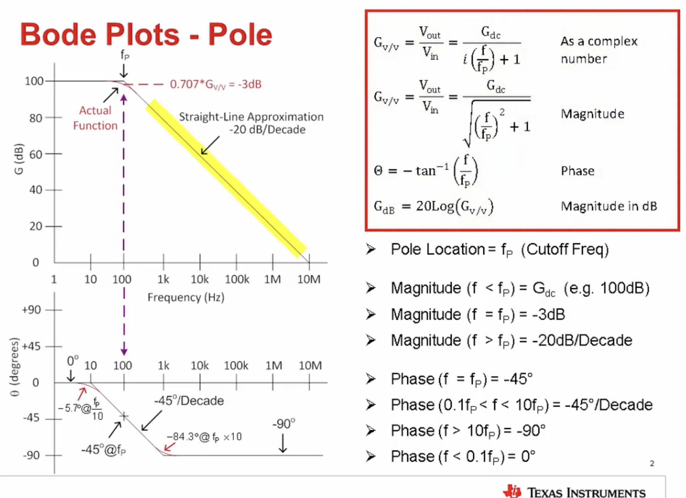
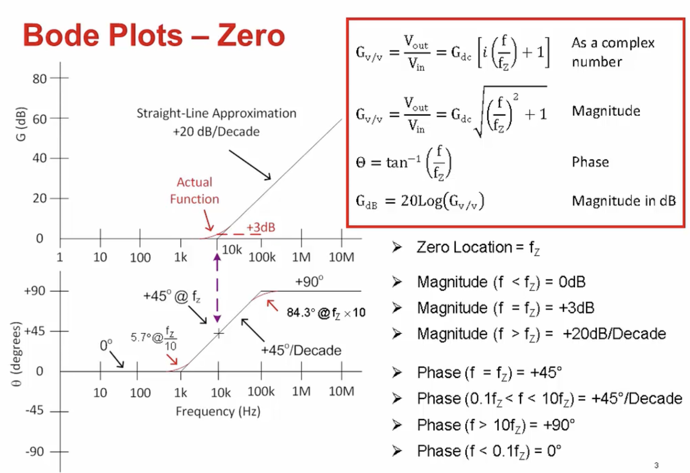
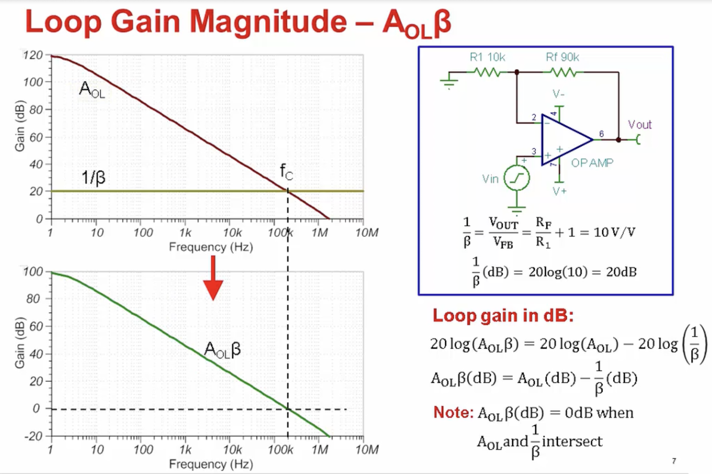
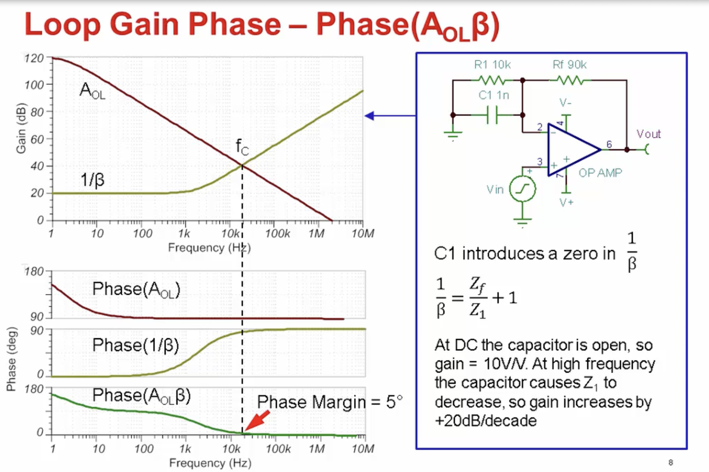
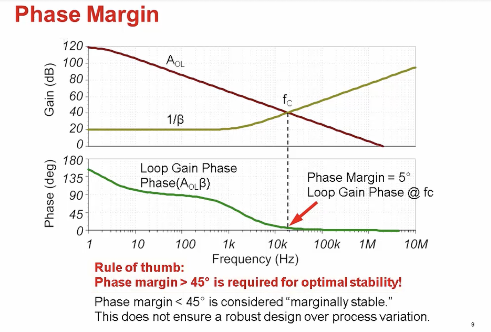
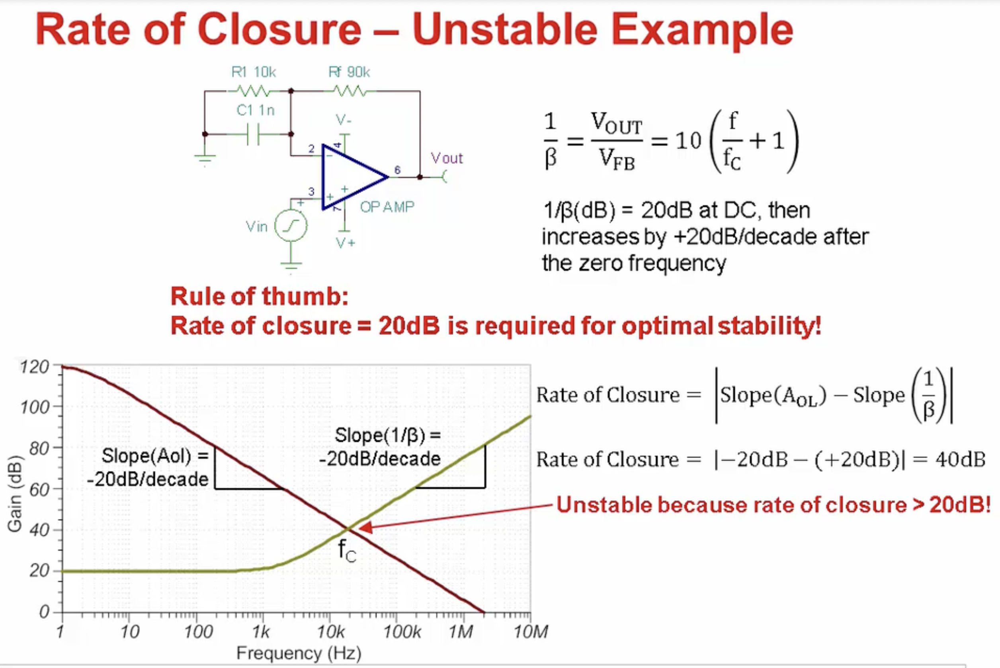
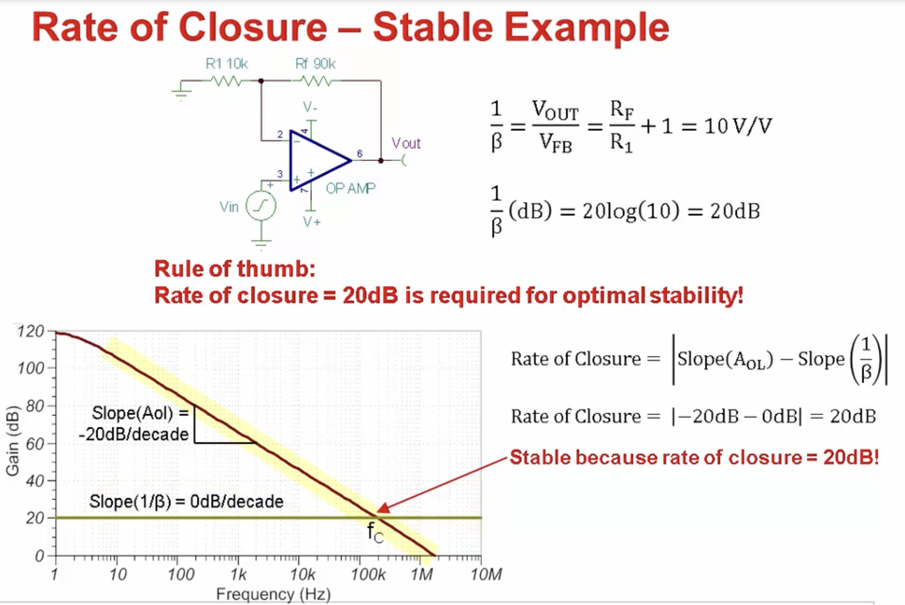
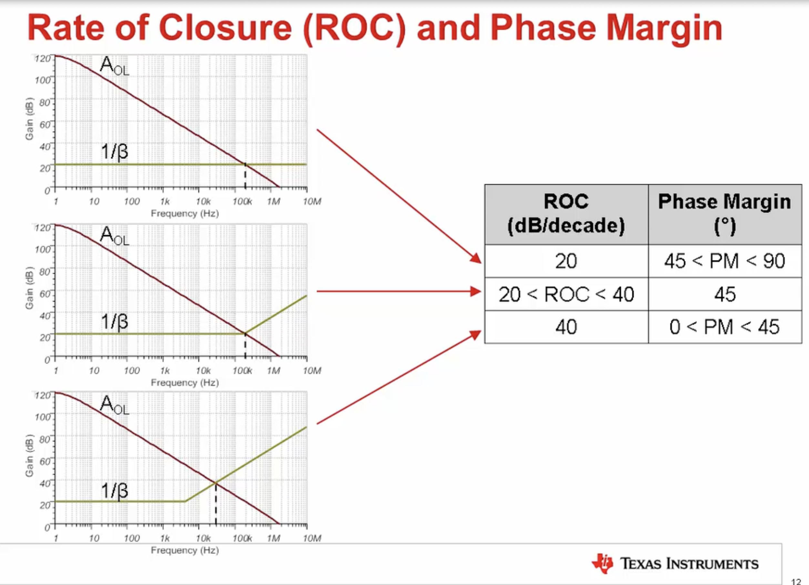

## [opamps] - stability note

Hello and welcome to Part 2 of the TI Precision Labs on Op Amp Stability. In the first video, we discussed the types of issues that op amp stability can cause in production systems, as well as how to identify stability issues in the lab. This video will provide a brief review of Bode plots and basic stability theory using phase margin iterative closure analysis. It is important to thoroughly understand these concepts before proceeding with the video series. Please be sure you've completed the lectures and problem sections for op amp bandwidth 1 through 3 before proceeding.

This slide is from Op Amp Bandwidth Video Number 1. It illustrates the equations for a pole and its associated to magnitude and phase response on Bode plots. A pole causes a negative 20 dB per decade decrease in the slope of the magnitude response after the pole frequency, fp. The pole also causes a negative 90 degree phase shift in the phase response, beginning roughly a decade before fp, and ending roughly a decade afterwards.

At fp, the magnitude response will have decreased by negative 3 dB, and the phase will have shifted by negative 45 degrees. While the pole results in a total phase shift of 90 degrees over about 2 and 1/2 decades, the phase shift is equal to negative 5.7 degrees a decade before fp, and negative 84.3 degrees a decade after fp.

This slide, also from Op Amp Bandwidth Video Number 1, illustrates the equations for a zero and its associated magnitude and phase response on Bode plots. A zero causes a positive 20 dB per decade increase in the slope of the magnitude response after the zero frequency, fz. The zero also causes a positive 90 degree phase shift in the phase response beginning roughly a decade before fz, and ending roughly a decade afterwards.

At fz, the magnitude responses increase by plus 3 dB, and the phase is shifted by positive 45 degrees. While the zero results in a total phase shift of positive 90 degrees over about 2 and 1/2 decades, the phase shift is equal to positive 5.7 degrees a decade before fz, and positive 84.3 degrees a decade after fz.

It's helpful to use an intuitive model for the op amp when performing AC stability analysis because of the complexity of modern op amps. In this simplified stability model, the differential voltage applied to the inputs is passed to the amplifier output stage, where it passes through the amplifier open loop gain, followed by the open loop output impedance, before it reaches the output terminal. The open loop gain, or Aol of an op amp, represents the maximum gain that can be applied over frequency to the differential voltage applied between the inputs of the device. Aol, for an ideal amplifier, is infinite, and is not limited by frequency.

Modern op amps can have open loop gains in excess of one million volts per volt, or 120 dB at low frequencies, with unity gain bandwidths from tens of kilohertz up to several gigahertz. The open loop output impedance, Zo, is a measure of the impedance of the open loop output stage of the op amp. Zo should not be confused with the amplifier's closed loop output impedance, Zout, which depends on Zo, Aol, and the circuit configuration.

To keep the stability analysis focused on the basic concepts for this video series, the behavior of Zo will be viewed as a resistor over all frequencies of interest. In truth, Zo can vary over frequency for newer rail-to-rail output stages, making stability analysis more difficult. Complex output impedance will be discussed in the advanced section at the end of this video series, after a firm understanding of analysis with the resistive output impedance has been developed.

To control the large open loop gain of modern amplifiers, negative feedback is required between the output of the amplifier and the inverting input. This is referred to as closing the loop. In this circuit, the loop is closed with Rf and R1, which creative voltage divider, and therefore, an attenuation between the output and the inverting input. The ratio of the resistors determines the amount of the output that is fed back to the input, which is defined as the feedback factor, or beta, of the circuit.

Closing the loop results in a closed loop gain, Acl, that is equal to Aol divided by 1 plus Aol multiplied by beta. The product of Aol and beta is referred to as loop gain. When a loop gain is large, the closed loop gain formula can be simplified to equal 1 over beta. In this example, 1 over beta equals 1 plus Rf divided by R1, which will be recognized as the gain of a non-inverting amplifier circuit.

Closed loop gain through negative feedback is a fundamental concept in amplifier circuit design, and should be thoroughly understood. Let's review it again quickly. The amplifier will adjust its output to equalize the two inputs, establishing the virtual short between them. Therefore, an attenuation from the output to the input-- set by beta-- forces the output to be larger than the input by the inverse of beta. This is how the ratio of the feedback resistor sets the closed loop gain of the circuit.

Let's now move on and define the conditions for stability using mathematical and graphical methods. First, we must define when an amplifier is unstable. Looking back at the op amp closed loop gain equation, we remember that Acl equals Aol divided by 1 plus loop gain. Taking a closer look, we can see that if loop gain equals negative 1, the denominator of the Acl equation equals negative 1, and therefore, Acl becomes undefined. This is the mathematical definition of instability.

How can this happen in a real circuit? Well, at some point in frequency, loop gain will equal 0 db, which is equal to 1 volt per volt. If enough delay is introduced into the feedback path, the phase in the feedback network will shift 180 degrees relative to Vn. A 180 degree phase shift is equivalent to an inversion of the input, or negative 1. Therefore, when loop gain equals 0 db and the phase is shifted by 180 degrees, the result is loop gain equals negative 1.

The term phase margin is used to define how close a circuit is this condition. Phase margin is simply the phase of loop gain at the frequency where loop gain equals 0 dB. For example, 10 degrees of phase margin means that loop gain has shifted by 170 degrees at the point where loop gain equals 0 dB.

As you can see, loop gain is a key component of stability analysis. How can we observe loop gain? First, we can consider the loop gain magnitude using a Bode plot. Using the same circuit as before, we have a gain of 10 volts per volt, or 20 dB. So 1 over beta is a constant 20 dB over frequency. The circuit's Aol is also shown.

To find the magnitude of loop gain, we simply subtract 1 over beta from Aol. This might not seem intuitive, but the mathematical relationship shown on the right side of the slide proves this using the properties of logarithms. Remember, in the last slide we stated that the phase margin is the loop gain phase at the frequency where loop gain equals zero dB. This frequency is called fc, and defines where the loop is closed. This is also the frequency were Aol and 1 over beta intersect, which makes sense, since the difference of two equal values is 0.

To measure the phase margin, we need to know the loop gain phase, or phase of Aol times beta, over frequency. Using the same log properties as before, we can simply subtract the phase of 1 over beta from the phase of Aol to get the phase of loop gain.

In this example, a capacitor was added to the feedback network of the op amp circuit. At DC, the capacitor is open, so the closed loop gain is 10 volts per volt like the previous circuit. At some higher frequency, the capacitor causes the impedance of the combination of R1 and C1 to decrease, so the gain of the circuit increases by plus 20 dB per decade. This can be seen from the 0 in the 1 over beta plot.

Looking at the phase, the 90 degree increase in the phase of 1 over beta creates a 90 degree decrease in the phase of loop gain. So the phase margin becomes very small, and is only equal to 5 degrees.

Now that we know how to observe phase margin, let's review what it's actually telling us. Remember that we want to avoid the condition where loop gain equals negative 1. That means we have a phase shift of 180 degrees add fc, or 0 degrees of phase margin.

For optimal stability, we use a rule of thumb which states that a phase margin of 45 degrees or higher is required. While a circuit may work with a phase margin less than 45 degrees, it is considered to only be marginally stable and will show significant overshoot in ringing. Also, keep in mind that over the lifetime of a design, devices will have different characteristics due to process variation, temperature, component value tolerances, and other fluctuations. Therefore, for a robust design, you should really meet the 45 degrees of phase margin minimum requirement.

Instead of having to directly measure the phase margin of every circuit to verify stability, another analysis method exists, which is simpler, and can actually give more information about what causes the stability problem in a circuit. This method is called rate of closure analysis. To use this method, we only need to consider the magnitude plots of Aol and 1 over beta. These plots have well-defined slopes due to the poles and zeroes in their transfer function.

By analyzing the rate of closure of Aol and 1 over beta at fc, the frequency at which they intersect, we can quickly determine the stability of a circuit. The rule for this method is that the rate of closure it at c must equal 20 dB for optimal stability.

Let's use our same circuit example from earlier, with a capacitor on the op amp inverting input. That capacitor causes a 0 in 1 over beta, which makes 1 over beta increase with the slope of 20 dB per decade. The Aol curve of the op amp decreases at 20 dB per decade, due to the op amp's dominant pole.

When they intersect at fc, the rate of closure is the absolute value of the slope of Aol minus the slope of 1 over beta, which works out to be 40 dB. Since the rate of closure is greater than 20 dB, we can conclude that the circuit is unstable, matching the poor phase margin measured previously.

Besides being quick and easy to check, the rate of closure method provides additional information into the cause of the circuit instability. In this example, the slope of Aol only shows the effect of the op amp dominant pole, as we expect. However, the rise in 1 over beta indicates a zero in the feedback network. Therefore, we can take steps to compensate for it. Measuring the phase margin does not provide this level of insight into the cause of the stability issue-- only whether or not there is an issue.

The rate of closure method works because the slopes of Aol well and 1 over beta are linked to the poles and zeroes in the circuit. A 20 dB rate of closure means the circuit is only under the net influence of one pole, which means the phase margin is at least 45 degrees, and not for optimal stability.

Here, we analyze the standard non-inverting amplifier circuit from earlier in the lecture using the rate of closure method. In this case, 1 over beta is flat, and doesn't contain the 0 shown in the previous example. Aol still decreases with a slope of negative 20 dB per decade as before, and therefore, the rate of closure is now 20 dB. We can conclude that this circuit is stable and will have phase margins greater than 45 degrees,

As shown in the previous slides, the rate of closure and phase margin are directly related to each other, allowing us to predict one value based on the other. This slide gives three different examples of rate of closure and their corresponding phase margins. In the first case, we have a rate of closure of 20 dB per decade. So the circuit is stable, and will have between 45 and 90 degrees of phase margin. This is the best case for circuit design.

In the second case, there is a 0 in 1 over beta right at fc. At fc, the rate of closure is beginning to change and will be somewhere between 20 and 40 dB per decade. This case corresponds roughly 45 degrees of phase margin.

Remember that a zero causes a total phase shift of 90 degrees, with 45 degrees of phase shift right at the zero frequency. Therefore, the loop gain phase will have 90 degrees of phase shift from the Aol dominant pole, and 45 degrees from the phase shift of the 1 over beta 0 at fc. This leaves 45 degrees of phase margin.

In the final case, there is a 0 in 1 over beta well before fc, so the rate of closure is 40 dB per decade. This results between 0 and 45 degrees of phase margin, corresponding to an unstable circuit. This case should be avoided.

In summary, this video discussed several fundamental concepts and op amp stability theory, including a Bode plot review, phase margin, and rate of closure analysis. Stay tuned for the next videos, which will cover the theory for simulating op amp stability and SPICE. Thanks for your time. Please try the quiz to check your understanding of this video's content.

### external resources
[pdf](https://training.ti.com/sites/default/files/docs/opamps-stability-phase-margin-presentation-quiz.pdf)

