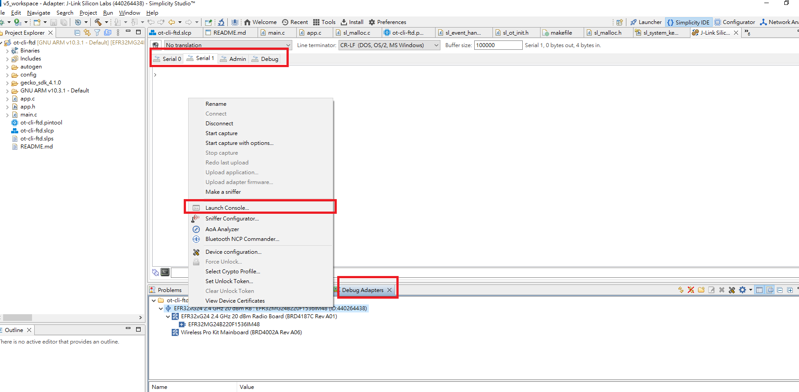

## [thread] - efr32mg project startup guide

> A step-by-step guide to creating, building, and running applications based on the Silicon Labs Thread stack.

### Requirements:

* Software:
	- Simplicity Studio v4
	- Silicon Labs Thread Stack 2.0.0
	- IAR Workbench 7.30

### Hardware:
	- EFR32MG Wireless Starter Kit (WSTK)

* I. Launch Simplicity Studio and Add Thread Stack
	1. Make sure at least two nodes are present with EFR32MG modules in Devices window.
	2. Go to Window -> Preferences. Then expand the Simplicity Studio item from the left list.
	3. Go to SDKs. In the right pane make sure Silicon Labs Thread Stack 2.0.0 is checked on. (If stack is not available please run Update Software.)
	4. Click OK to exit Preferences.

* II. Create New Application Framework Configuration for Server
	1. Go to File -> New -> Silicon Labs AppBuilder Project.
	2. Select Thread and then select our latest thread stack.
	3. Select Server. Click Next.
	4. Name your project. Example: ThreadServer200EFR32.
	5. In next window (Project Setup), check if Simplicity Studio detected the correct kit and part. For this example we used module BRD4153A with chip EFR32MG1P132F256GM48.

* III. Update Configuration for Server
	1. Under the "General" tab, notice the Generation directory and Device name and remember these for later.
	2. Under the "HAL" tab:
		- Set Bootloader to Application type.
		- Set the Application serial port to USART0 (port 1).
		- Check "USART0 (port 1)" box. This will be our communication line to the chip.
	3. Under the "Printing" tab:
		- Make sure "Enable debug printing" is checked.
		- Make sure under functional area Core and Application are checked in both "Compiled in" and "Enabled at startup" columns.
	4. Under the "Plugins" tab, we do not have anything to add for the sample apps.
	5. Under the "Callbacks" tab, we do not have anything to add for the sample apps.
	6. Under the "Other" tab, notice the additional server-implementation.c file. This is the application layer code.
	7. Click "Generate". Notice the project appeared in Project Explorer. Click OK.

* IV. Create New Application Framework Configuration for Client
	1. Go to File -> New -> Silicon Labs AppBuilder Project.
	2. Select Thread and then select our latest Thread stack.
	3. Select Client. Click Next.
	4. Name your project. Example: ThreadClient200EFR32. Click Finish.

* V. Update Configuration for Client
	1. Under the "General" tab, notice the Generation directory and Device name and remember these for later.
	2. Under the "HAL" tab:
		- Set Bootloader to Application type.
		- Set the Application serial port to USART0 (port 1).
		- Check "USART0 (port 1)" box. This will be our communication line to the chip.
	3. Under the "Printing" tab:
		- Make sure "Enable debug printing" is checked.
		- Make sure under functional area Core and Application are checked in both "Compiled in" and "Enabled at startup" columns.
	4. Under the "Plugins" tab, we do not have anything to add for the sample apps.
	5. Under the "Callbacks" tab, we do not have anything to add for the sample apps.
	6. Under the "Other" tab, notice the additional client-implementation.c file. This is the application layer code.
	7. Click "Generate". Notice the project appeared in Project Explorer. Click OK.

* VI. Build Projects in Simplicity Studio IDE
	1. Select the Server project in Project Explorer window.
	2. Compile your project by clicking on the Build icon. There is also a build option in the right-click menu.
	3. ensure that the build completes with 0 errors.
	4. Select Client project workspace and compile the same way.

* VII. Load Applications and Bootloaders to EFR32MG module on WSTK
	1. In Simplicity Studio, go to the Network Analyzer Perspective, right-click on a node for your application and select "Flash/Upload".
		- Browse to the S37 file create by the build (found in project directory tree under "IAR ARM - Debug" folder for example: MyProjects/ThreadServer200EFR32/IAR ARM - Debug).
		- Check the Bootloader option and browse to "./SiliconLabs/SimplicityStudio/v4/developer/stacks/thread/v2.0.0.0/protocol/thread_2.0/tool/bootloader-efr32mg1p132f256gm48/app-bootloader-spiflash/app-bootloader-spiflash.s37"
		- Check Erase Chip option; then click OK to proceed with the upload.
	2. The same can be done for the Client Application.

* VIII. Adding Client to Network
	1. In Simplicity Studio, in the Adapters view, right-click on the Server node and select "Console".
		- Navigate to "Serial 1" tab and press the return key a few times to get a prompt.
		- Server should output "Advertising to ff03::1"
	2. In the Adapters view, right-click on the Client node and select "Console".
		- Navigate to "Serial 1" tab and press the return key a few times to get a prompt.
		- Client should after some time output "ERR: Joining failed: 0xC0" and "Searching for network "client/server" using join key "ABCDEFGH"" (Where ABCDEFGH is an 8-byte join key).
		- In the Server Console type "expect {JOIN_KEY}" where {JOIN_KEY} is the join key printed by the Client. This initiates the joining and commissioning process.
		- The Server will print "Sent steering data". The joining process will take about one minute.
		- The Client will print "Joined network "client/server"" and "Bound to {SERVER_IP_ADDRESS}".
	3. Client will begin to send reporting data to Server.
	4. Server will print out the received data from Client.

### Software
#### ot-cli-ftd (Full Thread Device with simple CLI interface to test openthread stack)

#### Set up the Serial console for ot-cli-ftd devices

#### Set up the Raspberry Pi as a Border Router
