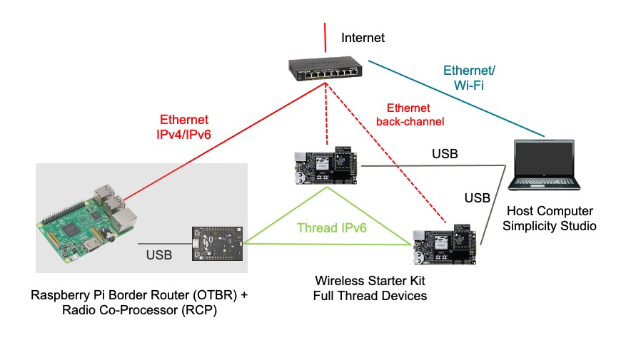
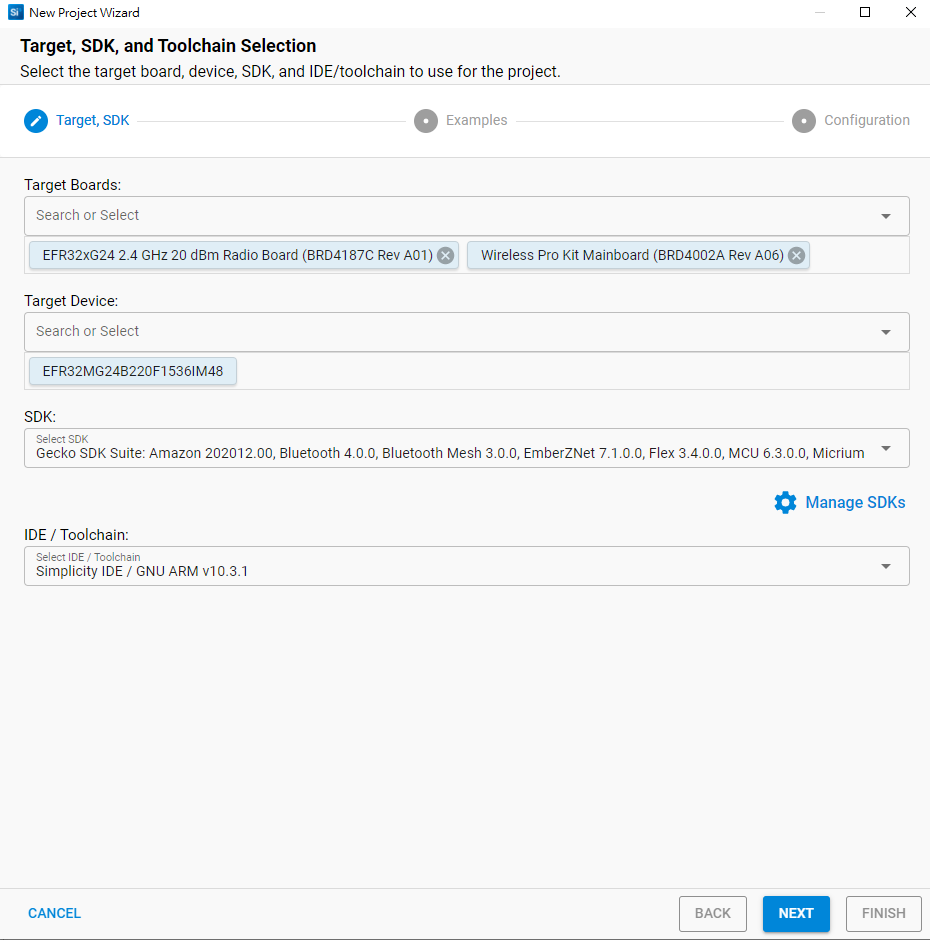
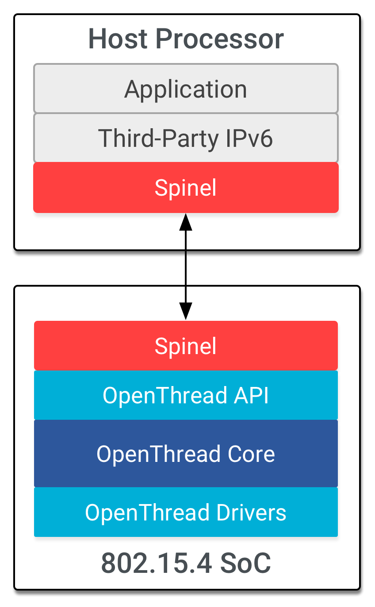
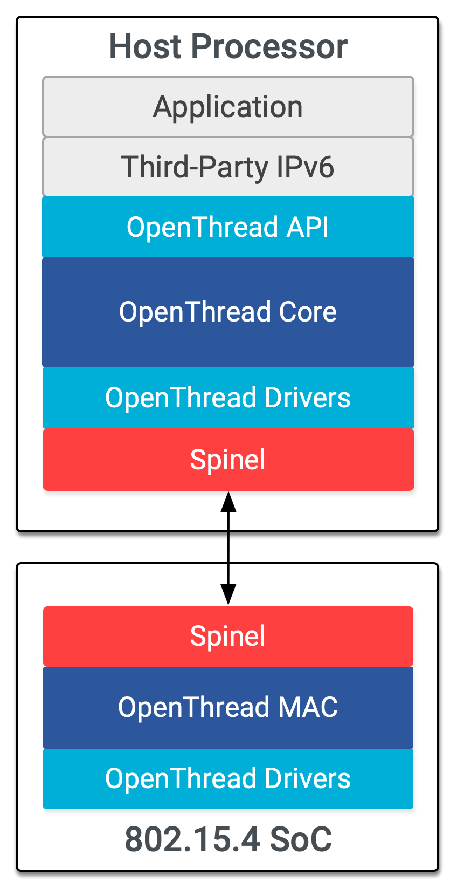

# [thread] - setup with silab

* 如何使用 Silicon Labs Simplicity Studio IDE 建立 OpenThread 專案。
* 如何建構和刷新 OpenThread CLI 二進位檔並傳送至 Silicon  Labs 廣播板。
* 如何使用 Docker 將 Raspberry Pi 3B+ 以上版本設為OpenThread Border Router (OTBR)。
* 如何在 OTBR 上建立 Thread 網路。
* 裝置外有 1 個網路委任網路。
* 如何使用 ping 指令驗證節點之間的 Thread 通訊。

## Raspberry Pi
* 具有 Raspbian Stretch Lite OS 映像檔或 Raspbian Stretch with Desktop (透過桌面連上網路) 的 Raspberry Pi 3B 以上版本。我們將其設定為 OT 邊界路由器。
* 擁有至少 2 個 USB 連接埠和網際網路連線的 Windows/Linux/Mac Host 系統。前往 SSv5 查看硬體和作業系統需求。
* 至少一張乙太網路線，用於將 Raspberry Pi 連上網際網路。WSTK 也支援透過 IP 進行偵錯及閃爍，因此您也可以使用額外的乙太網路線透過乙太網路轉換器將 WSTK 連接至主機系統。

## Software
* GNU ARM 工具鍊
* Gecko SDK Suite 3.2.0 以上版本和 Silicon Labs OpenThread SDK。
    - Gecko SDK 3.2.0
    - GNU ARM v7.2.1

---
> 透過 USB 將各個無線入門套件的主板連接到主機電腦。這些連線將允許對 RCP 和裝置進行程式設計和網路分析。我們會先使用主機電腦，透過 ot-rcp 韌體來編寫 BRD4166A，最終將連線至 Raspberry Pi。也可選擇，一般裝置可以透過通用乙太網路交換器連接至主機電腦。此外，這個入門套件也支援運用 IPv4 進行程式設計和網路分析。

* EFR32xG24 2.4 GHz 20 dBm RB, Wireless Pro Kit Mainboard Project Creation

---

### 網路輔助處理器 (NCP)
Benefits of NCP:
Host processor can sleep to save power, leaving the Radio Controller to keep the network going. Not really applicable for a Border Router.
More responsive than RCP for local Thread network traffic (packets don't need to be forwarded to the Linux host for processing just to be sent back out on the Thread interface)
Supported by the OTBR Docker Image (easier to get started with development)
* NCP
    
### 無線電處理器 (RCP)
Benefits of RCP:
Can operate on a lower cost Thread Radio IC (e.g., Nordic nRF52811)
The Border Router host (Linux) can access the full Thread CLI functionality, not just commands implemented by wpantund.  It can do this without disturbing wpantund.  This is helpful for troubleshooting, even remotely.
Updates to the OpenThread stack can be applied to the Border Router without re-flashing the NCP firmware (assumes RCP implementation is complete/stable).
* RCP
    

### RCP vs NCP

Background:
Basic definitions of NCP and RCP are here: [ncp-rcp](https://openthread.io/platforms/co-processor)
In an NCP configuration, the OpenThread stack is running on the Radio Controller (e.g., nRF52840 or '833)
An expanded explanation of RCP is here: [rcp](https://openthread.io/platforms#radio-co-processor-rcp)
The RCP configuration requires a very simple radio control layer on the Radio Controller (e.g., nRF52840, '833, or '811)
In order to use an RCP, therefore, the Border Router must be running a Thread stack -- this is where the OpenThread Posix core comes in.  See [posix-border](https://github.com/openthread/openthread/tree/master/src/posix)

### Spinal 通訊協定

Spinel 是通用的管理通訊協定，可讓主機裝置與共同處理器通訊。Spinel 最初是專為支援執行緒式 NCP 而設計，採用分層方法設計，可輕鬆在日後調整至其他網路技術。此限制會與 RCP 和 NCP 設計搭配使用。

這個通訊協定包含在 OpenThread (/src/lib/spinel) 中。名為 Pyspinel 的 Python CLI 工具可提供測試。
* [spinel-ietf-draft](https://datatracker.ietf.org/doc/html/draft-rquattle-spinel-unified)

