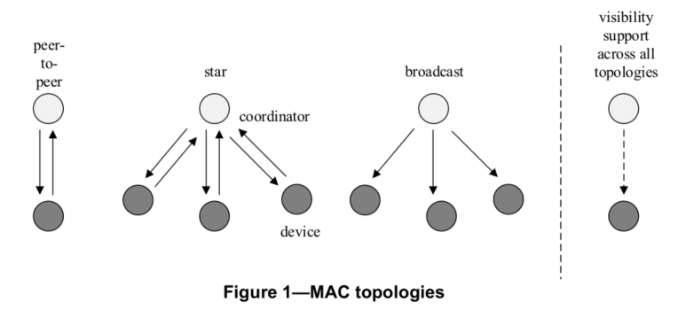

## [OWC] - Optical Wireless Communications 筆記

#### **3.1 Definition**
* blending: 
  * Disproportional merging of two different images as a single image.
* color function: 
  * Function that provides information to human eyes via color
    1. device status
    2. channel quality

* Point-and-shoot:
  * Transmission of color visibility dimming (CVD) frame to the target receiving device.

* Region of Interest:
  * An interesting subset of an image region.

#### **3.2 Acronyms and abbreviations
* A-QL: Asynchronous quick link
* CC: convolutional coding
* CCA: clear channel accessment
* CAP: 
* CFP: contension free period
* C-OOK: camera on-off keying
* CSK: color shift keying
* CVD: color visibility dimming
* FLR: Fast link recovery
* GF: Galois field
* GTS: guarajteed time slot
* SAP: Service Access Point

#### **4.2 Network topologies
* 3 classes of devices are considered for OWC:

||Infrastructure|Mobile|Vehicle|
|--|--|--|--|
|Fixed coordinator|Yes|No|No|
|Power supply|Ample|Limited|Moderate|
|Form Factor|Unconstrained|Constrained|Unconstrained|
|Light source|Intense|Weak|Intense|
|Mobility|No|Yes|No|
|Range|Short/long|Short|Long|
|Data rates|High/low|High|Low|

* OWPAN applications three topologies:
  * peer-to-peer
  * star
  * broadcast

  

* Each device/coordinator has unique 64-bit address.
* When device associated with coordinator it is assigned a short 16-bit address.
* Either unique addr or short addr can be used for communication.
* Each independent OWPAN has an identifier (5.2.1.3 and 5.2.1.5)

#### **4.4.1 PHY types**

* PHY I:
  * Outdoor usage with low data rate applications. 
  * On-Off keying (OOK) and variable pulse position modulation (VPPM). Data rate at Tens to Hundreds of kbps.
  * Table 76
* PHY II:
  * Indoor usage with moderate data rate.
  * On-Off keying (OOK) and variable pulse position modulation (VPPM). Data rate at Tens of Mbps.
  * Table 77
* PHY III:
  * Use Color-shift keying (CSK)
  * Have multiple light sources and detectors
  * Tens of Mbps.
  * Table 78
* PHY IV:
  * Discrete light source.
  * Up to 22 kbps.
  * Various modulation.
  * Table 79
* PHY V:
  * Use with diffused surface light source.
  * Up to 5.71 kbps
  * Various modulation.
  * Table 79

* PHY VI:
  * Video Display
  * Various Modulation
  * kbps
  * Table 79

###  **PHY Frame Structure**

### **12. PHY III Specifications**

### **13. PHY IV Specifications**

