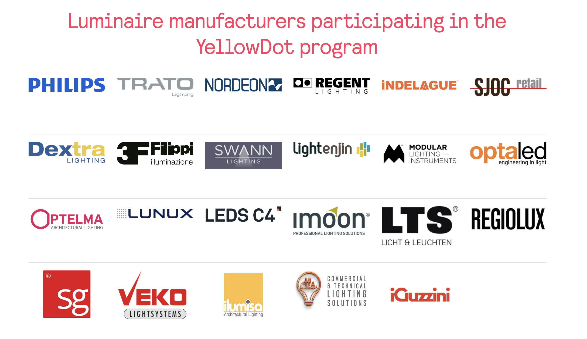

## [owc] - yellow dots alliance(?)

#### team members

> The YellowDot program is a luminaire certification
program that allows manufacturers to test and certify that
their LED luminaires are interoperable with Signify’s indoor
positioning technology. A key aspect of YellowDot ready
LED drivers is that data can be transmitted by modulating
data onto the LED current and thus in the light output. The
NCL310xx products are Yellow−dot compatible. This
means that it is possible to modulate the LED current
conform to the Yellow–dot specification. Contact Signify
for more information about this program and the technical
requirements. Modulating the data on the DIM pin can be
done either by using the MDAC (preferred) method or by
using the ADIM method together with the PWMVLC signal.