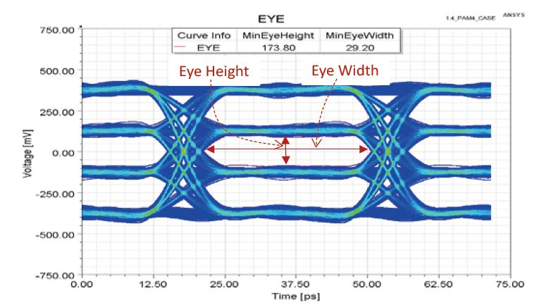
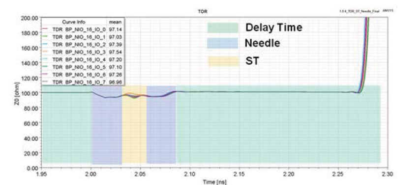

## [owc] - Optical Modulations

隨著5G通訊的普及以及AI的興起，資料傳輸呈現爆炸性的成長，在電路板材高頻特性的限制之下，NRZ編碼已經無法達到更高傳輸速率的要求，而PAM4編碼可以在相同頻段達到加倍的資料傳輸速率，因此PAM4編碼已經在高速數位資料傳輸上成為主流。

PAM4 雖然有高速傳輸的優點，但是因為每一個位準的高度僅是 NRZ 的三分之一，造成PAM4 的 SNR 必須比 NRZ 高將近11dB才能得到相同的 BER，因此對於傳輸線特性預測與電路板佈線的技巧就變得更重要。

* PAM4訊號有四個位階，其傳輸速率是傳統NRZ的兩倍，但是每一個位準的高度只有NRZ的三分之一。

* TDR可以顯示阻抗在時域上的變化，不連續點的阻抗不匹配會造成訊號的劣化，維持TDR曲線平穩，對於高速的PAM4訊號十分重要。

### **PAM (Pulse Amplitude Modulation)**

PAM 是脈波振幅調變 Pulse-Amplitude Modulation 的縮寫

* PAM3(for IEEE P802.3bp)
* PAM4(for IEEE802.3, 28/56/100/400GHz)
* PAM5(IEEE P802.3ab)
* PAM8(IEEE P802.3bm)

...等多種不同位階數的編碼方式，常用於高速數位訊號的傳輸。