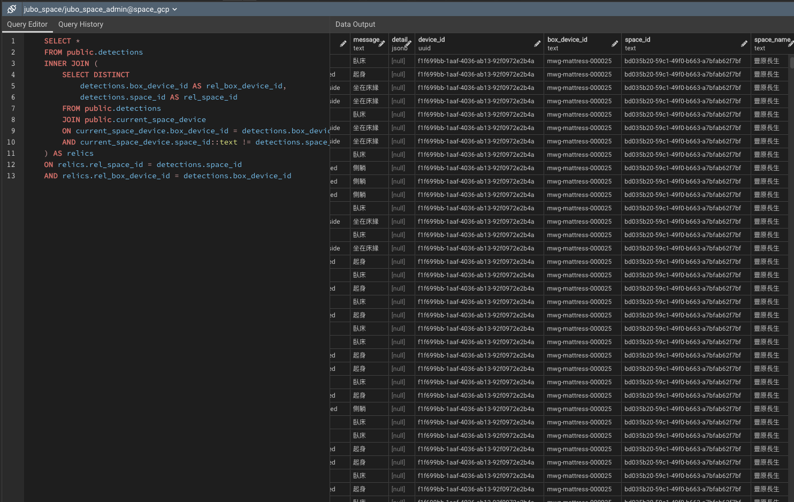
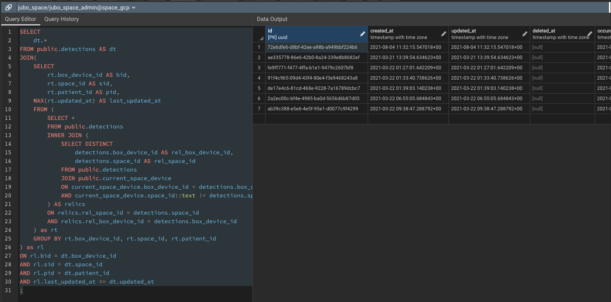
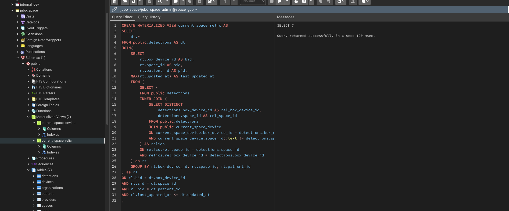

## [PostgreSql] - SQL 學習筆記


#### **CREATE EXTENSION**

https://www.postgresql.org/docs/9.1/sql-createextension.html

#### **CREATE Materialized View with JOIN tables**
[[doc]](https://www.postgresql.org/docs/9.5/sql-creatematerializedview.html)

* Example
  ```sql
  CREATE MATERIALIZED VIEW current_space_device
  SELECT spaces.id AS space_id,
      spaces.name AS space_name,
      spaces.branch,
      spaces.room,
      spaces.bed,
      devices.id AS device_id,
      devices.box_device_id,
      devices.organization_id,
      devices.brand,
      devices.name AS device_name,
      devices.type,
      devices.description,
      devices.configuration
    FROM spaces
      INNER JOIN devices ON spaces.id = devices.space_id
    WHERE devices.state = 'Normal'::text

  ```


  #### **查找已移除設備心路歷程**

  * 從 detections table JOIN materialized current_space_device table 篩選出已移動 space_id (與現在位置不符者清單)
    ```sql
      SELECT DISTINCT
        detections.box_device_id,
        detections.space_id
      FROM 
        public.detections
      JOIN 
        public.current_space_device
      ON 
        current_space_device.box_device_id = detections.box_device_id
      AND 
        current_space_device.space_id::text != detections.space_id;
    ```


  * 將上一個 subquery JOIN detections 篩選出已已移除設備的 detections
  ```sql
	SELECT *
	FROM public.detections
	INNER JOIN (
		SELECT DISTINCT
			detections.box_device_id AS rel_box_device_id,
			detections.space_id AS rel_space_id
		FROM public.detections
		JOIN public.current_space_device
		ON current_space_device.box_device_id = detections.box_device_id
		AND current_space_device.space_id::text != detections.space_id
	) AS relics
	ON relics.rel_space_id = detections.space_id
	AND relics.rel_box_device_id = detections.box_device_id  

  ```



* 使用 aggregate function MAX / GROUP BY 篩選出已移除設備的最後一筆 detection updates

```sql

SELECT
	rt.box_device_id,
	rt.space_id AS sid,
	rt.patient_id,
	MAX(rt.updated_at) AS last_updated_at
FROM (
	SELECT *
	FROM public.detections
	INNER JOIN (
		SELECT DISTINCT
			detections.box_device_id AS rel_box_device_id,
			detections.space_id AS rel_space_id
		FROM public.detections
		JOIN public.current_space_device
		ON current_space_device.box_device_id = detections.box_device_id
		AND current_space_device.space_id::text != detections.space_id
	) AS relics
	ON relics.rel_space_id = detections.space_id
	AND relics.rel_box_device_id = detections.box_device_id
) as rt
GROUP BY rt.box_device_id, rt.space_id, rt.patient_id;

```


* 最後 在重新將 detections table JOIN 篩選最後一筆 detections 紀錄

```sql
SELECT 
	dt.*
FROM public.detections AS dt
JOIN(
	SELECT
		rt.box_device_id AS bid,
		rt.space_id AS sid,
		rt.patient_id AS pid,
	MAX(rt.updated_at) AS last_updated_at
	FROM (
		SELECT *
		FROM public.detections 
		INNER JOIN (
			SELECT DISTINCT
				detections.box_device_id AS rel_box_device_id,
				detections.space_id AS rel_space_id
			FROM public.detections
			JOIN public.current_space_device
			ON current_space_device.box_device_id = detections.box_device_id
			AND current_space_device.space_id::text != detections.space_id
		) AS relics
		ON relics.rel_space_id = detections.space_id
		AND relics.rel_box_device_id = detections.box_device_id
	) as rt
	GROUP BY rt.box_device_id, rt.space_id, rt.patient_id
) as rl
ON rl.bid = dt.box_device_id
AND rl.sid = dt.space_id
AND rl.pid = dt.patient_id
AND rl.last_updated_at <= dt.updated_at
;

```


* Materialized 產生結果於 current_space_relics

```sql
CREATE MATERIALIZED VIEW current_space_relic AS
SELECT 
	dt.*
FROM public.detections AS dt
JOIN(
	SELECT
		rt.box_device_id AS bid,
		rt.space_id AS sid,
		rt.patient_id AS pid,
	MAX(rt.updated_at) AS last_updated_at
	FROM (
		SELECT *
		FROM public.detections 
		INNER JOIN (
			SELECT DISTINCT
				detections.box_device_id AS rel_box_device_id,
				detections.space_id AS rel_space_id
			FROM public.detections
			JOIN public.current_space_device
			ON current_space_device.box_device_id = detections.box_device_id
			AND current_space_device.space_id::text != detections.space_id
		) AS relics
		ON relics.rel_space_id = detections.space_id
		AND relics.rel_box_device_id = detections.box_device_id
	) as rt
	GROUP BY rt.box_device_id, rt.space_id, rt.patient_id
) as rl
ON rl.bid = dt.box_device_id
AND rl.sid = dt.space_id
AND rl.pid = dt.patient_id
AND rl.last_updated_at <= dt.updated_at
;

```


* 從 Query 結果可以看出移除設備的更換 Space & Patient 歷程

