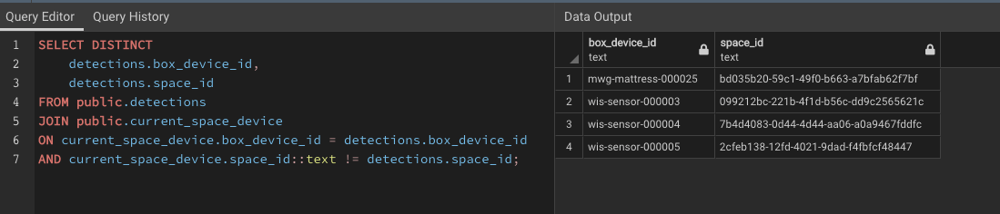
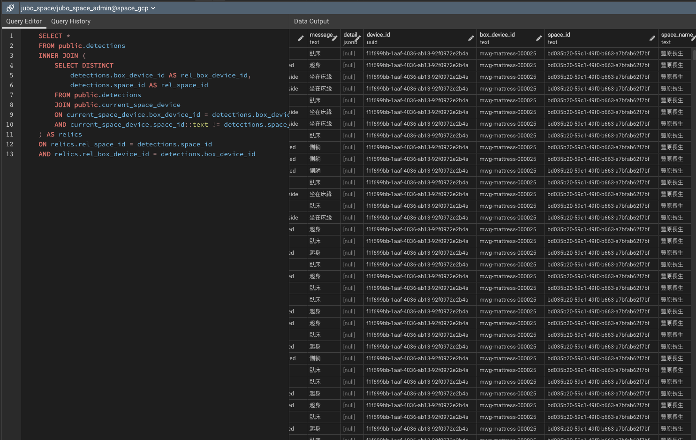
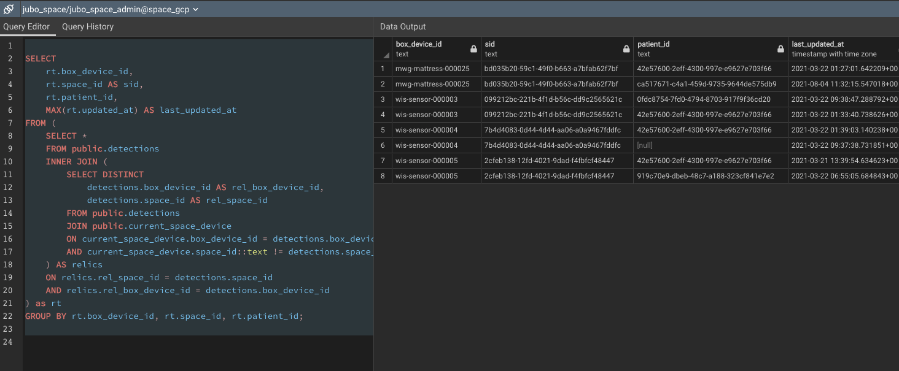
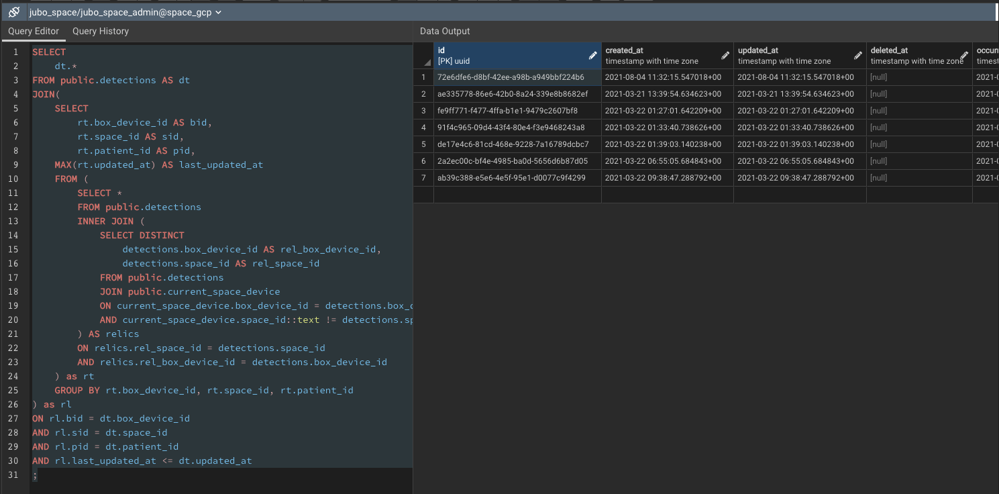
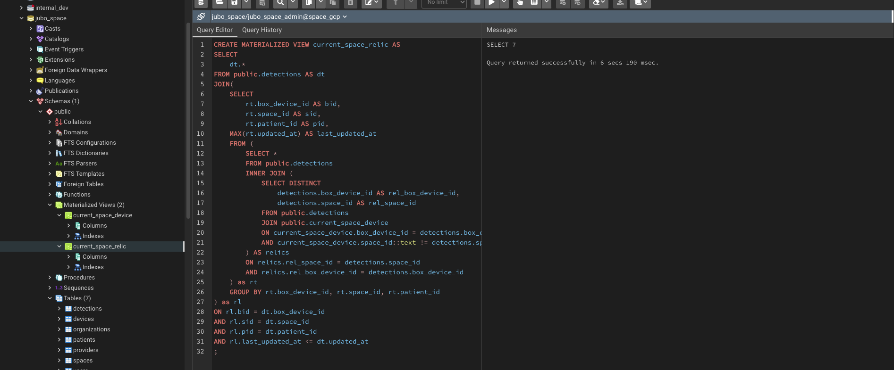
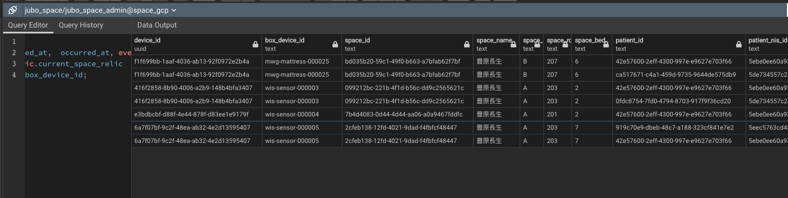

## [PostgreSql] - SQL 學習筆記

#### **CREATE EXTENSION**

<https://www.postgresql.org/docs/9.1/sql-createextension.html>

#### **Add Column to a Table**
  * ALTER TABLE
  * Add COLUMN <new_col> <datatype> <constraint>;
```sql
  ALTER TABLE detections
  ADD COLUMN configs jsonb;
```

#### **CREATE Materialized View with JOIN tables**

[[doc]](https://www.postgresql.org/docs/9.5/sql-creatematerializedview.html)

* Example

  ```sql
  CREATE MATERIALIZED VIEW current_space_device AS
  SELECT spaces.id AS space_id,
      spaces.name AS space_name,
      spaces.branch,
      spaces.room,
      spaces.bed,
      devices.id AS device_id,
      devices.box_device_id,
      devices.organization_id,
      devices.brand,
      devices.name AS device_name,
      devices.type,
      devices.description,
      devices.configuration
    FROM spaces
      INNER JOIN devices ON spaces.id = devices.space_id
    WHERE devices.state = 'Normal'::text

  ```

 #### **JOINING current_device with patients TABLE**
  *

 ```sql
  CREATE MATERIALIZED VIEW current_space_device AS
  SELECT 
   current.*,
   patients.sex,
   patients.first_name,
   patients.last_name,
   patients.id_number,
   patients.status,
   patients.provider_patient_id
  FROM(  
   SELECT spaces.id AS space_id,
     spaces.name AS space_name,
     spaces.branch,
     spaces.room,
     spaces.bed,
     devices.id AS device_id,
     devices.box_device_id,
     devices.organization_id,
     devices.brand,
     devices.name AS device_name,
     devices.type,
     devices.description,
     devices.configuration
    FROM spaces
     INNER JOIN devices ON spaces.id = devices.space_id
    WHERE devices.state = 'Normal'::text
  ) AS current
   INNER JOIN patients ON
   status = 'present'::text AND
   current.branch = patients.branch AND
   current.room = patients.room AND
   current.bed = patients.bed AND
   current.organization_id = patients.organization_id;
   
 ```

#### **查找已移除設備心路歷程**

  * 從 detections table JOIN materialized current_space_device table 中篩選出被移動過的設備清單和其 space_id (與當今設備位置 current_space_device 不符者清單)

 [DISTINCT CLAUSE](https://www.postgresql.org/docs/9.5/sql-select.html#SQL-DISTINCT)

 ```sql
  SELECT DISTINCT
   detections.box_device_id,
   detections.space_id
  FROM 
   public.detections
  JOIN 
   public.current_space_device
  ON 
   current_space_device.box_device_id = detections.box_device_id
  AND 
   current_space_device.space_id::text != detections.space_id;
 ```



* 將上一個 subquery JOIN detections 篩選出已已移除設備的 detections
 
  ```sql
 SELECT *
 FROM public.detections
 INNER JOIN (
  SELECT DISTINCT
   detections.box_device_id AS rel_box_device_id,
   detections.space_id AS rel_space_id
  FROM public.detections
  JOIN public.current_space_device
  ON current_space_device.box_device_id = detections.box_device_id
  AND current_space_device.space_id::text != detections.space_id
 ) AS relics
 ON relics.rel_space_id = detections.space_id
 AND relics.rel_box_device_id = detections.box_device_id  

  ```



* 使用 aggregate function MAX / GROUP BY 篩選出
 1. 已遷移設備位置
 2. 已更換病人

的最後一筆 detection

```sql

SELECT
 rt.box_device_id,
 rt.space_id AS sid,
 rt.patient_id,
 MAX(rt.updated_at) AS last_updated_at
FROM (
 SELECT *
 FROM public.detections
 INNER JOIN (
  SELECT DISTINCT
   detections.box_device_id AS rel_box_device_id,
   detections.space_id AS rel_space_id
  FROM public.detections
  JOIN public.current_space_device
  ON current_space_device.box_device_id = detections.box_device_id
  AND current_space_device.space_id::text != detections.space_id
 ) AS relics
 ON relics.rel_space_id = detections.space_id
 AND relics.rel_box_device_id = detections.box_device_id
) as rt
GROUP BY rt.box_device_id, rt.space_id, rt.patient_id;

```



* 最後 在重新將 detections table JOIN 篩選最後一筆 detections 紀錄

```sql
SELECT 
 dt.*
FROM public.detections AS dt
JOIN(
 SELECT
  rt.box_device_id AS bid,
  rt.space_id AS sid,
  rt.patient_id AS pid,
 MAX(rt.updated_at) AS last_updated_at
 FROM (
  SELECT *
  FROM public.detections 
  INNER JOIN (
   SELECT DISTINCT
    detections.box_device_id AS rel_box_device_id,
    detections.space_id AS rel_space_id
   FROM public.detections
   JOIN public.current_space_device
   ON current_space_device.box_device_id = detections.box_device_id
   AND current_space_device.space_id::text != detections.space_id
  ) AS relics
  ON relics.rel_space_id = detections.space_id
  AND relics.rel_box_device_id = detections.box_device_id
 ) as rt
 GROUP BY rt.box_device_id, rt.space_id, rt.patient_id
) as rl
ON rl.bid = dt.box_device_id
AND rl.sid = dt.space_id
AND rl.pid = dt.patient_id
AND rl.last_updated_at <= dt.updated_at
;

```



* Materialized 產生結果於 current_space_relics

```sql
CREATE MATERIALIZED VIEW current_space_relic AS
SELECT 
 dt.*
FROM public.detections AS dt
JOIN(
 SELECT
  rt.box_device_id AS bid,
  rt.space_id AS sid,
  rt.patient_id AS pid,
 MAX(rt.updated_at) AS last_updated_at
 FROM (
  SELECT *
  FROM public.detections 
  INNER JOIN (
   SELECT DISTINCT
    detections.box_device_id AS rel_box_device_id,
    detections.space_id AS rel_space_id
   FROM public.detections
   JOIN public.current_space_device
   ON current_space_device.box_device_id = detections.box_device_id
   AND current_space_device.space_id::text != detections.space_id
  ) AS relics
  ON relics.rel_space_id = detections.space_id
  AND relics.rel_box_device_id = detections.box_device_id
 ) as rt
 GROUP BY rt.box_device_id, rt.space_id, rt.patient_id
) as rl
ON rl.bid = dt.box_device_id
AND rl.sid = dt.space_id
AND rl.pid = dt.patient_id
AND rl.last_updated_at <= dt.updated_at
;

```



* 從 Query 結果可以從 detections table 中篩選出已移除設備更換 Space & Patient 歷程



*

#### Create ***Materialized View*** for **Latest Detections**

```sql
  CREATE MATERIALIZED VIEW detections_latest AS
SELECT 
	spa.organization_id,
	ld.*
FROM public.spaces AS spa
INNER JOIN (
SELECT DISTINCT ON (box_device_id)
	det.id,
	det.created_at,
	det.deleted_at,
    det.occurred_at,
	det.device_id,
    det.box_device_id,
	det.configs,
    det.event,
    det.message,
    det.detail,
    det.space_id,
    det.space_name,
    det.space_branch,
    det.space_room,
    det.space_bed,
    det.patient_id,
    det.patient_nis_id,
    det.patient_id_number,
    det.patient_first_name,
    det.patient_last_name

FROM public.detections AS det
ORDER BY box_device_id, occurred_at DESC
) AS ld

ON spa.id::text = ld.space_id

;
```

#### Create ***Materialized View*** for **Twenty_Four_Hour_Detections**
##### **Conditions**

```sql
CREATE MATERIALIZED VIEW detections_24h AS
SELECT *
FROM public.detections
WHERE occurred_at >= now() - INTERVAL '1 DAY';
```

#### Create ***Materialized View*** for **One_Month_Detections**
##### **Conditions**

```sql
CREATE MATERIALIZED VIEW detections_1M AS
SELECT *
FROM public.detections
WHERE occurred_at >= now() - INTERVAL '1 MONTH';
```


#### Create ***Materialized View*** for **離床/跌倒**
##### **Conditions**

```sql
SELECT DISTINCT ON (box_device_id)
	occurred_at, box_device_id, id
	FROM public.detections_24h as h24
	WHERE h24.event = 'leave_bed'
	OR h24.event = 'away_from_bed'
	OR h24.event = 'falldown'
	GROUP BY h24.box_device_id, h24.id, h24.occurred_at
ORDER BY box_device_id, occurred_at DESC
;

```

#### Create Index Using btree
```sql
  CREATE INDEX 
    idx_occurred_time 
  ON 
    public.detections 
  USING 
    btree (occurred_at);
```

#### Show all indexes of a table 
```sql
SELECT
	indexname,
	indexdef
FROM
	pg_indexes
WHERE
	tablename = 'detections';
```