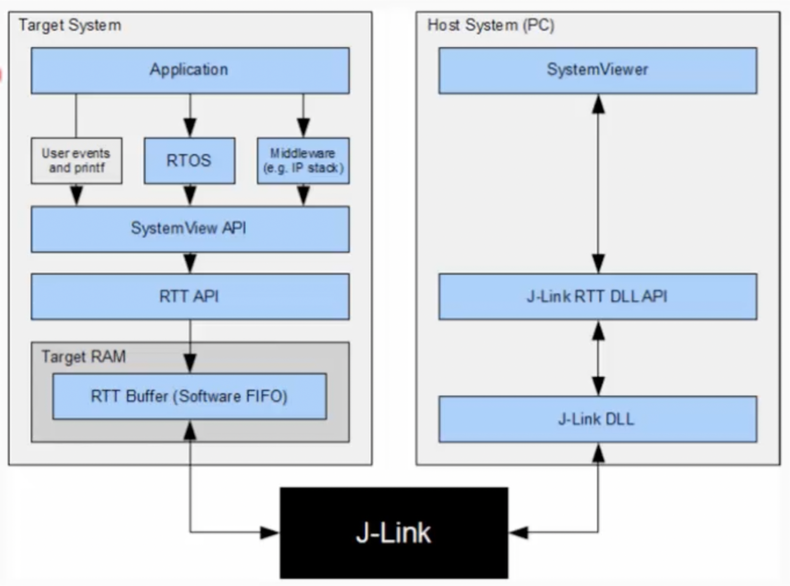
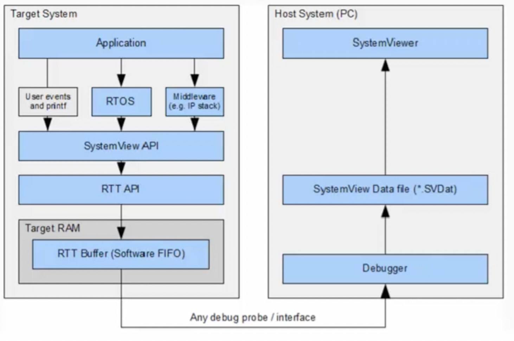

## [segger] - SystemView

#### FreeRTOS
* Analyze how many tasks are running
* how much duration they consume on CPU
* ISR entry and exit timings and duration of run
* Analyze behaviour of tasks:
    + blocking
    + unblocking
    + notifying
    + yielding
* Analyze CPU idle time; sending CPU to speed mode
* Total runtime behaviour of application

### Real Time Recording (Continuous Recording)
* with SEGGER J-link and Real Time Transfer (RTT)
* can be achieved via ST-link
    - J-link firmware has to be flashed on ST-link circuitry for STM32 board.
    
### Single-shot recording:
* in single shot mode, recording start manually in the application.
* Record specific parts
    - RTT Buffer (Software FIFO)
    - save to *SVDat
    

### Add Segger SystemView Target Source to Project
* Create SEGGER folder in Third Party, with following sub folders
    - Config
        + Global.h
        + SEGGER_RTT_Conf.h
        + SEGGER_SYSVIEW_Conf.h
        + SEGGER_SYSVIEW_Conf_FreeRTOS.h
    - Patch
        + FreeRTOS_10_4_3.patch
    - OS
        + SEGGER_SYSVIEW_FREERTOS.c
        + SEGGER_SYSVIEW_FREERTOS.h
    - SEGGER
        + SEGGER_RTT_ASM_ARMv7M.s
        + SEGGER_RTT_printf.c
        + SEGGER_RTT.c
        + SEGGER_RTT.h
        + SEGGER_SYSVIEW_ConfDefaults.h
        + SEGGER_SYSVIEW_Int.h
        + SEGGER_SYSVIEW.c
        + SEGGER_SYSVIEW.h
        + SEGGER.h
        + Syscalls
            - SEGGER_RTT_Syscalls_GCC.c

* Path setting for include files

### Patching the patch file (STM32CubeIDE method)
* Select ThirdParty folder (right click) >> Team >> Apply Patch
*

