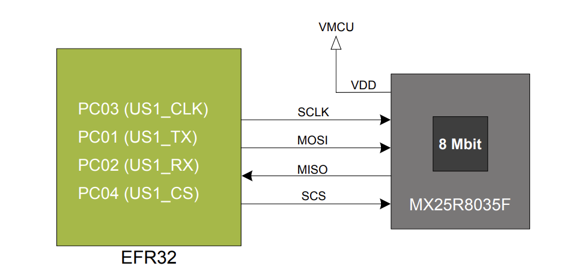
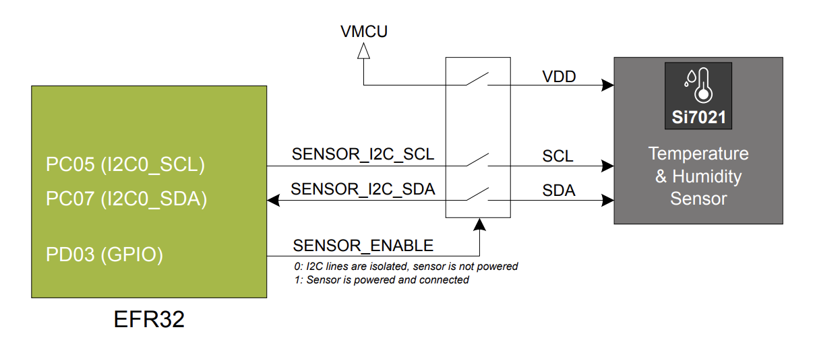
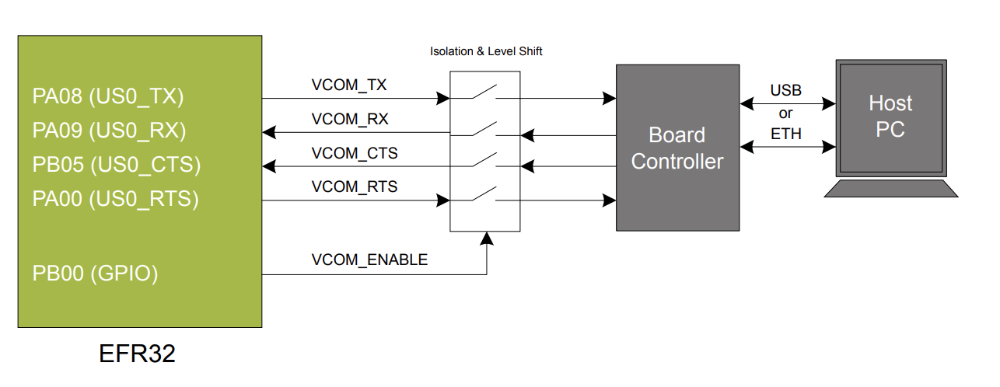

## [silabs] -

### serial flash
* 8 Mbit Macronix MX25R SPI flash

### Si7021 Relative Humidity and Temperature Sensor
* factory-calibrated and the calibration data is stored in the on-chip non-volatile memory.
* This ensures that the sensors are fully interchangeable with no recalibration or software changes required.
* Si7021 offers an accurate, low-power, factory-calibrated digital solution ideal for measuring humidity, dew point, and temperature in
applications ranging from HVAC/R and asset tracking to industrial and consumer platforms.
* SENSOR_ENABLE (PD03) must be set high
* When enabled, the sensor's current consumption is included in the AEM
measurements.

### Virtual COM port

|Signal|Description|
|---|---|
|VCOM_TX|
|VCOM_RX|
|VCOM_CTS|
|VCOM_RTS|
|VCOM_ENABLE|

### external
[guide](https://www.silabs.com/documents/public/user-guides/ug526-brd4187c-user-guide.pdf)
[doc](https://docs.silabs.com/)