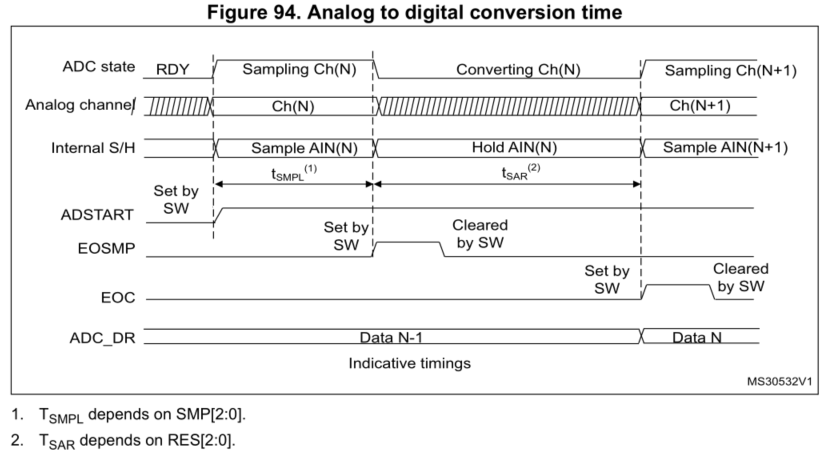
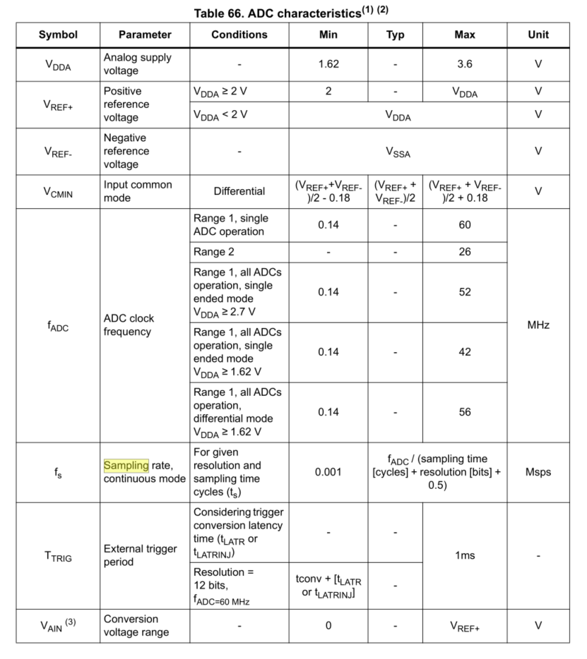

# [stm] - stm32gs_series_adc_study_note
* 12, 10, 8, 6 bit resolution configurable
* 5 ADCs, 4 in pairs can operate in dual mode
  - ADC1 channel - 14 external, 4 internal
  - ADC2 channel - 16 external, 2 internal
  - ADC3 channel - 15 external, 3 internal
  - ADC4 channel - 16 external, 2 internal
  - ADC5 channel - 13 external, 5 internal
* oversampler
  - 16 bit data register
  - oversampling ration 2 ~ 256
  - data shift up to 8 bit
* external channels: 5 fast channel, 13 slow channels
* internal channels:
  - internal ref volt (VREFINT) - ADC1, 3, 4, 5

* Start of conversion (SOC)
  - software (regular/injected)
  - hardware trigger
* Analog watchdog
  - filtering out-of-range data
* Interrupts:
  - ADC ready
  - End of sampling (EOS)
  - end of conversion (EOC)
  - end of sequence conversion
  - analog watchdog 1, 2, 3
  - overrun events
* Conversion modes
  - convert single channel 
  - scan sequence of channels
  - single mode converts selected inputs per trigger
  - continous mode converts selected inputs continuously
  - discontinuous mode

* Single Ended Mode
  - Vconv = ADCy_INPx = Vinp[i] - Vref-
* Differential Mode
  - Vconv = ADCy_INPx - ADCy_INNx = Vinp[i] - Vinn[i]
* Adc Pins
  - Vref+ : high/positive ref volt for ADC
  - Vref− : is internally connected to Vssa
  - Vdda : analog power supply Vdda
  - Vssa : Gnd for analog power supply
  - Vinp[i] : connected to ADCx_INP[i] external or internal channels
  - Vinn[i] : connected to Vref- (single-end) or to external channels, ADCx_INN[i] and ADCx_INP[i+1] (differential)
  - ADCx_INN[i] : Up to 19 analog input channels (x = ADC number = 1, 2, 3, 4 or 5).
  - ADCx_INP[i] : Up to 19 analog input channels (x = ADC number = 1, 2, 3, 4 or 5).

  | When configuring the channel “i” in differential input mode, its negative input voltage V INN[i] is connected to another channel. As a consequence, this channel is no longer usable in single-ended mode or in differential mode and must never be configured to be converted.
* ADC clocks:
  - system clock
  - PLL "P" clock

* ADC Deep Power Down mode (DEEPPWD)


* ADC voltage Regulator (ADVREGEN)


* Calibration (ADCAL, ADCALDIF, ADC_CALFACT)
  - 
  - ADCALDIF = 0 before calibration for single-ended conversion
  - ADCALDIF = 1 before calibration before differential conversion
  

* Single ADC convert both single ended and differential conversion
  1. Disable ADC
  2. Calibrate ADC in singled ended (ADCALDIF = 0), updates CALFACT_S register
  3. Calibrate ADC in differential (ADCALDIF = 1), updates CALFACT_D register
  4. Enable ADC, configure channels and launch conversions.
  5. each switch from single to differential, calibration is auto injected

* ADC on-off control (ADEN, ADDIS, ADRDY)
  - software enable
    1. clear ADC_ISR->ADRDY
    2. set ADEN
    3. wait ADRDY = 1 and clear ADRDY

  - software disable
    1. check both ADSTART = 0 and JADSTART = 0
    2. or set stop ADSTP = 1 and JADSTP = 1
    3. wait until ADSTP =  and JADSTP = 0
    4. set ADDIS
    5. wait ADEN = 0

* Channel Selection (SQRx, JSQRx - injected sequence)
  - regular group (ADC_SQRy)- 16 conversion
  - injected group (ADC_JSQR)= 4 conversion
    - allow mondify ADC_JSQR register on the fly when JADSTART = 1

* Sampling Time (SMPR1, SMPR2)
  - selectable 2.5, 6.5, 12.5, 24.5, 47.5, 92.5, 247.5, 640.5 ADC clock cycles
  - conversion time calculation: 
    - Tconv = sampling time + 12.5 ADC clock cycles (conversion)
  - set EOSMP = 1 at end of sampling (regular conversion)

* BULB sampling mode
  - sampling period start immediately after the last ADC conversion if BULB is set
  - BULB mode is not compatible with continuous mode or injected channel conversion
  - cannot set ADC_CFGR2->SMPTRIG bit if BULB is set

  ```c
  // stm32g4xx_hal_adc.h
  #define ADC_SAMPLING_MODE_BULB                  (ADC_CFGR2_BULB) 
  /*!< ADC conversions sampling phase starts immediately after end of conversion, and stops upon trigger event.
  ```

* Sampling time control trigger mode (SMPTRIG)
  - when SMPTRIG is set, sampling time is controlled by te trigger signal edge
  - if SMPTRIG is set, cannot set BULB bit
  - SWTRIG must be cleared to end the sampling period abd start the conversion

* Interleaved mode with independent injection
* SMPPLUS control bit

* Single conversion (CONT = 0)

* continuous conversion (CONT = 1)

* ADC timing
  - Tconv = Tsmpl + Tsar = 2.5 min cycle + 12.5 cycles * Tadc_clk
  - Tconv = 2.5 * 160Mhz + 12.5 * 160Mhz = 41.67 nsec 

  


* ADC sampling rate (continuous mode)
  - sampling rate = fadc / (sampling time [cycles] + resolution [bits] + 0.5) (Msps)
  - eg. 160Mhz / (6.5 + 12 + 0.5) = 8.42 Msps
* ADC characteristics


* Stopping ongoing conversion
  - ADSTP, JADSTP

* Injected channel management
  - Triggered injection mode
    1. ADC_CFGR->JAUTO  must be cleared
  - auto injection mode


### Fast Conversion
  |Resolution (bit)|Tsar (ns) at 30Mhz|Tconv (clock cycle with Tsar=2.5 cycle)|Tconv(ns) at 30Mhz|
  |---|---|---|---|
  |12|12.5 ADC|416.67 ns|15 ADC|500 ns|
  |10|10.5 ADC|350 ns|13 ADC| 433.33 ns|
  |8|8.5 ADC|203.33 ns|11 ADC|366.67 ns|
  |6|6.5 ADC| 216.67 ns|9 ADC|300 ns|


#### 21.4.29 oversampler


```c
/* Configuration of Oversampler:                                      */
/*  - Oversampling Ratio                                              */
/*  - Right bit shift                                                 */
/*  - Triggered mode                                                  */
/*  - Oversampling mode (continued/resumed)                           */
// oversampling configuration 
HAL_StatusTypeDef HAL_ADC_Init(ADC_HandleTypeDef *hadc)
  ...
      if (hadc->Init.OversamplingMode == ENABLE)
      {
        assert_param(IS_ADC_OVERSAMPLING_RATIO(hadc->Init.Oversampling.Ratio));
        assert_param(IS_ADC_RIGHT_BIT_SHIFT(hadc->Init.Oversampling.RightBitShift));
        assert_param(IS_ADC_TRIGGERED_OVERSAMPLING_MODE(hadc->Init.Oversampling.TriggeredMode));
        assert_param(IS_ADC_REGOVERSAMPLING_MODE(hadc->Init.Oversampling.OversamplingStopReset));

        /* Configuration of Oversampler:                                      */
        /*  - Oversampling Ratio                                              */
        /*  - Right bit shift                                                 */
        /*  - Triggered mode                                                  */
        /*  - Oversampling mode (continued/resumed)                           */
        MODIFY_REG(hadc->Instance->CFGR2,
                   ADC_CFGR2_OVSR  |
                   ADC_CFGR2_OVSS  |
                   ADC_CFGR2_TROVS |
                   ADC_CFGR2_ROVSM,
                   ADC_CFGR2_ROVSE                       |
                   hadc->Init.Oversampling.Ratio         |
                   hadc->Init.Oversampling.RightBitShift |
                   hadc->Init.Oversampling.TriggeredMode |
                   hadc->Init.Oversampling.OversamplingStopReset
                  );
      }
  ...
```

### Dual ADC modes
> - ADCx_CCR -> DUAL[4:0] not zero
> - ADC_CFGR -> CONT, AUTDLY, DISCEN, DISCNUM[2:0], JDISCEN, JQM, JAUTO are shared between master and slave ADC


#### possible modes:
  1. Injected simultaneous mode
  2. Regular simultaneous mode
  3. Interleaved mode
  4. Alternate trigger mode
  5. or combinations of
    1. injected + regular simultaneous mode
    2. regular simnultaneous + alternate trigger mode
    3. injected simultaneous + interleaved mode

### ADC ISR Register (ADC_ISR)
| bit | Register | Description | Detail |
| --- | --- | --- | ---- |
| 10 |   JQOVF   |     | |
|  9 |   AWD3   |     | |
|  8 |   AWD2   |     | |
|  7 |   AWD1   |     | |
|  6 |   JEOS   |     | |
|  5 |   JEOC   |     |  |
|  4 |   OVR   |   adc overrun  | set when overrun occurrs on regular channel, 0 = no overrun, 1 = overrun occurred|
|  3 |   EOS   |   end of regular sequence flag  |  |
|  2 |   EOC   |   end of conversion flag  |  |
|  1 |   EOSMP   |   end of sampling flag  |  |
|  0 |   ADRDY   |   adc ready  |  |

### ADC registers (for each ADC)


#### ADC Common Registers
* ADCx_CSR - Common Status Register (x = 12 or 345)
  - status bit of different ADCs
  - read only
  - must be cleared by writing 0 to it in the corresponding ADC_ISR

| bit | REGISTER BIT | Description |
| --- | --- | --- |
| 26  | JQOVF_SLV  | copy of JQOVF bit |
|   |   |

* ADCx_CCR - Common configuration Register
* ADCx_CDR - Common regular data register for dual mode

```c
typedef struct
{
  __IO uint32_t CSR;          /*!< ADC common status register,            Address offset: 0x300 + 0x00 */
  uint32_t      RESERVED1;    /*!< Reserved,                              Address offset: 0x300 + 0x04 */
  __IO uint32_t CCR;          /*!< ADC common configuration register,     Address offset: 0x300 + 0x08 */
  __IO uint32_t CDR;          /*!< ADC common group regular data register Address offset: 0x300 + 0x0C */
} ADC_Common_TypeDef;


```

#### Multi-mode
```c
// DMAAccessMode selects
#define ADC_DMAACCESSMODE_DISABLED      (0x00000000UL)     /*!< DMA multimode disabled: each ADC uses its own DMA channel */
#define ADC_DMAACCESSMODE_12_10_BITS    (ADC_CCR_MDMA_1)   /*!< DMA multimode enabled (one DMA channel for both ADC, DMA of ADC master) for 12 and 10 bits resolution */
#define ADC_DMAACCESSMODE_8_6_BITS      (ADC_CCR_MDMA)     /*!< DMA multimode enabled (one DMA channel for both ADC, DMA of ADC master) for 8 and 6 bits resolution */

#if defined(ADC_MULTIMODE_SUPPORT)
/**
  * @brief  Structure definition of ADC multimode
  * @note   The setting of these parameters by function HAL_ADCEx_MultiModeConfigChannel() is conditioned by ADCs state (both Master and Slave ADCs).
  *         Both Master and Slave ADCs must be disabled.
  */
typedef struct
{
  uint32_t Mode;              /*!< Configures the ADC to operate in independent or multimode.
                                   This parameter can be a value of @ref ADC_HAL_EC_MULTI_MODE. */

  uint32_t DMAAccessMode;     /*!< Configures the DMA mode for multimode ADC:
                                   selection whether 2 DMA channels (each ADC uses its own DMA channel) or 1 DMA channel (one DMA channel for both ADC, DMA of ADC master)
                                   This parameter can be a value of @ref ADC_HAL_EC_MULTI_DMA_TRANSFER_RESOLUTION. */

  uint32_t TwoSamplingDelay;  /*!< Configures the Delay between 2 sampling phases.
                                   This parameter can be a value of @ref ADC_HAL_EC_MULTI_TWOSMP_DELAY.
                                   Delay range depends on selected resolution:
                                    from 1 to 12 clock cycles for 12 bits, from 1 to 10 clock cycles for 10 bits,
                                    from 1 to 8 clock cycles for 8 bits, from 1 to 6 clock cycles for 6 bits.     */
} ADC_MultiModeTypeDef;
#endif /* ADC_MULTIMODE_SUPPORT */
```

#### Mutli-ADC mode DMA driver snippets
```c
    /**
      * @brief  Enables ADC DMA request after last transfer (Multi-ADC mode) and enables ADC peripheral
      *         Configures the DMA in double buffer mode
      *
      * @note   Caution: This function must be used only with the ADC master.
      *                  DMA must be configured in Circular buffer mode
      *
      * @param  hadc pointer to a ADC_HandleTypeDef structure that contains
      *         the configuration information for the specified ADC.
      * @param  FirstMemAddress   Pointer to the first buffer in which transferred from ADC peripheral to memory will be stored.
      * @param  SecondMemAddress  Pointer to the second buffer in which transferred from ADC peripheral to memory will be stored.
      * @param  Length  The length of data to be transferred from ADC peripheral to memory.
      * @retval HAL status
      */
    HAL_StatusTypeDef HAL_ADCEx_MultiModeStart_DualBF_DMA(ADC_HandleTypeDef* hadc, uint32_t *FirstMemAddress, uint32_t *SecondMemAddress, uint32_t DataLength)
    {
      __IO uint32_t counter = 0U;
      ADC_Common_TypeDef *tmpADC_Common;
     
      /* Check the parameters */
      assert_param(IS_FUNCTIONAL_STATE(hadc->Init.ContinuousConvMode));
      assert_param(IS_ADC_EXT_TRIG_EDGE(hadc->Init.ExternalTrigConvEdge));
      assert_param(IS_FUNCTIONAL_STATE(hadc->Init.DMAContinuousRequests));
     
      /* Process locked */
      __HAL_LOCK(hadc);
     
      /* Check if ADC peripheral is disabled in order to enable it and wait during
         Tstab time the ADC's stabilization */
      if((hadc->Instance->CR2 & ADC_CR2_ADON) != ADC_CR2_ADON)
      {
        /* Enable the Peripheral */
        __HAL_ADC_ENABLE(hadc);
     
        /* Delay for temperature sensor stabilization time */
        /* Compute number of CPU cycles to wait for */
        counter = (ADC_STAB_DELAY_US * (SystemCoreClock / 1000000U));
        while(counter != 0U)
        {
          counter--;
        }
      }
     
      /* Start conversion if ADC is effectively enabled */
      if(HAL_IS_BIT_SET(hadc->Instance->CR2, ADC_CR2_ADON))
      {
        /* Set ADC state                                                          */
        /* - Clear state bitfield related to regular group conversion results     */
        /* - Set state bitfield related to regular group operation                */
        ADC_STATE_CLR_SET(hadc->State,
                          HAL_ADC_STATE_READY | HAL_ADC_STATE_REG_EOC | HAL_ADC_STATE_REG_OVR,
                          HAL_ADC_STATE_REG_BUSY);
     
        /* If conversions on group regular are also triggering group injected,    */
        /* update ADC state.                                                      */
        if (READ_BIT(hadc->Instance->CR1, ADC_CR1_JAUTO) != RESET)
        {
          ADC_STATE_CLR_SET(hadc->State, HAL_ADC_STATE_INJ_EOC, HAL_ADC_STATE_INJ_BUSY);
        }
     
        /* State machine update: Check if an injected conversion is ongoing */
        if (HAL_IS_BIT_SET(hadc->State, HAL_ADC_STATE_INJ_BUSY))
        {
          /* Reset ADC error code fields related to conversions on group regular */
          CLEAR_BIT(hadc->ErrorCode, (HAL_ADC_ERROR_OVR | HAL_ADC_ERROR_DMA));
        }
        else
        {
          /* Reset ADC all error code fields */
          ADC_CLEAR_ERRORCODE(hadc);
        }
     
        /* Process unlocked */
        /* Unlock before starting ADC conversions: in case of potential           */
        /* interruption, to let the process to ADC IRQ Handler.                   */
        __HAL_UNLOCK(hadc);
     
        /* Set the DMA transfer complete callback */
        hadc->DMA_Handle->XferCpltCallback = ADC_MultiModeDMAConvCplt;
        hadc->DMA_Handle->XferM1CpltCallback = ADC_MultiModeDMAConvCplt;
     
        /* Set the DMA half transfer complete callback */
        hadc->DMA_Handle->XferHalfCpltCallback = ADC_MultiModeDMAHalfConvCplt;
        hadc->DMA_Handle->XferM1HalfCpltCallback = ADC_MultiModeDMAHalfConvCplt;
     
        /* Set the DMA error callback */
        hadc->DMA_Handle->XferErrorCallback = ADC_MultiModeDMAError ;
     
        /* Manage ADC and DMA start: ADC overrun interruption, DMA start, ADC     */
        /* start (in case of SW start):                                           */
     
        /* Clear regular group conversion flag and overrun flag */
        /* (To ensure of no unknown state from potential previous ADC operations) */
        __HAL_ADC_CLEAR_FLAG(hadc, ADC_FLAG_EOC);
     
        /* Enable ADC overrun interrupt */
        __HAL_ADC_ENABLE_IT(hadc, ADC_IT_OVR);
     
        /* Pointer to the common control register to which is belonging hadc    */
        /* (Depending on STM32F4 product, there may be up to 3 ADC and 1 common */
        /* control register)                                                    */
        tmpADC_Common = ADC_COMMON_REGISTER(hadc);
     
        if (hadc->Init.DMAContinuousRequests != DISABLE)
        {
          /* Enable the selected ADC DMA request after last transfer */
          tmpADC_Common->CCR |= ADC_CCR_DDS;
        }
        else
        {
          /* Disable the selected ADC EOC rising on each regular channel conversion */
          tmpADC_Common->CCR &= ~ADC_CCR_DDS;
        }
     
        /* Enable the DMA Stream */
        HAL_DMAEx_MultiBufferStart_IT(hadc->DMA_Handle,(uint32_t)&tmpADC_Common->CDR, (uint32_t) FirstMemAddress, (uint32_t) SecondMemAddress, (uint32_t) DataLength);
        
        /* if no external trigger present enable software conversion of regular channels */
        if((hadc->Instance->CR2 & ADC_CR2_EXTEN) == RESET) 
        {
          /* Enable the selected ADC software conversion for regular group */
          hadc->Instance->CR2 |= (uint32_t)ADC_CR2_SWSTART;
        }
      }
      
      /* Return function status */
      return HAL_OK;
    }

```

#### interleaved mode -- one DMA transfer half word per two conversions (master and slave). 8-bit resolution. 

```c
  DMA1_Channel1 -> CPAR = (uint32_t)&(ADC12_COMMON -> CDR);
  DMA1_Channel1 -> CMAR = (uint32_t)&obuff[0][0];
  DMA1_Channel1 -> CNDTR = 1 * 1024;
  DMA1_Channel1 -> CCR = DMA_CCR_MINC | DMA_CCR_TCIE | DMA_CCR_EN | DMA_CCR_MSIZE_0 | DMA_CCR_PSIZE_0 | DMA_CCR_TEIE | (DMA_CCR_PL_Msk);

  ADC12_COMMON -> CCR = (0b11 << ADC12_CCR_MDMA_Pos) | (0b111 << ADC12_CCR_MULTI_Pos);

  ADC1 -> CFGR = ADC_CFGR_DMAEN | (0b10 << ADC_CFGR_RES_Pos);
  ADC1 -> CFGR &= ~(ADC_CFGR_EXTEN_Msk | ADC_CFGR_EXTSEL_Msk);  // software trigger only, converting as fast as possible
  ADC1 -> CFGR |= ADC_CFGR_CONT;
  ADC1 -> SMPR1 = 0;
  ADC1 -> SMPR2 = 0;

  ADC1 -> SQR1 &= ~(ADC_SQR1_L_Msk);
  ADC1 -> SQR1 &= ~(ADC_SQR1_SQ1_Msk);
  ADC1 -> SQR1 |= (1 << ADC_SQR1_SQ1_Pos);

  ADC2 -> CFGR = ADC_CFGR_DMAEN | (0b10 << ADC_CFGR_RES_Pos);
  ADC2 -> SMPR1 = 0;
  ADC2 -> SMPR2 = 0;

  ADC2 -> SQR1 &= ~(ADC_SQR1_L_Msk);
  ADC2 -> SQR1 &= ~(ADC_SQR1_SQ1_Msk);
  ADC2 -> SQR1 |= (1 << ADC_SQR1_SQ1_Pos);
  ADC1 -> CR |= ADC_CR_ADSTART;

```