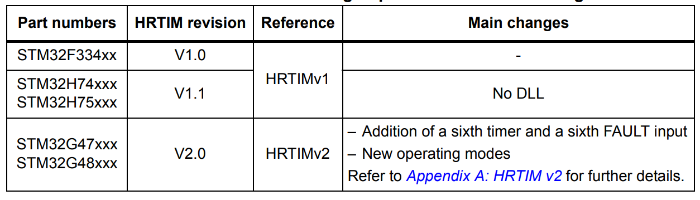
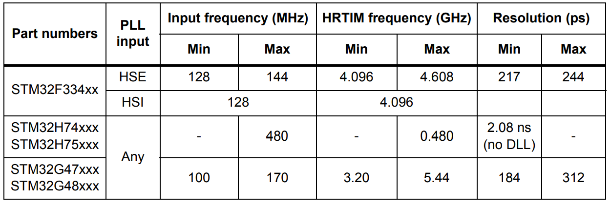

# [stm] - High Resolution Timer - HRTIM

> HRTIM is basically made of six or seven 16-bit auto-reload up-counters with four compare registers each.

> Each timing unit holds the control of two outputs via set / reset crossbar

### HRTIM versions


### HRTIM operating frequency


### Delay-Locked Loop DLL
* HRTIM delay-locked loop (DLL) divides the
high-frequency clock period in 32 evenly spaced steps
* The
high-resolution can be used once the DLLRDY flag has been set.
* possible to enable periodic calibration by
hardware
* The code snippet (for STM32F334) shows how the calibration is done

### HRTIM I/O Initialization
* HRTIM alternate functions


### HRTIM NVIC
* 8 interrupt vectors (HRTIMv2)
* all faults are grouped within a distinct vector


### HRTIM DMA controller
* 7 DMA channels (HRTIMv2)
* 1 per timing unit; including master timer
* enable when starting the timer
* specific start/stop functions - HAL_HRTIM_WaveformCounterStart_DMA

### HRTIM Comparator
* built-in comparators; 
* initialize before output is routed to HRTIM
* analog input, clock enable and polarity

### HRTIM op-amp
* can amplify low level signal to ADC or to comparators

### HRTIM ADC
* HRTIM can trigger any of the ADCs


### Formula
* Counting Period: PER = T(counting) / T(high-res)
```c
  // a timer clocked by a 4.6 GHz clock (144 MHz x 32)
  // a 10 µs time period setting
  // calculate: 10 µs / 217 ps = 46082d
  HRTIM1->sTimerxRegs[HRTIM_TIMERINDEX_TIMER_D].PERxR = 0x0000B400;

```

### HRTIM timer outputs.
- can be coupled by pairs (HRTIM_CHx1 & HRTIM_CHx2)
- with deatime insertion or work independent

|Signal Name|Signal Type|Description|
|----|----|----|----|
|HRTIM_CHAx|Output|  |  |
|HRTIM_CHBx|Output|  |  |
|HRTIM_CHCx|Output|  |  |
|HRTIM_CHDx|Output|  |  |
|HRTIM_CHEx|Output|  |  |
|HRTIM_CHFx|Output|  |  |


### Fault Inputs
- immediately disable HRTIM outputs when asserted
- 12 on-chip inputs, 6 off-chip HRTIM_FLTx inputs

|Signal Name|Signal Type|Description|
|----|----|----|
|hrtim_in_flt1[4:1]|Digitial input|  |
|hrtim_in_flt2[4:1]|Digitial input|  |
|hrtim_in_flt3[4:1]|Digitial input|  |
|hrtim_in_flt4[4:1]|Digitial input|  |
|hrtim_in_flt5[4:1]|Digitial input|  |
|hrtim_in_flt6[4:1]|Digitial input|  |

### External Events (10x)
- programmable polarity / edge
- on-chip
  1. comparator
  2. ADC watchdog
  3. TIMx timers
  4. trigger output
- off-chip
  1. HRTIM_EEVx input pins

|Signal Name|Signal Type|Description|
|----|----|----|
|hrtim_eev1[4:1] | Digital Input ||
|hrtim_eev2[4:1] | Digital Input ||
|hrtim_eev3[4:1] | Digital Input ||
|hrtim_eev4[4:1] | Digital Input ||
|hrtim_eev5[4:1] | Digital Input ||
|hrtim_eev6[4:1] | Digital Input ||
|hrtim_eev7[4:1] | Digital Input ||
|hrtim_eev8[4:1] | Digital Input ||
|hrtim_eev9[4:1] | Digital Input ||
|hrtim_eev10[4:1]| Digital Input ||


#### HRTIM_MCR - master control register


#### HRTIM_MISR / HRTIM_MICR - master time interrupt status / clear register


#### HRTIM_MDIER - master timer DMA interrupt enable
| bit | name | description | 
|--|--|--|
|bit22 | MUPDDE  | master update DMA request enable |
|bit21 | SYNCDE | sync input DMA request enable  |
|bit20 | MREPDE  | master repitition DMA request enable  |
|bit19 - 16 | MCMPxDE  | master compare x DMA request enable  |
| bit 6  |  MUPDIE |  master update inerrupt enable  |
| bit 5  |  SYNCIE |  Sync input interrupt enable  |
| bit 4  |  MREPIE |  master repetition interrupt enable  |
| bit 3-0  |  MCMPxIE | Master compare x interrupt enable   |


#### HRTIM_MCNTR / HRTIM_MPER / HRTIM_MREP - master timer counter / period / repetition register


#### HRTIM_MCMPxR (x=1,2,3,4) - master timer compare x register


#### HRTIM_TIMxCR (x=a,b,c,d,e,f) - HRTIM timer x control register
|bit|name|description|
|---|---|---|
| bit 31:28  | UPDGAT[3:0]  | |
| bit 27  | PREEN  | |
| bit 26:25  | DACSYNC[1:0]  | |
| bit 24  | MSTU  | |
| bit 23  |  TEU | Timer E Update (Register Update)|
| bit 22  |  TDU | Timer D Update (Register Update)|
| bit 21  |  TCU | Timer C Update (Register Update)|
| bit 20  |  TBU | Timer B Update (Register Update)|
| bit 19  |  TAU | Timer A Update (Register Update)|
| bit 18  |  TxRSTU | Timer x reset udpate|
| bit 17  |  TxREPU | Timer x repetition update|
| bit 16  | TFU | Timer F Update (Register Update) |
| bit 15:14 | DELCMP4[1:0] | CMP4 auto-delayed mode |
| bit 13:12 | DELCMP2[1:0] | CMP2 auto-delayed mode |
| bit 11 |
| bit 10 |
| bit 9 |
| bit 8:7 |
| bit 6 |
| bit 55 |
| bit 4 |
| bit 3 |
| bit 2:0 |


#### fEEVS (external event signal sampling clock) vs fHRTIM (timer clock frequency)


#### external
* [guide](https://www.st.com/resource/en/application_note/an4539-hrtim-cookbook-stmicroelectronics.pdf)

*[expansion-package](https://wiki.st.com/stm32mcu/wiki/Introduction_to_STM32Cube_Expansion_Packages#What_is_an_STM32Cube_Expansion_Package-3F)