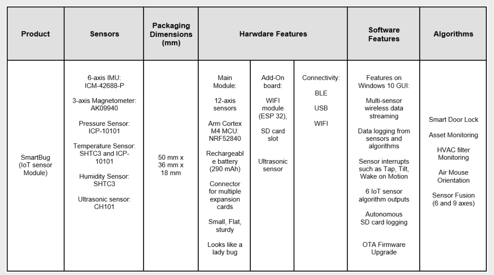

## [tdk-mems] - smart bug

### Spec

### Features

* Out-of-the-box, one-size-fits-all solution
* Sensors: IMU, magnetometer, pressure, temperature, humidity and ultrasonic
Arm Cortex M4 MCU
* Wireless connectivity: BLE and WIFI
* Rechargeable battery (290 mAh)
* USB interface
* Wireless multi-sensor and multi-algorithm data streaming and logging using a Win 10 GUI
* Autonomous data logging from multiple sensors on an SD card
* Embedded motion sensor events such as Tap, Tilt, Raise to Wake, Pedometer, Wake on Motion
* Dedicated sensor algorithm output data for multiple IoT applications

### external
* [webiste](https://invensense.tdk.com/smartbug/)
* [user guide](http://3cfeqx1hf82y3xcoull08ihx-wpengine.netdna-ssl.com/wp-content/uploads/2020/07/SW-000103-SmartBug-User-Guide-v1.1.pdf)