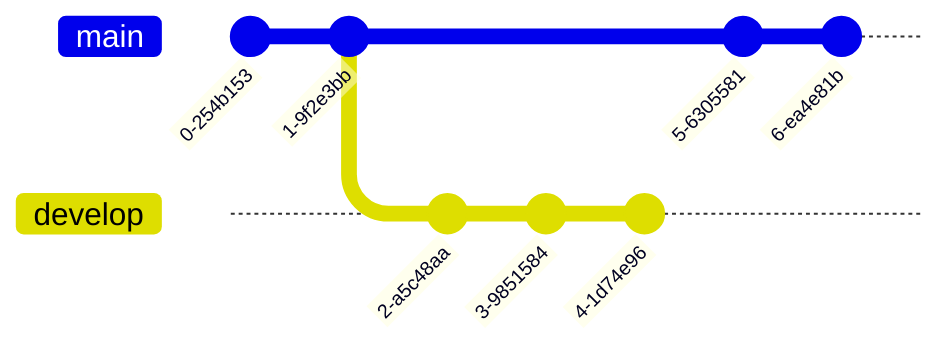
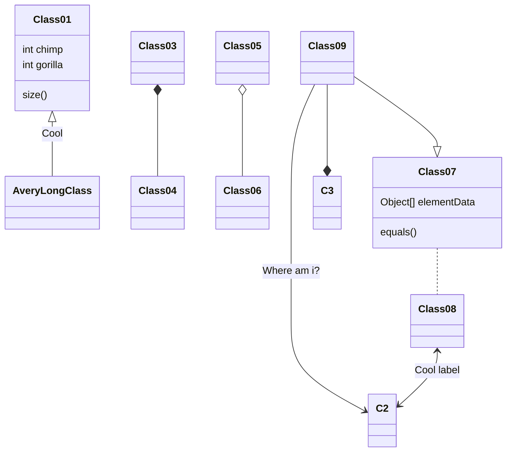
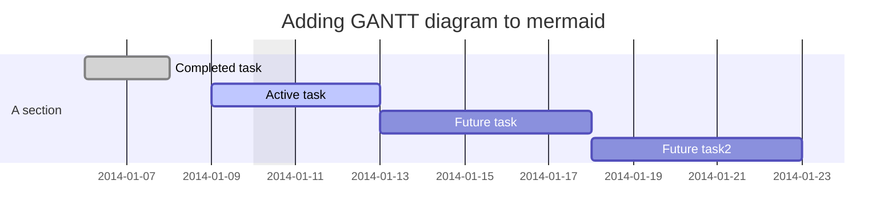
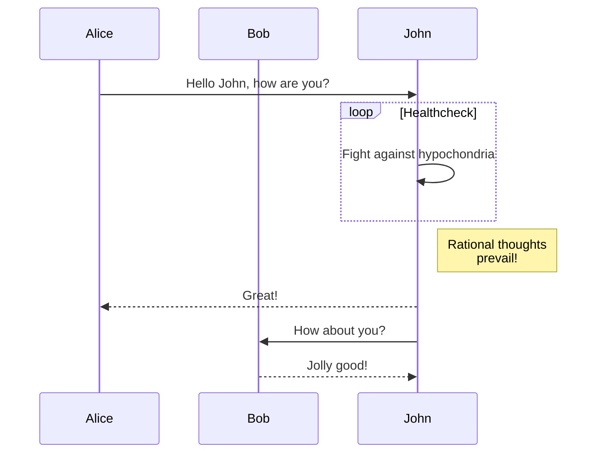

## [vscode] - drawio / mermaid

### guide

```bash
git clone --recursive https://github.com/nopeslide/drawio_mermaid_plugin.git
cd drawio_mermaid_plugin/drawio_desktop
npm install
npm run build
cd ../vscode
npm install
npm run vscode:package

```

### git graph



### class diagram



### gantt diagram



### sequence diagram



---
### flowchart


---
### external
* [github](https://mermaid-js.github.io/mermaid/#/)
* [intro](https://marketplace.visualstudio.com/items?itemName=nopeslide.vscode-drawio-plugin-mermaid)