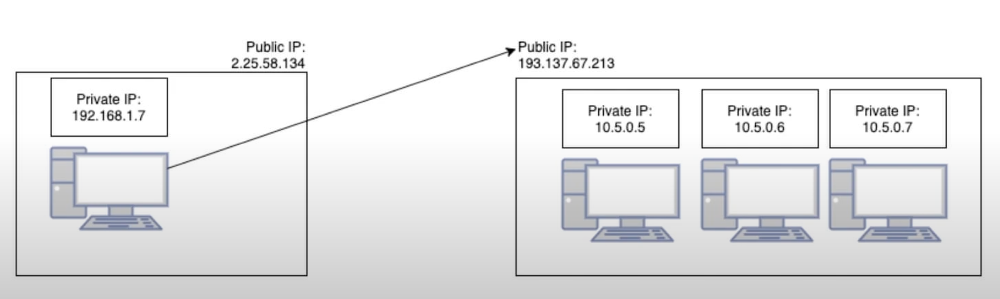
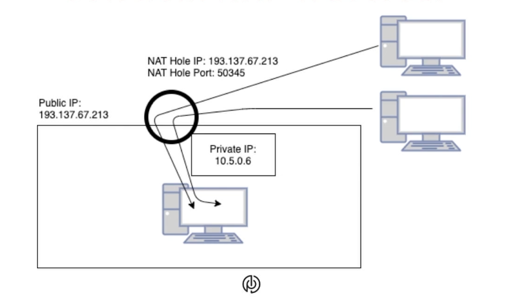
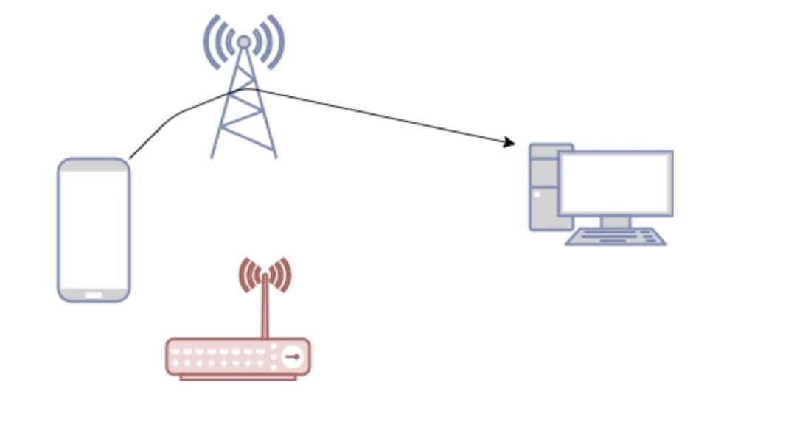
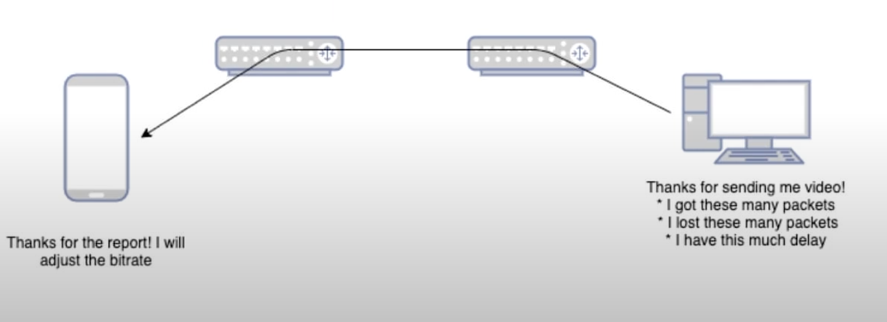

## [webrtc] - intro knownledge


- python: aiortc
- c: gstreamer's webrtcbin
- typescript: werift
- golang: pion
- erlang: shiguredo
- java: |pipe|
- rust: webrtc-rs
- c/embedded: aws webrtc


### webrtc for the curious


### what to be solved by webrtc
- connect two users with no public ip
    - Solution: NAT traversal (similar to automatic port forwarding)
- stay connected on the move
    - Solution: ICE restart (switch connection on the fly)
- what bitrate do I upload? (what bandwidth is available?)
    - Solution: Congestion Control
- Do not block on the past
    - Solution: SCTP

- bundle existing protocols










### Pion
#### Connecting (Signaling Offer/Answer)
```golang
package main

import (
    "github.com/pion/webrtc/v2"
)

func main() {
    peerConnection, err := webrtc.NewPeerConnection(webrtc.Configuration{})
    if err != nil {
        panic(err)
    }

    offer, err := peerConnection.CreateOffer(nil)
    if err!= nil {
        panic(err)
    }
    err = peerConnection.SetLocalDescription(offer)
    if err!= nil {
        panic(err)
    }

    answer := webrtc.SessionDescription{}
    err = peerConnection.SetRemoteDescription(answer)
    if err != nil {
        panic(err)
    }
    // you are connected
}

```
#### Sending Data (Data Channels)

```golang
    datachannel, err := peerConnection.CreateDataChannel("my-test-channel", nil)
    if err != nil {
        panic(err)
    }
    datachannel.OnOpen(func() {
        err = datachannel.SendText("Hello, World!")
        if err!= nil {
            panic(err)
    }})
```

#### Send Video
```golang
videoTrack, err := peerConnection.NewTrack(webrtc.DefaultPayloadTypeVP8, 50000, "video", "pion")
if err != nil {
    panic(err)
}

_, err = peerConnection.AddTrack(videoTrack)
if err!= nil {
    panic(err)
}

for {
    frame, _, err := ivf, ParseNextFrame()
    if err != nil {
        panic(err)
    }
    err = videoTrack.WriteSample(media.Sample{Data: frame, Samples: 90000})
    if err!= nil {
        panic(err)
    }
}

```

#### Sample Projects
- ns-remote
- kerberios.io (security camera)
- Neko (browser share screening)
- TelloGo (Drone video feedback)
- ascii (encoding/decoding video frame with ascii)
- cloud-morph (diablo on browser)
- webTTY (peer to peer tty on browser)
- snowflake ()
- webwormhole.io (file exchange with webrtc)
- s4y/space (virtual reality server)


### source
[conf42](https://youtu.be/4kdU9_a-gII)