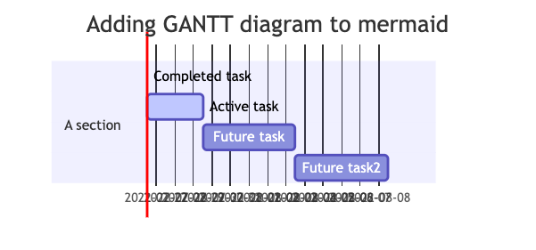

## [log] - self

##

## 08-09-2022
* Add LED display tasks
  * esp32 mqtt driver -> led display driver
  * raspberry pi 4 mqtt driver -> led display driver

## 08-05-2022

#### **M2351 AN0019 Study**
| Task | Status | Description |
| --- | --- | --- |
| IDAU | :white_check_mark: | |
| SAU | :white_check_mark: | |
| (S) (NS) (NSC) switch | | |
| Keil Environment | | |

---
#### **NCL31000 & NCL31000ASGEVB evaluation**

| Task | Status | Description |
| --- | --- | --- |
| BOM LIST |  | |
| BOM COST EVALUATION | |
| Datasheet, EVB | |
| Circuit Design | |
| PCB Layout | |

---
#### **CI/CD Pipeline setup using GitHub Actions and AWS**
| Task | Status | Description |
| --- | --- | --- |
| New AWS Account | | |
| New Github Action account | | |

---
#### **dsp**
:open_book: gnu-plot study
    - download
    - generate waveform

---
### **tdk-mems-study**
:floppy_disk: air quality

:floppy_disk: smart sound

:floppy_disk: smart_bug project

---

#### **openthread**
- simplicity ftd project compiled and loaded to dev-kit
- cli tested no response
- buy radio-kit for rpi
- buy another dev-kit
- plan and design usage
- study CLIMAX

#### **power modeling**
:open_book: small signal modeling for dc-dc-buck

:bangbang: matlab dc-dc simulation modeling code

## 08-01-2022
#### NCL31000 & NCL31000ASGEVB evaluation

- BOM LIST
- BOM COST EVALUATION
- Datasheet, EVB
- Circuit Design
- PCB Layout

#### CI/CD Pipeline setup using GitHub Actions and AWS
- New AWS Account
- New Github Action account

## 07-21-2022
#### dsp
:open_book: gnu-plot study
    - download
    - generate waveform

### tdk-mems-study
:floppy_disk: air quality

:floppy_disk: smart sound

:floppy_disk: smart_bug project

#### openthread
- simplicity ftd project compiled and loaded to dev-kit
- cli tested no response
- buy radio-kit for rpi
- buy another dev-kit
- plan and design usage
- study CLIMAX

#### power modeling
:open_book: small signal modeling for dc-dc-buck

:bangbang: matlab dc-dc simulation modeling code

#### unity-c-tdd
:open_book: template project for stm study

#### high speed security
* [google scholar](https://scholar.google.com/citations?user=hI3a_oIAAAAJ&hl=en)
* [sinica](https://homepage.iis.sinica.edu.tw/pages/byyang/supervised_en.html)
* [sinica](https://troll.iis.sinica.edu.tw/by-publ/#%E6%BB%B7%E6%95%99%E6%8E%88)
* [springer](https://link.springer.com/content/pdf/10.1007/s13389-012-0027-1.pdf)
