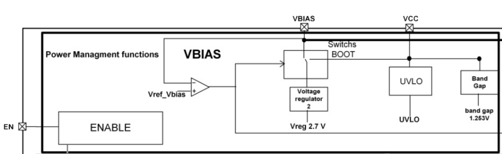

## [log] - free your mind

### **ic internal dc bias startup block diagram**

### djs
* [site](https://www.djs.com.tw/products64.html)
* [site](http://www.yite.com.tw/)
以特科技有限公司
YITE TECHNOLOGY CORP
統編 54064846
代表人 洪東京
電話 :06-2705100
傳真 :06-2706100
臺南市仁德區仁德里文華路三段446號1樓
1 F., No. 446, Sec. 3, Wenhua Rd., Rende Vil., Rende Dist., Tainan City 71756, Taiwan (R.O.C.)

