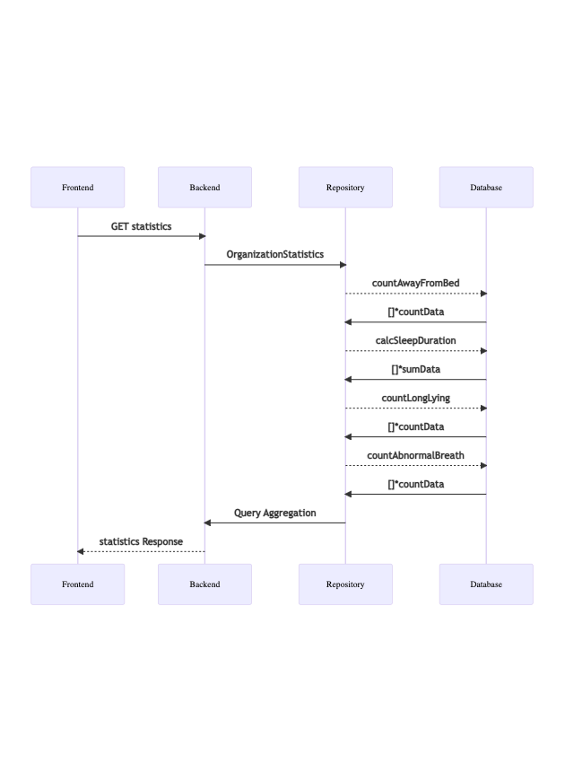

## 床墊統計資訊呈現

### 評估需求合理性
* 根據 PM 或需求提出方的隻字片語，探索出真實的需求


* 向 stakeholders 簡述此任務的需求、目標、客戶價值等


---
### 系統設計-高層次的元件互動示意

> 此步將根據前一步對需求的理解來進一步思考 著重在清楚描述各「元件 (noun)」如何「互動 (verb)」

* 設計 ListSpaceWithHistoricPatientDevice(orgID uuid.UUID, startAt, endAt time.Time)
  * 結合 spaces_v2, device_installed_in_spaces, patient_lived_spaces 產生
  * 輸出 []*SpacePatientDeviceRegistry inherit SpaceWithPatientDevice 含時間範圍:

```go
type SpacePatientDeviceRegistry struct {
    SpaceWithPatientDevice,
    startAt, endAt time.Time
}
```

### API Design

* METHOD: GET
* API URL: https://space.jubo.health/api/statistics/
* Payload:

```json
"criteria": {
    "dataType": "organization", // organization, individual
    "interval": "weekly",       // weekly, daily
    "organizationID": "d8788976-cbd7-4b9a-9f77-318113b929ab",
    "patientID": "c9b16660-e226-4198-bf31-ee7ecd551606",
    "end": 1660924800,
    "start": 1660320000
}
```

1. 夜間離床計算平均次數 (週)
    * 設計 Db Query: 從 events table select count distinct patientId with patient state = 1 in time range (week).
        + repository.statistics.CountAwayFromBedWithinTimeIn(deviceIDs []*uuid.UUID, startAt, endAt time.Time)

2. 夜間臥床少於 6 小時 (週)
    * 設計 Db Query: 從 events table query
    * 從 events table select patient state = 0 列出每日睡眠時間
    * 從 events table select patient state = 2 || = 1 列出每日起床時間
    * 計算後回傳
        + repository.statistics.CountSleepLessThan(deviceIDs []*uuid.UUID, startAt, endAt time.Time)

3. 久臥超過三次
    * 設計 Db Query: 從 smartbed_delay_alerts 中 query
        + repository.statistics.CountLongLying(deviceIDs []*uuid.UUID, startAt, endAt time.Time)

4. 呼吸異常超過 6 次
    * 設計 Db Query: 從 breath_rate_alerts table query
        + repository.statistics.CountAbnormalBreathing(deviceIDs []*uuid.UUID, startAt, endAt time.Timer)

```json
Statistics: {
    "PatientID_1": {
        "eveningAwayFromBedAvg": 1,           // 次數
        "eveningSleepLessThanAvg": 2.5,       // 小時
        "dailyLongLying":     1,              // 次數
        "dailyAbnormalBreath":    2           // 次數
    },
    "PatientID_2": {
        "eveningAwayFromBedAvg": 1,           // 次數
        "eveningSleepLessThanAvg": 4.1,       // 小時
        "dailyLongLying":     1,              // 次數
        "dailyAbnormalBreath":    2           // 次數
    },
    "PatientID_3": {
        "eveningAwayFromBedAvg": 1,           // 次數
        "eventingSleepLessThanAvg": 8.4,      // 小時
        "dailyLongLying":     1,              // 次數
        "dailyAbnormalBreath":    2           // 次數
    },
    ...
    "RequestedInterval": {
        // return timestamp from api context
        "startAt": 1660900859,
        "endAt": 1660900859
    }
},
```

### networking 的路線圖



### data 的流向、資料的「讀」與「寫」路徑有清晰的分野


### 程式碼應添加哪些改動, 既有程式碼將會如何更動


### 系統設計-資料儲存示意


### 系統設計-程式碼介面 (interface) 設計


